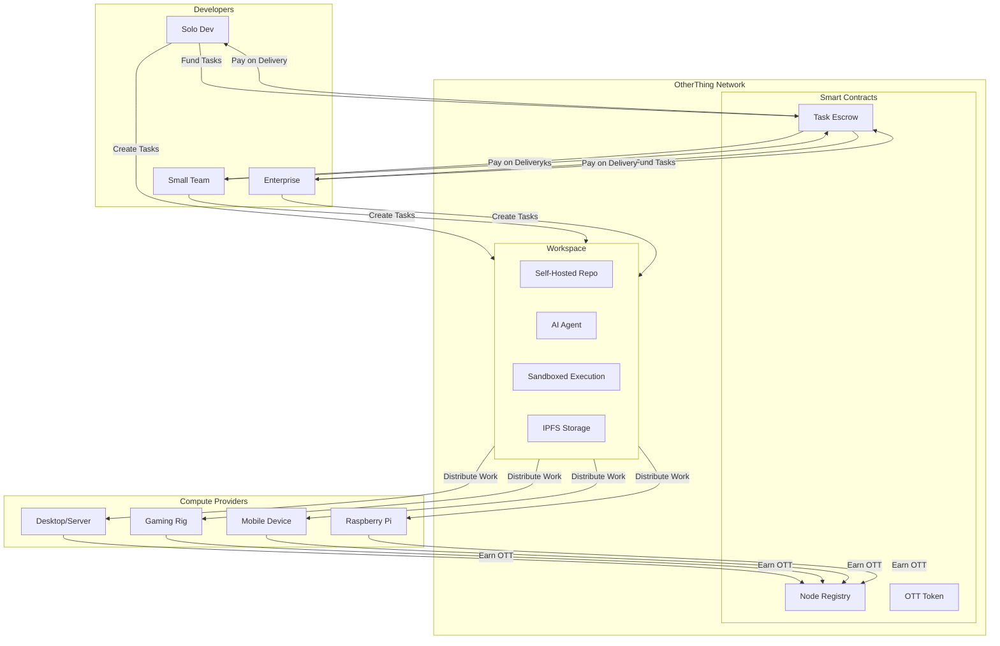
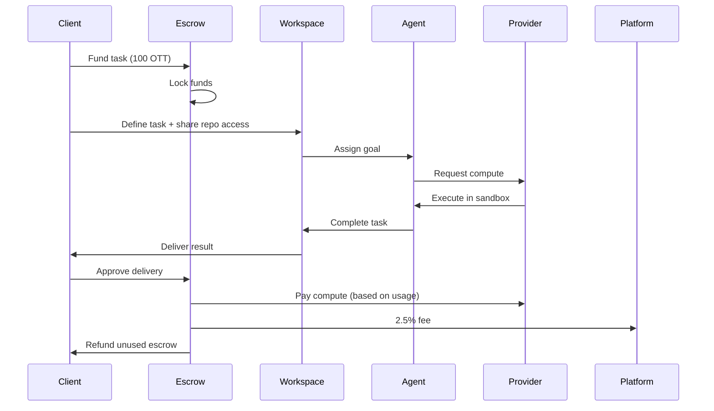
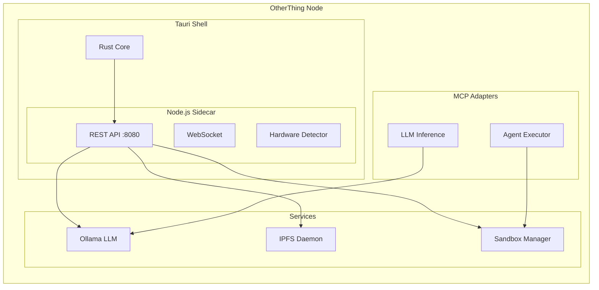
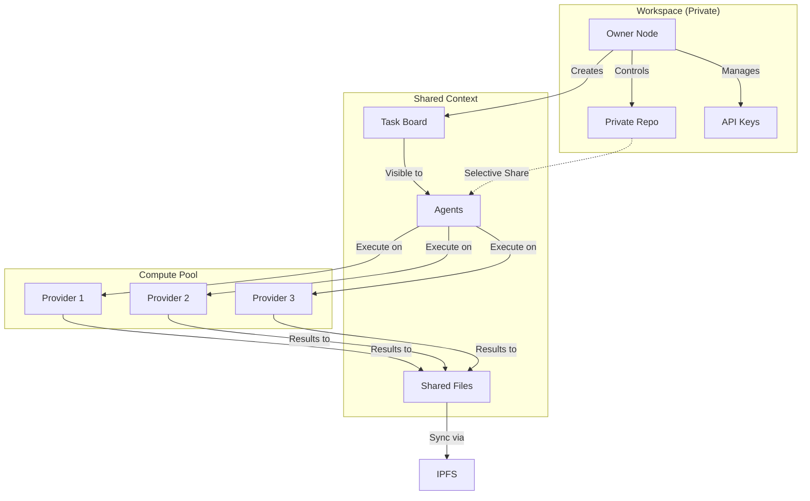
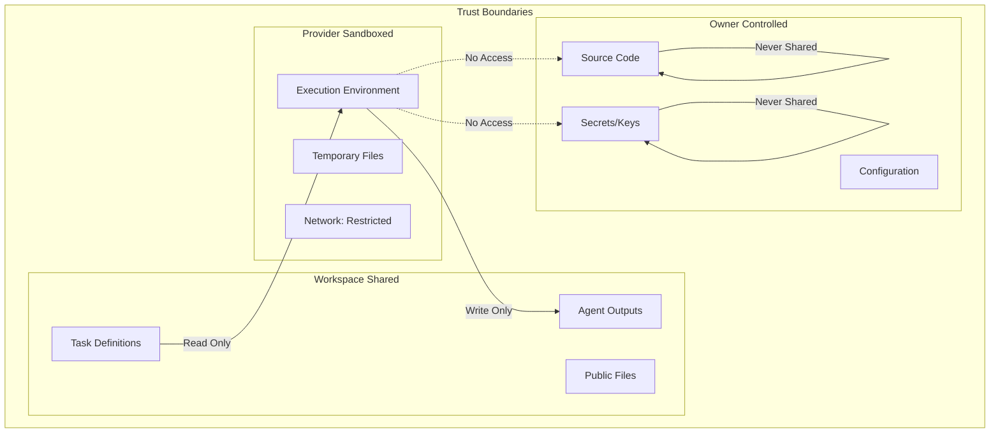

# OtherThing Architecture

## System Overview

```mermaid
flowchart TB
    subgraph Developers
        D1[Solo Dev]
        D2[Small Team]
        D3[Enterprise]
    end

    subgraph "OtherThing Network"
        subgraph Workspace
            REPO[Self-Hosted Repo]
            AGENT[AI Agent]
            SANDBOX[Sandboxed Execution]
            IPFS[IPFS Storage]
        end

        subgraph "Smart Contracts"
            ESCROW[Task Escrow]
            REGISTRY[Node Registry]
            OTT[OTT Token]
        end
    end

    subgraph "Compute Providers"
        N1[Desktop/Server]
        N2[Gaming Rig]
        N3[Mobile Device]
        N4[Raspberry Pi]
    end

    D1 & D2 & D3 -->|Create Tasks| Workspace
    Workspace -->|Distribute Work| N1 & N2 & N3 & N4
    N1 & N2 & N3 & N4 -->|Earn OTT| REGISTRY
    D1 & D2 & D3 -->|Fund Tasks| ESCROW
    ESCROW -->|Pay on Delivery| D1 & D2 & D3
```

## Transaction Flow

```mermaid
sequenceDiagram
    participant Client
    participant Escrow
    participant Workspace
    participant Agent
    participant Provider
    participant Platform

    Client->>Escrow: Fund task (100 OTT)
    Escrow->>Escrow: Lock funds
    Client->>Workspace: Define task + share repo access
    Workspace->>Agent: Assign goal
    Agent->>Provider: Request compute
    Provider->>Agent: Execute in sandbox
    Agent->>Workspace: Complete task
    Workspace->>Client: Deliver result
    Client->>Escrow: Approve delivery
    Escrow->>Provider: Pay compute (based on usage)
    Escrow->>Platform: 2.5% fee
    Escrow->>Client: Refund unused escrow
```

## Node Architecture

```mermaid
flowchart LR
    subgraph "OtherThing Node"
        subgraph "Tauri Shell"
            RUST[Rust Core]
            subgraph "Node.js Sidecar"
                API[REST API :8080]
                WS[WebSocket]
                HW[Hardware Detector]
            end
        end

        subgraph Services
            OLLAMA[Ollama LLM]
            IPFS_D[IPFS Daemon]
            SANDBOX_D[Sandbox Manager]
        end

        subgraph "MCP Adapters"
            LLM_A[LLM Inference]
            AGENT_A[Agent Executor]
        end
    end

    RUST --> API
    API --> OLLAMA
    API --> IPFS_D
    API --> SANDBOX_D
    LLM_A --> OLLAMA
    AGENT_A --> SANDBOX_D
```

## Workspace Collaboration

```mermaid
flowchart TB
    subgraph "Workspace (Private)"
        OWNER[Owner Node]
        REPO_P[Private Repo]
        KEYS[API Keys]
    end

    subgraph "Shared Context"
        TASKS[Task Board]
        FILES[Shared Files]
        AGENTS_W[Agents]
    end

    subgraph "Compute Pool"
        CP1[Provider 1]
        CP2[Provider 2]
        CP3[Provider 3]
    end

    OWNER -->|Controls| REPO_P
    OWNER -->|Manages| KEYS
    OWNER -->|Creates| TASKS
    TASKS -->|Visible to| AGENTS_W
    AGENTS_W -->|Execute on| CP1 & CP2 & CP3
    CP1 & CP2 & CP3 -->|Results to| FILES
    FILES -->|Sync via| IPFS_SYNC[IPFS]

    REPO_P -.->|"Selective Share"| AGENTS_W
```

## Security Model

```mermaid
flowchart TB
    subgraph "Trust Boundaries"
        subgraph "Owner Controlled"
            SRC[Source Code]
            SECRETS[Secrets/Keys]
            CONFIG[Configuration]
        end

        subgraph "Workspace Shared"
            TASK_DEF[Task Definitions]
            PUB_FILES[Public Files]
            AGENT_OUT[Agent Outputs]
        end

        subgraph "Provider Sandboxed"
            EXEC[Execution Environment]
            TEMP[Temporary Files]
            NET[Network: Restricted]
        end
    end

    SRC -->|"Never Shared"| SRC
    SECRETS -->|"Never Shared"| SECRETS
    TASK_DEF -->|"Read Only"| EXEC
    EXEC -->|"Write Only"| AGENT_OUT
    EXEC -.->|"No Access"| SRC
    EXEC -.->|"No Access"| SECRETS
```
