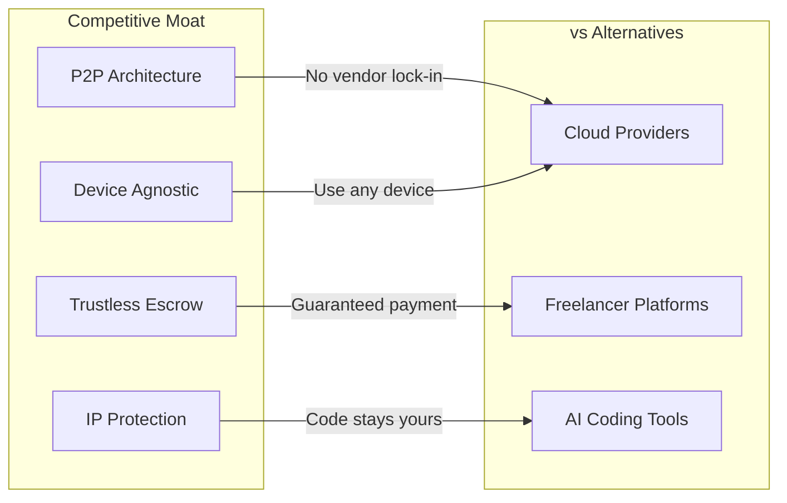
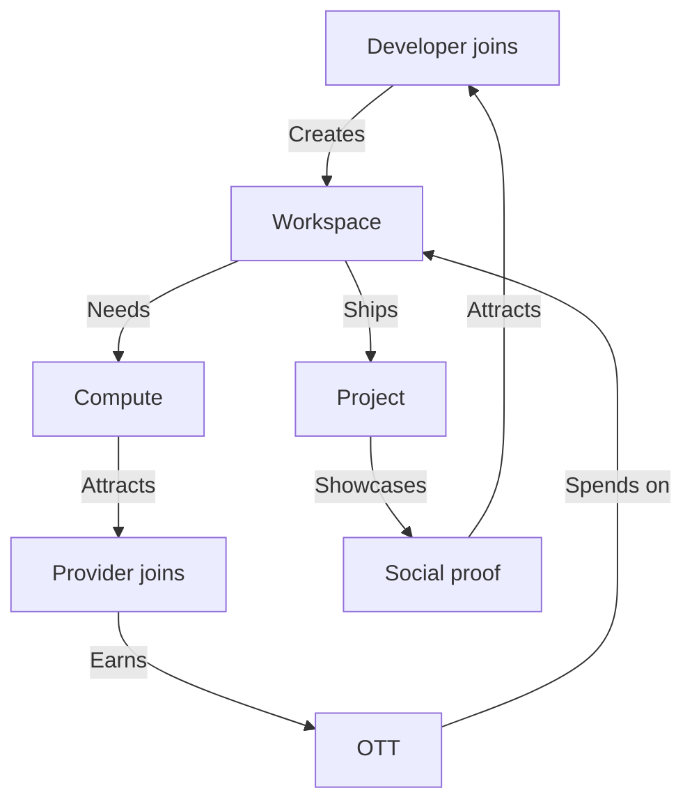

# Go-to-Market Strategy

## Why Now

The timing is right:
- **AI agents are production-ready** — LLMs can now write, review, and debug code
- **Compute is decentralizing** — Edge devices are powerful enough to run inference
- **Developers are burned out** — 83% report burnout; side projects die from lack of bandwidth
- **Trust in cloud is eroding** — Copilot trains on your code, APIs get breached, vendors lock you in

## Who First

### Phase 1: The Frustrated Indie Dev (Months 1-6)

**Profile**: Solo developers with 3+ abandoned side projects, active on GitHub, frustrated with cloud costs

**Pain Points**:
- "I have 10 ideas but only ship 1"
- "AWS bill killed my last project"
- "I don't trust Copilot with my code"

**Acquisition**:
- Dev Twitter/X, Hacker News, Reddit r/programming
- "Ship your backlog" campaign
- Free tier: 100 OTT for first workspace

**Success Metric**: 1,000 active workspaces

### Phase 2: The Side Hustler with Hardware (Months 3-9)

**Profile**: Gamers, homelabbers, crypto miners looking for passive income from idle rigs

**Pain Points**:
- "My 4090 sits idle 20 hours a day"
- "Mining is dead, what else can I do?"
- "I want to support open source but have no time"

**Acquisition**:
- r/homelab, r/pcmasterrace, Discord gaming servers
- "Earn while you sleep" positioning
- Show real earnings dashboards

**Success Metric**: 5,000 registered nodes, 500 TB shared storage

### Phase 3: Small Teams & Agencies (Months 6-12)

**Profile**: 2-10 person dev shops, agencies with overflow work, startups with more tasks than engineers

**Pain Points**:
- "We can't hire fast enough"
- "Contractors see our whole codebase"
- "We need to prototype faster"

**Acquisition**:
- LinkedIn, AngelList, Indie Hackers
- Case studies from Phase 1 success stories
- Team workspaces with role-based access

**Success Metric**: 100 paying teams, $50K MRR

## How We Win

### vs AWS/GCP/Azure
- **They see your code** — We don't
- **Pay for idle** — Pay only for compute used
- **Complex pricing** — 1 OTT = 1 USD, simple

### vs Upwork/Fiverr
- **Trust strangers** — Trustless escrow
- **Share whole repo** — Share only what's needed
- **Manual coordination** — AI agents handle execution

### vs GitHub Copilot
- **Trains on your code** — Your code never leaves your node
- **Just suggestions** — Full task execution
- **Single provider** — Decentralized, censorship-resistant

## Growth Loops

## Metrics That Matter

| Phase | North Star | Target |
|-------|-----------|--------|
| 1 | Active Workspaces | 1,000 |
| 2 | Compute Hours/Day | 10,000 |
| 3 | Monthly Transaction Volume | $100K |

## Launch Checklist

- [ ] Testnet live with 100 beta nodes
- [ ] 10 case studies of shipped projects
- [ ] Integration with GitHub (import repos)
- [ ] Mobile app for compute providers
- [ ] Fiat on-ramp for OTT purchase

---

*We're not building a product. We're building a movement: developers helping developers ship.*
