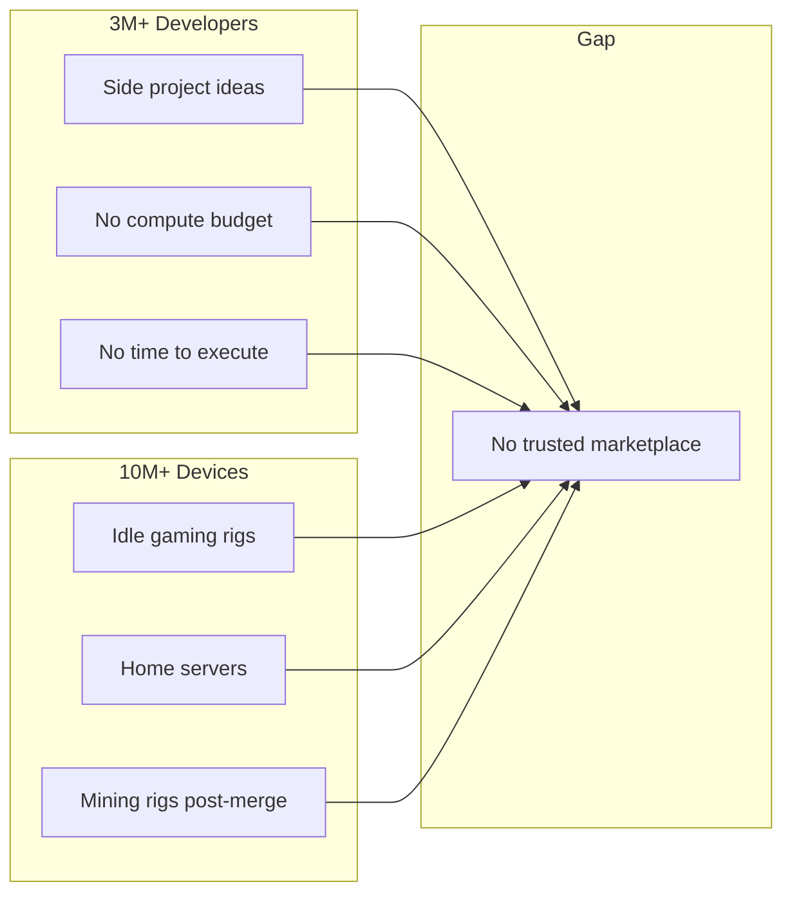
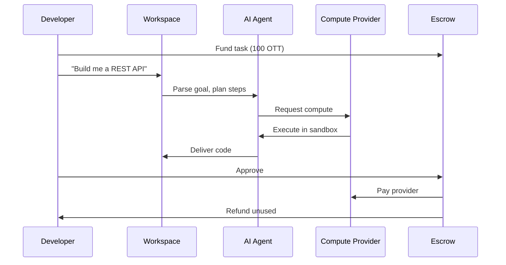
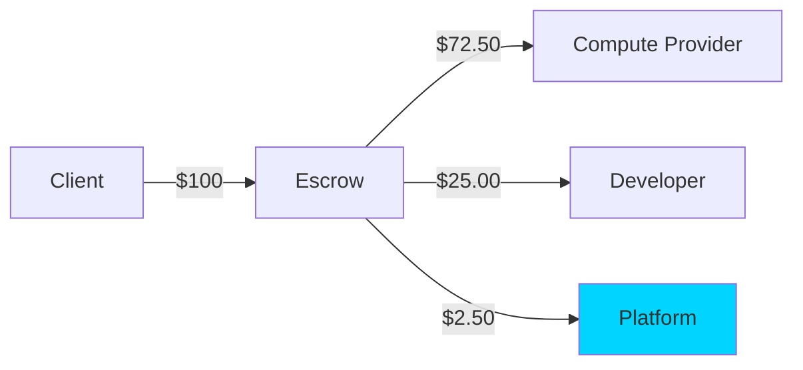
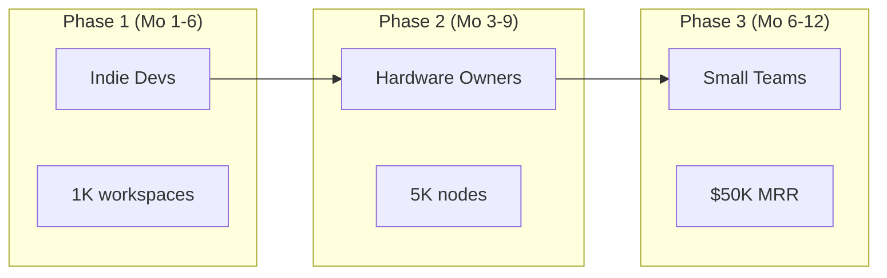

# OtherThing
## Pitch Deck

---

# 1. The Graveyard

Every developer has one.

```
~/projects/
├── todo-app-v2/          # abandoned 2019
├── saas-idea/            # abandoned 2020
├── ml-side-project/      # abandoned 2021
├── crypto-thing/         # abandoned 2022
├── ai-agent-startup/     # abandoned 2023
└── the-next-one/         # will abandon 2024?
```

**Millions of ideas. Billions in unrealized value. All rotting in backlog purgatory.**

---

# 2. Why They Die

| Barrier | Reality |
|---------|---------|
| **Compute is expensive** | $500/month for a GPU instance |
| **Cloud sees your code** | Copilot trains on your repos |
| **Can't outsource safely** | Contractors see everything |
| **No time** | Day job eats 60 hours/week |

The tools exist. The skills exist. The *resources* don't.

---

# 3. Who Feels This



**Developers need compute. Hardware owners have compute. No one connects them safely.**

---

# 4. Introducing OtherThing

> A peer-to-peer compute marketplace where developers ship their "other things" using trusted, distributed resources — while keeping their IP locked down.

**GitHub on crack. Fully P2P. Your code, your compute, your terms.**

---

# 5. How It Works



**Client funds escrow → Agent executes on distributed compute → Code delivered → Everyone gets paid**

---

# 6. The Secret Sauce

| Feature | Why It Matters |
|---------|----------------|
| **Self-hosted repos** | Your code never leaves your machine |
| **Sandboxed execution** | Providers can't see or steal IP |
| **Trustless escrow** | No payment without delivery |
| **Device agnostic** | Phones, laptops, servers — all contribute |
| **Model transformers** | Abstract hardware differences |

**Zero trust required. Cryptographic guarantees.**

---

# 7. Architecture

```
┌─────────────────────────────────────────────────────────────┐
│                      OtherThing Network                     │
├─────────────────────────────────────────────────────────────┤
│                                                             │
│   ┌─────────┐     ┌─────────────┐     ┌─────────────┐      │
│   │Developer│────▶│  Workspace  │◀────│  Provider   │      │
│   └─────────┘     └──────┬──────┘     └─────────────┘      │
│                          │                                  │
│                   ┌──────▼──────┐                          │
│                   │  AI Agent   │                          │
│                   │  + Sandbox  │                          │
│                   └──────┬──────┘                          │
│                          │                                  │
│              ┌───────────▼───────────┐                     │
│              │    Smart Contracts    │                     │
│              │  ┌─────┐ ┌─────────┐  │                     │
│              │  │ OTT │ │ Escrow  │  │                     │
│              │  └─────┘ └─────────┘  │                     │
│              └───────────────────────┘                     │
│                                                             │
└─────────────────────────────────────────────────────────────┘
```

---

# 8. Token Economics

## OTT Token

| Property | Value |
|----------|-------|
| Peg | **1 OTT = 1 USD** |
| Platform Fee | **2.5%** of transactions |
| Node Stake | **100 OTT** (refundable) |

### Why stable?
- Predictable pricing for developers
- Easy onboarding (think in dollars)
- Business-compatible invoicing

---

# 9. Money Flow



| Participant | Revenue Source |
|-------------|----------------|
| **Providers** | Compute fees (CPU/GPU/storage) |
| **Developers** | Task completion payments |
| **Platform** | 2.5% transaction fee |

---

# 10. Market Opportunity

```
┌────────────────────────────────────────────────────────────┐
│                                                            │
│   Cloud Compute Market         $500B+ annually             │
│   ████████████████████████████████████████████████████    │
│                                                            │
│   Freelance Dev Market         $50B+ annually              │
│   ████████████████                                         │
│                                                            │
│   AI Coding Tools              $10B+ by 2027               │
│   ████████                                                 │
│                                                            │
│   OtherThing TAM               Intersection of all three   │
│                                                            │
└────────────────────────────────────────────────────────────┘
```

**We're not competing with AWS. We're creating a new category: trustless compute for IP-sensitive work.**

---

# 11. Competitive Landscape

|  | OtherThing | AWS/GCP | Upwork | Copilot |
|--|------------|---------|--------|---------|
| Code privacy | ✅ Never shared | ❌ Visible | ❌ Shared | ❌ Trains on it |
| Payment guarantee | ✅ Escrow | N/A | ⚠️ Manual | N/A |
| Decentralized | ✅ P2P | ❌ Centralized | ❌ Centralized | ❌ Centralized |
| Full execution | ✅ Agents | ⚠️ Infra only | ✅ Humans | ❌ Suggestions |
| Pricing | ✅ Simple | ❌ Complex | ⚠️ Negotiated | ✅ Simple |

---

# 12. Go-to-Market



| Phase | Target | Hook | Goal |
|-------|--------|------|------|
| 1 | Indie devs | "Ship your backlog" | 1,000 workspaces |
| 2 | Hardware owners | "Earn while you sleep" | 5,000 nodes |
| 3 | Small teams | "Scale without hiring" | $50K MRR |

---

# 13. Traction & Roadmap

## Now (Testnet)
- ✅ Desktop app (Tauri + Node.js)
- ✅ IPFS storage integration
- ✅ Ollama LLM inference
- ✅ Smart contracts deployed (Sepolia)
- ✅ MCP adapter framework

## Next (Q2 2025)
- [ ] Mobile app for providers
- [ ] GitHub repo import
- [ ] Fiat on-ramp
- [ ] 100 beta nodes

## Future (Q4 2025)
- [ ] Mainnet launch
- [ ] SDK for custom adapters
- [ ] Enterprise workspaces
- [ ] 10,000 nodes

---

# 14. The Team

| Role | Background |
|------|------------|
| **Founder & CEO** | Serial builder with 10+ years in distributed systems. Previously shipped infrastructure at scale. Lives in the project graveyard — building OtherThing to escape it. |
| **Technical Architecture** | Deep expertise in P2P networks, blockchain, and AI/ML infrastructure. Contributor to open source compute projects. |
| **Community & Growth** | Developer relations background. Understands what makes devs tick — and what makes them ship. |

**Advisors**: Operators from decentralized infrastructure, developer tools, and Web3 protocols.

*Building the infrastructure for a million shipped side projects.*

---

# 15. The Ask

## Raising: $2.5M Seed

| Use of Funds | Allocation |
|--------------|------------|
| Engineering (core team + infra) | 50% — $1.25M |
| Go-to-market (dev advocacy, content, community) | 30% — $750K |
| Operations (legal, compliance, ops) | 20% — $500K |

### 18-Month Milestones
- 10,000 registered compute nodes
- 1,000 paying workspaces
- $100K monthly transaction volume
- Mainnet launch
- Mobile provider app live

---

# 16. Why Now

1. **AI agents are ready** — LLMs can execute, not just suggest
2. **Edge compute is powerful** — Phones run 7B parameter models
3. **Trust in cloud is broken** — Data breaches, training on code, vendor lock-in
4. **Developers are exhausted** — 83% report burnout

**The graveyard doesn't have to grow. Let's ship the other things.**

---

# Contact

**Website**: [otherthing.io](https://otherthing.io)
**GitHub**: [github.com/server9-dev/otherthing-node](https://github.com/server9-dev/otherthing-node)
**Twitter/X**: [@othaborhood](https://twitter.com/othaborhood)
**Email**: hello@otherthing.io
**Discord**: [discord.gg/otherthing](https://discord.gg/otherthing)

---

*"The best time to ship was yesterday. The second best time is with OtherThing."*
