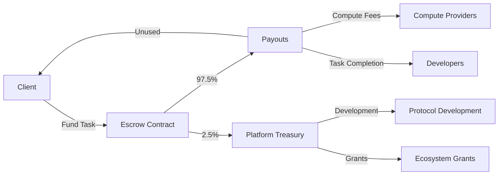
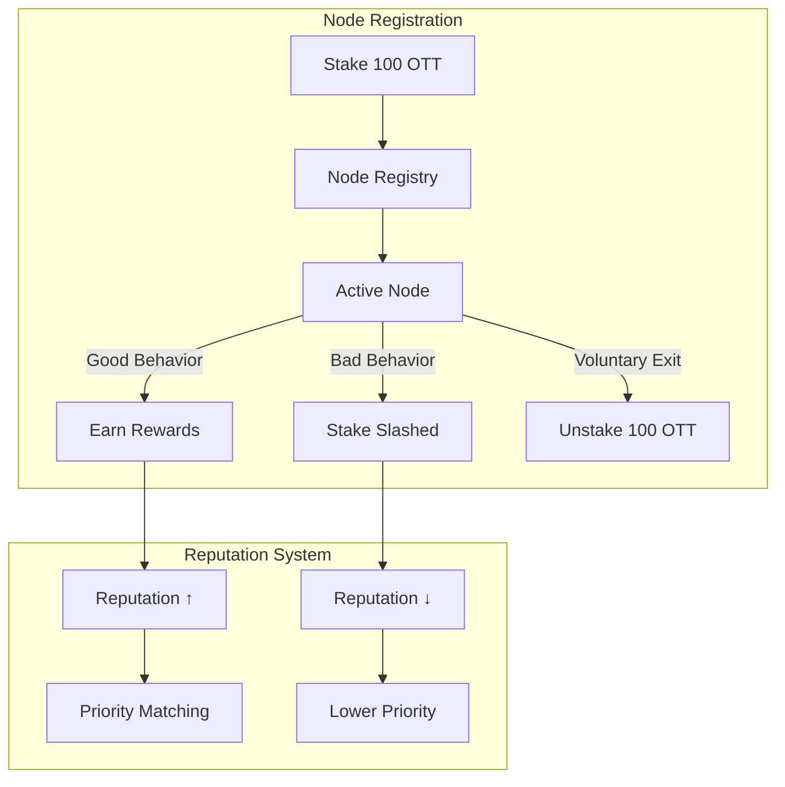

# OTT Tokenomics

## Why OTT Exists

Traditional payment rails don't work for micro-transactions between anonymous compute providers. OTT enables:
- Instant settlement between parties who don't trust each other
- Programmable escrow that releases on verifiable delivery
- Fair compensation for fractional compute contributions

## Token Overview

| Property | Value |
|----------|-------|
| Name | OtherThing Token |
| Symbol | OTT |
| Peg | 1 OTT = 1 USD |
| Network | Ethereum (Sepolia testnet → Mainnet) |
| Type | ERC-20 |

## Value Flow

## Fee Structure

| Transaction | Platform Fee | Recipient |
|-------------|--------------|-----------|
| Task Escrow | 2.5% | Platform Treasury |
| Compute Usage | 0% | Direct to Provider |
| Node Registration | 100 OTT stake | Refundable |
| Workspace Creation | Free | — |

## Participant Economics

### Compute Providers

**Earnings**: Based on resources contributed
- CPU: ~0.001 OTT per core-minute
- GPU: ~0.01 OTT per GPU-minute
- Storage: ~0.0001 OTT per GB-hour
- Inference: ~0.001 OTT per 1K tokens

**Requirements**:
- Stake 100 OTT to register node
- Maintain 95%+ uptime for full rewards
- Pass security attestation

### Developers

**Costs**: Pay for compute used by agents
**Earnings**: Receive escrowed funds on task completion

**Typical Task Costs**:
| Task Type | Estimated Cost |
|-----------|---------------|
| Code review | 0.50 - 2 OTT |
| Bug fix | 1 - 10 OTT |
| Feature implementation | 5 - 50 OTT |
| Full project | 50 - 500 OTT |

### Clients

**Costs**: Fund escrow for tasks + 2.5% platform fee
**Protection**: Funds released only on approval or dispute resolution

## Staking Mechanics

## Token Distribution

| Allocation | Percentage | Purpose |
|------------|------------|---------|
| Ecosystem Rewards | 40% | Compute provider incentives |
| Treasury | 25% | Protocol development |
| Team | 15% | Core contributors (4yr vest) |
| Early Supporters | 10% | Seed participants |
| Liquidity | 10% | Exchange liquidity |

## Why 1:1 USD Peg?

1. **Predictable pricing** — Devs can budget without crypto volatility
2. **Easy onboarding** — Think in dollars, not tokens
3. **Business compatibility** — Invoice in OTT, account in USD
4. **Stable escrow** — Task value doesn't change during execution

## Smart Contracts

| Contract | Address (Sepolia) | Purpose |
|----------|-------------------|---------|
| OTT Token | `0x201333A5C882751a98E483f9B763DF4D8e5A1055` | ERC-20 token |
| NodeRegistry | `0xFaCB01A565ea526FC8CAC87D5D4622983735e8F3` | Node staking & reputation |
| TaskEscrow | `0x246127F9743AC938baB7fc221546a785C880ad86` | Payment escrow |

---

*Simple economics: provide value, get paid. No speculation, no volatility, just work.*
