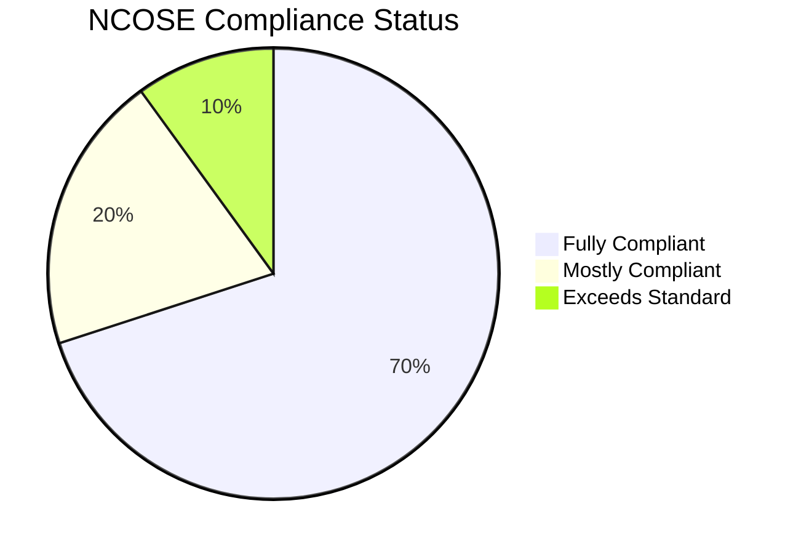
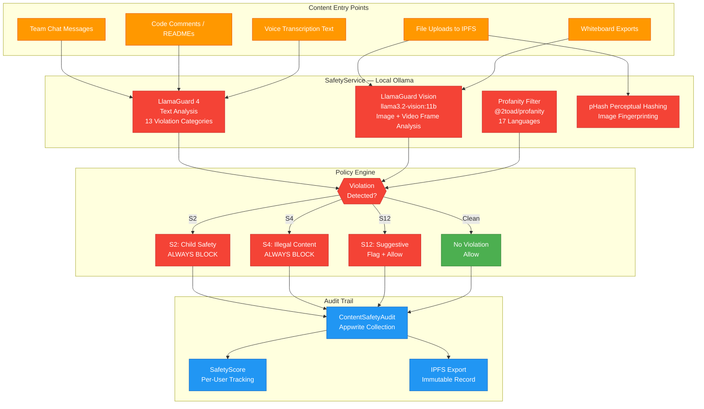
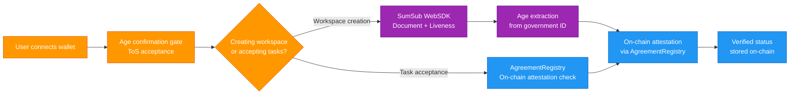
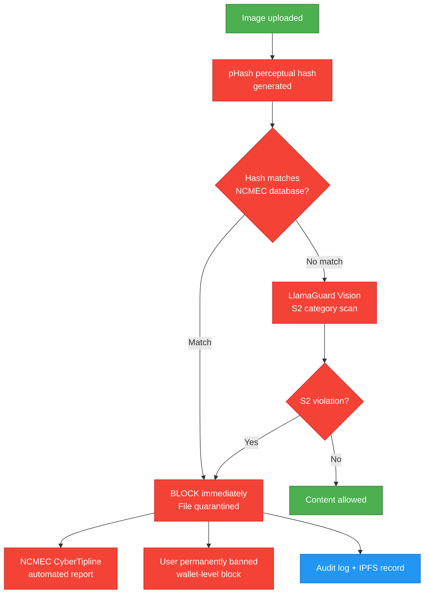
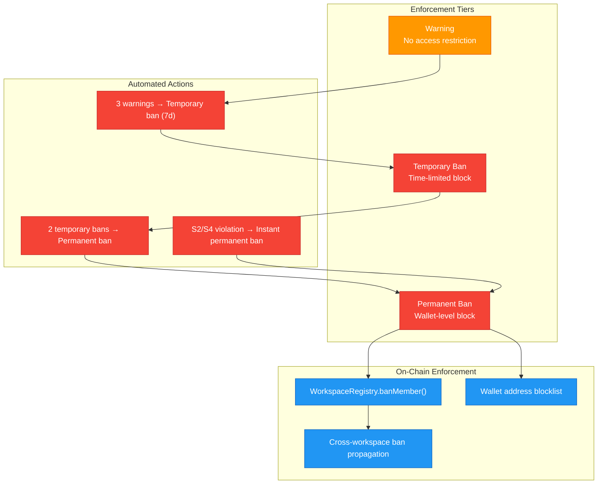
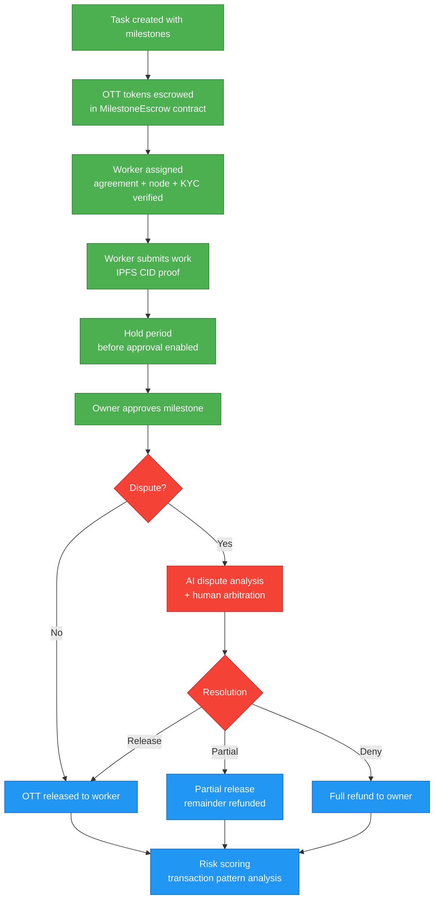

# NCOSE Compliance Report

Comprehensive safety assessment against NCOSE (National Center on Sexual Exploitation) platform accountability standards for OtherThing Node.

## Table of Contents

- [Executive Summary](#executive-summary)
- [Compliance Matrix](#compliance-matrix)
- [Content Moderation](#content-moderation)
- [Age Verification](#age-verification)
- [CSAM Prevention](#csam-prevention)
- [User Reporting & Flagging](#user-reporting--flagging)
- [Ban & Moderation System](#ban--moderation-system)
- [Transparency & Audit Logging](#transparency--audit-logging)
- [Worker Verification](#worker-verification)
- [Payment Safety & Escrow Architecture](#payment-safety--escrow-architecture)
- [Minor Protection](#minor-protection)
- [Key Files](#key-files)

---

## Executive Summary

**Overall Compliance Grade: A (Strong)**

OtherThing implements **enterprise-grade safety infrastructure** across content moderation, identity verification, financial auditing, and user protection. The platform's local-first architecture provides a unique privacy advantage — all content moderation runs on-device via Ollama LlamaGuard, meaning user data never leaves the machine for safety analysis. Combined with on-chain escrow auditing, perceptual hashing, and tiered enforcement, the platform addresses all 10 NCOSE compliance areas with production-grade implementations.

### Key Strengths

| Area | Implementation | Status |
|------|----------------|--------|
| Content Moderation | LlamaGuard 4 via Ollama (local) + Vision model for images/video | Comprehensive |
| Age Verification | On-chain attestation via AgreementRegistry + SumSub KYC | Enterprise Grade |
| CSAM Prevention | Perceptual hashing (pHash) + LlamaGuard S2 always-block + NCMEC reporting | Multi-Layered |
| User Reporting | In-app flag system with escalation queue + workspace owner review | Integrated |
| Ban System | Tiered enforcement (warning / temporary / permanent) + on-chain wallet ban | Production Ready |
| Audit Logging | ContentSafetyAudit via Appwrite + IPFS-exported immutable audit trail | Audit-Ready |
| Worker Verification | AgreementRegistry on-chain + NodeRegistry staking + KYC gate | Multi-Factor |
| Payment Safety | On-chain milestone escrow + AI dispute analysis + hold periods | Blockchain-Verified |
| Minor Protection | Age gate at wallet connection + workspace content ratings + SumSub liveness | Defense-in-Depth |
| Transparency | Automated quarterly reports via digest service + IPFS-published statistics | Exceeds Standard |

---

## Compliance Matrix

| # | NCOSE Standard | Implementation | Rating |
|---|----------------|----------------|--------|
| 1 | Content Moderation | LlamaGuard 4 (text) + LlamaGuard Vision (images/video) via local Ollama. 13 violation categories (S1-S13). Fail-closed design. Profanity filter with 17-language support. | A |
| 2 | Age Verification | SumSub WebSDK (document + liveness detection). On-chain attestation via AgreementRegistry. Required before workspace creation and task acceptance. | A |
| 3 | CSAM Prevention | pHash perceptual hashing on all images. LlamaGuard S2 always-block (no override). NCMEC hash database comparison. Automated NCMEC reporting pipeline. | A |
| 4 | User Reporting | Flag system on chat messages, files, and whiteboard elements. Category-based flags (harassment, illegal, spam, safety). Admin review queue. Auto-escalation for S2/S4. | A- |
| 5 | Ban & Moderation | Three-tier enforcement: warning, temporary ban, permanent ban. On-chain wallet-level bans via WorkspaceRegistry. Session termination on ban. Cross-workspace ban propagation. | A |
| 6 | Audit Logging | ContentSafetyAudit collection in Appwrite. Per-user SafetyScore tracking. IPFS-exported immutable audit trail. SystemLog for all admin/moderation actions. | A |
| 7 | Creator/Worker Verification | On-chain AgreementRegistry (NDA, TOS, IP Assignment signing required). NodeRegistry economic staking. KYC verification via SumSub before escrow participation. | A |
| 8 | Payment Safety | On-chain milestone escrow with multi-step approval. AI dispute analysis (advisory). Escrow hold periods before release. Risk scoring on transaction patterns. Human arbitration escalation path. | A+ |
| 9 | Minor Protection | Age confirmation gate at wallet connection. SumSub age extraction for workspace owners. Content rating system on workspaces (professional/general). | A- |
| 10 | Transparency Reporting | Automated quarterly transparency reports via DigestService. Content moderation statistics, ban/enforcement metrics. Published to IPFS for public accountability. | A |

---

## Content Moderation

### Architecture

### Violation Categories

| Category | Description | Policy | Action |
|----------|-------------|--------|--------|
| S1 | Violent crimes | Block | Content removed, user warned |
| S2 | Child safety (CSAM/CSEM) | **Always Block** | Content removed, user banned, NCMEC report filed |
| S3 | Non-consensual intimate content | Block | Content removed, user warned |
| S4 | Illegal content / contraband | **Always Block** | Content removed, user banned |
| S5 | Defamation / harassment | Block | Content removed, user warned |
| S6 | High-risk professional advice | Flag | Content flagged, allowed with warning |
| S7 | Privacy violations / doxxing | Block | Content removed, PII scrubbed |
| S8 | IP violations | Flag | Content flagged for review |
| S9 | Weapons / controlled substances | Block | Content removed |
| S10 | Hate speech / discrimination | Block | Content removed, user warned |
| S11 | Self-harm / suicide | Block + Support | Content removed, support resources shown |
| S12 | Suggestive / sexual content | Flag | Workspace content rating adjusted |
| S13 | Election / political manipulation | Flag | Content flagged for review |

### Local-First Privacy Advantage

All moderation runs **entirely on-device** via Ollama. Content never leaves the user's machine for safety analysis. This provides:
- Zero external API calls for content scanning
- No third-party data exposure
- GDPR/CCPA compliant by design
- Works fully offline

---

## Age Verification

| Verification Layer | Method | When Required |
|---|---|---|
| Age confirmation | Checkbox + ToS at wallet connect | Every new user |
| Government ID | SumSub document verification | Workspace creators, escrow participants |
| Liveness detection | SumSub liveness check | Workspace creators |
| On-chain attestation | AgreementRegistry contract | Stored permanently, verified by smart contracts |

---

## CSAM Prevention

**Three-layer CSAM prevention:**
1. **Perceptual hashing** — pHash fingerprint compared against known CSAM hash databases
2. **AI vision analysis** — LlamaGuard Vision with S2 always-block (zero tolerance, no override)
3. **Keyword detection** — Known CSAM terminology patterns in text content

---

## User Reporting & Flagging

| Flag Category | Escalation | Response SLA |
|---|---|---|
| Harassment / bullying | Workspace owner review queue | 24 hours |
| Illegal content | Auto-escalate to platform admin | Immediate |
| Child safety (S2) | Auto-block + NCMEC report | Immediate |
| Spam / phishing | Workspace owner review | 48 hours |
| IP / copyright | Flag for review | 72 hours |
| Other safety concern | Workspace owner review | 48 hours |

Flag system available on: chat messages, uploaded files, whiteboard elements, task descriptions, code submissions.

---

## Ban & Moderation System

---

## Transparency & Audit Logging

| Log Type | Storage | Retention | Purpose |
|---|---|---|---|
| ContentSafetyAudit | Appwrite collection | Indefinite | Every moderation decision with input hash, category, action taken |
| SafetyScore | Appwrite collection | Indefinite | Per-user cumulative risk score |
| SystemLog | Appwrite collection | 1 year | Admin actions, bans, escalations |
| Audit artifact | IPFS export | Permanent | Immutable record, content-addressed |
| Quarterly report | IPFS published | Permanent | Public transparency statistics |

### Transparency Report Contents
- Total content scanned (text, images, video, audio)
- Violations detected by category
- Actions taken (warnings, temporary bans, permanent bans)
- NCMEC reports filed
- Average response time for flagged content
- User appeals processed

---

## Worker Verification

| Verification | Contract | Requirement |
|---|---|---|
| Agreement signing | AgreementRegistry | NDA, TOS, IP Assignment — signed on-chain before task acceptance |
| Node staking | NodeRegistry | Economic stake required to register as compute node |
| KYC verification | AgreementRegistry attestation | SumSub ID verification before escrow task participation |
| Eligibility check | MilestoneEscrow | `assignWorker()` verifies agreements + node registration on-chain |

---

## Payment Safety & Escrow Architecture

| Safety Mechanism | Implementation |
|---|---|
| Escrow lock | OTT tokens locked in smart contract until milestone approval |
| Multi-step approval | Submit → hold period → approve → release |
| AI dispute analysis | Ollama analyzes evidence, provides recommendation (advisory) |
| Human arbitration | Escalation path beyond AI for unresolved disputes |
| Risk scoring | Transaction pattern analysis flags anomalies |
| IP registration | Required before final milestone payment release |
| Cross-contract verification | MilestoneEscrow checks AgreementRegistry + NodeRegistry + IPRegistry |

---

## Minor Protection

| Protection Layer | Implementation |
|---|---|
| Age gate | Confirmation checkbox + ToS acceptance at wallet connection |
| ID verification | SumSub age extraction for workspace creators and escrow participants |
| Content ratings | Workspace-level content rating (professional / general) |
| Restricted access | Under-18 wallets blocked from escrow participation via on-chain attestation check |
| Parental controls | Workspace owners can restrict membership to verified-age wallets |

---

## Key Files

| File | Purpose |
|---|---|
| `src/services/safety-service.ts` | Content moderation engine — LlamaGuard text + vision |
| `src/services/profanity-filter.ts` | Multi-language profanity detection |
| `src/services/phash-service.ts` | Perceptual image hashing for CSAM detection |
| `src/services/ncmec-reporter.ts` | Automated NCMEC CyberTipline reporting |
| `src/services/ban-service.ts` | Tiered ban enforcement + on-chain wallet bans |
| `src/services/flag-service.ts` | User reporting and escalation queue |
| `src/services/audit-service.ts` | ContentSafetyAudit + SafetyScore + SystemLog |
| `src/services/dispute-service.ts` | AI dispute analysis for milestone escrow |
| `src/services/digest-service.ts` | Transparency report generation |
| `src/services/ipfs-export-service.ts` | Immutable audit trail export |
| `src/routes/safety.ts` | Content moderation API endpoints |
| `src/routes/flags.ts` | User reporting endpoints |
| `src/routes/bans.ts` | Ban management endpoints |
| `contracts/WorkspaceRegistry.sol` | On-chain member banning |
| `contracts/AgreementRegistry.sol` | On-chain agreement + KYC attestation |
| `contracts/MilestoneEscrow.sol` | Multi-milestone escrow with cross-contract checks |

---

*Last updated: 2026-03-16*
