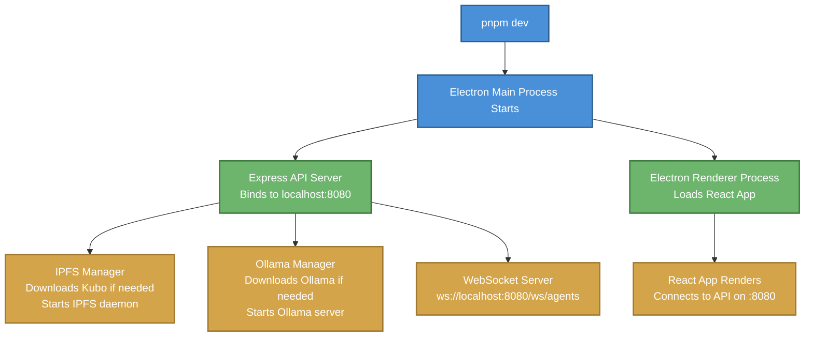
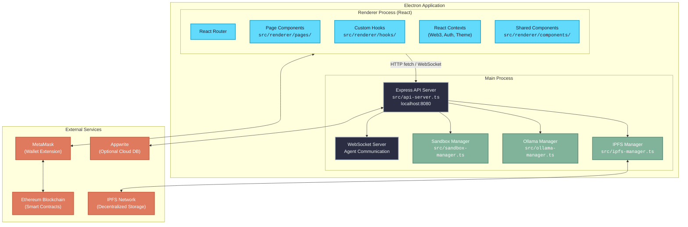
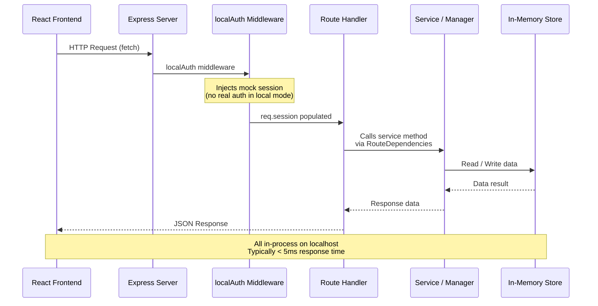
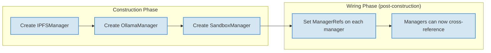
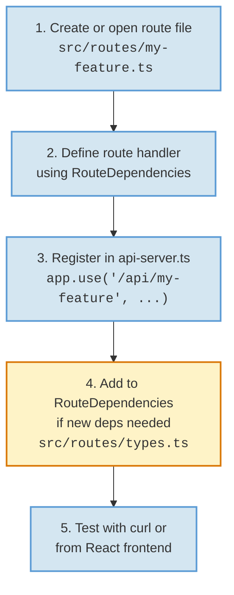
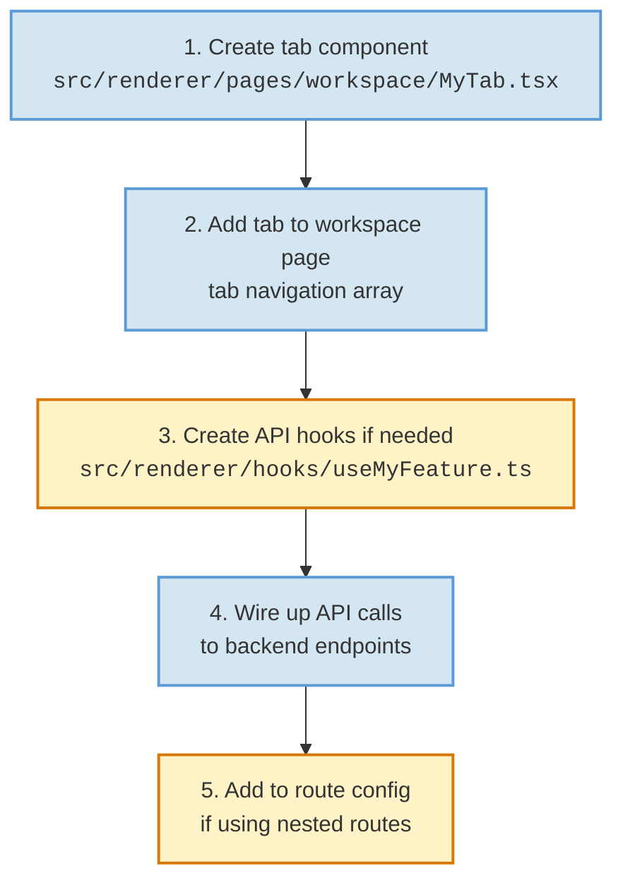

# Developer Onboarding Guide

## OtherThing Node — Decentralized Workspace Platform

Welcome to the OtherThing Node codebase. This guide will get you from zero to productive as quickly as possible.

---

## Table of Contents

1. [Prerequisites](#prerequisites)
2. [First-Time Setup](#first-time-setup)
3. [System Overview](#system-overview)
4. [Architecture Deep Dive](#architecture-deep-dive)
5. [Codebase Navigation](#codebase-navigation)
6. [Common Workflows](#common-workflows)
7. [Testing](#testing)
8. [Troubleshooting](#troubleshooting)

---

## Prerequisites

### Required

| Tool | Version | Purpose |
|------|---------|---------|
| **Node.js** | 18+ | Runtime for Electron and Express |
| **pnpm** | Latest | Package manager (faster, stricter than npm) |
| **Git** | 2.x+ | Version control, repo cloning features |

### Optional (Features Degrade Gracefully Without These)

| Tool | Purpose | Auto-Download? |
|------|---------|----------------|
| **Ollama** | Local AI inference (chat, code review, dispute resolution) | Yes — `src/ollama-manager.ts` downloads if missing |
| **IPFS Kubo** | Decentralized storage, content addressing | Yes — `src/ipfs-manager.ts` downloads if missing |
| **MetaMask** | Ethereum wallet for blockchain features (escrow, workspaces, treasury) | No — browser extension required |
| **code-server** | In-browser VS Code editor for workspaces | No — must be installed separately |

---

## First-Time Setup

```bash
# 1. Clone the repository
git clone <repo-url>
cd otherthing-node

# 2. Install dependencies
pnpm install

# 3. Environment configuration (if needed)
cp .env.example .env
# Edit .env with your settings (Appwrite keys, Ethereum RPC, etc.)

# 4. Start development mode
pnpm dev
```

### What Happens on `pnpm dev`



After startup you should see:
- API server running at `http://localhost:8080`
- WebSocket available at `ws://localhost:8080/ws/agents`
- React UI in the Electron window
- IPFS node initializing (first run may take a minute to download Kubo)
- Ollama loading (first run downloads the binary and a default model)

---

## System Overview

OtherThing Node is a **local-first decentralized workspace platform**. It runs as an Electron desktop application with an embedded Express API server. All data processing happens locally; blockchain and IPFS provide decentralized coordination and storage.

### High-Level Architecture



### Key Design Principles

1. **Local-First** — All computation happens on the user's machine. No central server.
2. **Decentralized Coordination** — Blockchain for ownership, escrow, and membership. IPFS for content storage.
3. **Graceful Degradation** — Features work independently. No Ollama? AI features disabled. No MetaMask? Blockchain features disabled. No IPFS? Content stored locally only.
4. **Manager Pattern** — Long-running processes (IPFS, Ollama, Sandbox) are managed by dedicated manager classes that handle lifecycle (download, start, stop, health check).

---

## Architecture Deep Dive

### Request Lifecycle

Every API request follows this path:



### The RouteDependencies Pattern

All route files receive their dependencies through a shared `RouteDependencies` object. This is the primary dependency injection mechanism.

**Defined in:** `src/routes/types.ts`

```
// Conceptual structure of RouteDependencies
interface RouteDependencies {
  ipfsManager: IPFSManager;
  ollamaManager: OllamaManager;
  sandboxManager: SandboxManager;
  // ... other managers and services
}
```

Every route file exports a function that accepts `RouteDependencies` and returns an Express Router:

```
// Pattern used in all 30 route files
export function createSomeRoutes(deps: RouteDependencies): Router {
  const router = Router();
  // Use deps.ipfsManager, deps.ollamaManager, etc.
  return router;
}
```

### The ManagerRefs Pattern

Some managers need references to other managers that are created after them. The `ManagerRefs` pattern solves this with mutable references set after construction:



### In-Memory Store Pattern

Most data is stored in `Map` objects scoped by workspace ID. There is no database for the local node.

```
// Common pattern across route files
const taskStore = new Map<string, Task[]>();        // workspaceId -> tasks
const messageStore = new Map<string, Message[]>();  // workspaceId -> messages
const fileStore = new Map<string, FileEntry[]>();   // workspaceId -> files
```

**Important implications:**
- All data is lost on app restart (by design — persistent data goes to IPFS/blockchain)
- No query optimization — linear scans through arrays
- No concurrent write protection — single-threaded Node.js handles this naturally
- Workspace isolation is by convention (Map key), not enforcement

---

## Codebase Navigation

### File Structure Map

```mermaid
flowchart TD
    subgraph Root["otherthing-node/"]
        direction TB
        Src["src/"]
        Pkg["package.json"]
        Env[".env / .env.example"]
    end

    subgraph SrcDir["src/"]
        direction TB
        APIEntry["api-server.ts<br/><i>Main Express server setup<br/>Route registration, middleware</i>"]
        ElectronMain["main.ts / electron-main.ts<br/><i>Electron main process entry</i>"]

        subgraph Managers["Managers (Process Lifecycle)"]
            direction TB
            IPFS_M["ipfs-manager.ts<br/><i>IPFS Kubo download, start, stop<br/>Pin, unpin, cat, add</i>"]
            Ollama_M["ollama-manager.ts<br/><i>Ollama download, start, stop<br/>Model management, inference</i>"]
            Sandbox_M["sandbox-manager.ts<br/><i>Sandboxed code execution<br/>Preview environments</i>"]
        end

        subgraph RoutesDir["routes/ (30 files, 188+ endpoints)"]
            direction TB
            RTypes["types.ts<br/><i>RouteDependencies interface</i>"]
            RWorkspace["workspaces.ts<br/><i>CRUD, membership, settings</i>"]
            RTasks["tasks.ts<br/><i>Task management, escrow</i>"]
            RAgents["agents.ts<br/><i>AI agent operations</i>"]
            RCompute["compute.ts<br/><i>GPU marketplace, tunnels</i>"]
            RRepos["repos.ts<br/><i>Git operations, code browsing</i>"]
            ROther["... 25 more route files"]
        end

        subgraph ServicesDir["services/"]
            direction TB
            SvcBiz["Business logic services<br/><i>Decoupled from routes</i>"]
        end

        subgraph AdaptersDir["adapters/"]
            direction TB
            MCP["MCP-compatible adapters<br/><i>Tool system for AI agents</i>"]
        end

        subgraph MiddlewareDir["middleware/"]
            direction TB
            LocalAuth["localAuth.ts<br/><i>Mock session injection</i>"]
        end

        subgraph RendererDir["renderer/ (React Frontend)"]
            direction TB

            subgraph PagesDir["pages/"]
                direction TB
                WkPages["workspace/<br/><i>WorkspacePage, CodeTab,<br/>TasksTab, ChatTab,<br/>WhiteboardTab, etc.</i>"]
                OtherPages["Other pages<br/><i>Home, Settings, etc.</i>"]
            end

            subgraph HooksDir["hooks/"]
                direction TB
                CustomHooks["useWorkspace, useWallet,<br/>useIPFS, useOllama, etc."]
            end

            subgraph ComponentsDir["components/"]
                direction TB
                SharedUI["Shared UI components<br/><i>Buttons, Cards, Modals,<br/>Layout, etc.</i>"]
            end

            subgraph ContextDir["context/"]
                direction TB
                Web3Ctx["Web3Context.tsx<br/><i>Wallet connection,<br/>chain state,<br/>contract interactions</i>"]
                OtherCtx["Other contexts"]
            end
        end
    end

    classDef entry fill:#ff6b6b,stroke:#c92a2a,stroke-width:2px,color:#fff
    classDef manager fill:#81b29a,stroke:#5a8a72,stroke-width:2px,color:#fff
    classDef route fill:#74c0fc,stroke:#3b8bdb,stroke-width:2px,color:#fff
    classDef frontend fill:#ffd43b,stroke:#e8b30e,stroke-width:2px,color:#333
    classDef service fill:#b197fc,stroke:#7c4dff,stroke-width:2px,color:#fff
    classDef dir fill:#f8f9fa,stroke:#adb5bd,stroke-width:1px,color:#333

    class APIEntry entry
    class ElectronMain entry
    class IPFS_M manager
    class Ollama_M manager
    class Sandbox_M manager
    class RTypes route
    class RWorkspace route
    class RTasks route
    class RAgents route
    class RCompute route
    class RRepos route
    class ROther route
    class LocalAuth route
    class SvcBiz service
    class MCP service
    class WkPages frontend
    class OtherPages frontend
    class CustomHooks frontend
    class SharedUI frontend
    class Web3Ctx frontend
    class OtherCtx frontend
```



### Key Files Quick Reference

| File | Purpose | You'll Edit This When... |
|------|---------|--------------------------|
| `src/api-server.ts` | Express server setup, route registration | Adding new route files, middleware |
| `src/routes/types.ts` | RouteDependencies interface | Adding new shared dependencies |
| `src/routes/*.ts` | API endpoints (30 files) | Adding/modifying API endpoints |
| `src/services/*.ts` | Business logic | Adding complex business rules |
| `src/adapters/*.ts` | MCP tool adapters | Adding new AI agent tools |
| `src/ipfs-manager.ts` | IPFS lifecycle and operations | Changing IPFS behavior |
| `src/ollama-manager.ts` | Ollama lifecycle and inference | Changing AI model behavior |
| `src/sandbox-manager.ts` | Sandbox management | Changing code execution |
| `src/renderer/pages/workspace/*.tsx` | Workspace tab components | Adding workspace UI features |
| `src/renderer/hooks/*.ts` | Custom React hooks | Adding frontend data hooks |
| `src/renderer/context/Web3Context.tsx` | Wallet and blockchain state | Changing blockchain interactions |
| `src/middleware/localAuth.ts` | Auth middleware | Changing authentication |

---

## Common Workflows

### 1. Adding a New API Endpoint

This is the most common task. Follow this workflow:



**Step-by-step:**

**Step 1 — Create the route file** (or add to an existing one)

```typescript
// src/routes/my-feature.ts
import { Router } from 'express';
import { RouteDependencies } from './types';

export function createMyFeatureRoutes(deps: RouteDependencies): Router {
  const router = Router();

  // In-memory store (scoped by workspace)
  const store = new Map<string, MyData[]>();

  // GET endpoint
  router.get('/:workspaceId/items', (req, res) => {
    const { workspaceId } = req.params;
    const items = store.get(workspaceId) || [];
    res.json(items);
  });

  // POST endpoint
  router.post('/:workspaceId/items', (req, res) => {
    const { workspaceId } = req.params;
    const items = store.get(workspaceId) || [];
    const newItem = { id: crypto.randomUUID(), ...req.body };
    items.push(newItem);
    store.set(workspaceId, items);
    res.json(newItem);
  });

  return router;
}
```

**Step 2 — Register in `src/api-server.ts`**

```typescript
import { createMyFeatureRoutes } from './routes/my-feature';

// In the route registration section:
app.use('/api/my-feature', createMyFeatureRoutes(deps));
```

**Step 3 — Test**

```bash
# Create an item
curl -X POST http://localhost:8080/api/my-feature/workspace-1/items \
  -H 'Content-Type: application/json' \
  -d '{"name": "Test Item"}'

# List items
curl http://localhost:8080/api/my-feature/workspace-1/items
```

---

### 2. Adding a New Workspace Tab

Workspace tabs are React components rendered inside the workspace page.



**Step-by-step:**

**Step 1 — Create the tab component**

```tsx
// src/renderer/pages/workspace/MyTab.tsx
import React, { useEffect, useState } from 'react';

interface MyTabProps {
  workspaceId: string;
}

export function MyTab({ workspaceId }: MyTabProps) {
  const [items, setItems] = useState([]);

  useEffect(() => {
    fetch(`http://localhost:8080/api/my-feature/${workspaceId}/items`)
      .then(res => res.json())
      .then(setItems);
  }, [workspaceId]);

  return (
    <div>
      <h2>My Feature</h2>
      {items.map(item => (
        <div key={item.id}>{item.name}</div>
      ))}
    </div>
  );
}
```

**Step 2 — Register the tab** in the workspace page tab navigation (typically an array of tab definitions in the workspace page component).

**Step 3 — Create a custom hook** (optional but recommended for complex data fetching):

```tsx
// src/renderer/hooks/useMyFeature.ts
export function useMyFeature(workspaceId: string) {
  // Fetch, cache, and expose data + mutations
}
```

---

### 3. Adding a New Service

Services encapsulate business logic that may be used by multiple route files.

**Step 1 — Create the service**

```typescript
// src/services/my-service.ts
export class MyService {
  constructor(private deps: { ipfsManager: IPFSManager }) {}

  async processItem(item: Item): Promise<ProcessedItem> {
    // Business logic here
    const cid = await this.deps.ipfsManager.add(JSON.stringify(item));
    return { ...item, cid };
  }
}
```

**Step 2 — Add to RouteDependencies** in `src/routes/types.ts` if routes need access.

**Step 3 — Instantiate in `src/api-server.ts`** and pass through the deps object.

---

### 4. Adding a New Agent Tool

Agent tools are exposed via the MCP-compatible adapter system and allow AI agents to perform actions.

**Step 1 — Create or extend an adapter** in `src/adapters/`

**Step 2 — Define the tool schema** (name, description, input parameters)

**Step 3 — Implement the tool handler** that performs the action

**Step 4 — Register the tool** so it appears in the agent's tool list

The agent communicates via WebSocket at `ws://localhost:8080/ws/agents`.

---

### 5. Working with IPFS

The `IPFSManager` (`src/ipfs-manager.ts`) handles all IPFS operations.

**Common operations:**

```typescript
// Add content to IPFS (returns CID)
const cid = await deps.ipfsManager.add(JSON.stringify(data));

// Retrieve content by CID
const content = await deps.ipfsManager.cat(cid);

// Pin content (prevent garbage collection)
await deps.ipfsManager.pin(cid);

// Unpin content
await deps.ipfsManager.unpin(cid);
```

**Key concepts:**
- Content is addressed by CID (Content Identifier) — a hash of the content
- Pinned content persists; unpinned content may be garbage collected
- The IPFS node connects to a private swarm (isolated network via swarm key)
- First run auto-downloads the Kubo binary

---

### 6. Working with Blockchain

Blockchain interactions happen through the React frontend via Web3Context.

**Key file:** `src/renderer/context/Web3Context.tsx`

**Common patterns:**

```tsx
// In a React component
const { account, contract, isConnected } = useWeb3();

// Read from smart contract
const members = await contract.getWorkspaceMembers(workspaceId);

// Write to smart contract (triggers MetaMask popup)
const tx = await contract.createEscrow(workspaceId, amount);
await tx.wait(); // Wait for confirmation
```

**Important notes:**
- All blockchain writes require MetaMask approval (user signs the transaction)
- The server never has access to private keys
- Workspace membership, escrow, and treasury are on-chain
- Read operations are free; write operations cost gas

---

## Testing

### Current State

The testing infrastructure is minimal. The project prioritizes rapid iteration over comprehensive test coverage at this stage.

### Running Tests

```bash
# If test scripts are configured:
pnpm test

# Manual API testing with curl:
curl http://localhost:8080/api/workspaces
curl -X POST http://localhost:8080/api/workspaces -H 'Content-Type: application/json' -d '{"name": "Test"}'
```

### Testing Approach

| Layer | Approach | Status |
|-------|----------|--------|
| API Endpoints | Manual testing with curl / Postman | Primary method |
| React Components | Manual testing in Electron | Primary method |
| Blockchain | Testnet deployment | Available |
| IPFS | Local node testing | Available |
| AI/Ollama | Manual prompt testing | Available |
| Unit Tests | Jest / Vitest | Limited coverage |
| Integration Tests | End-to-end | Not yet implemented |

### Recommended Testing Workflow

1. **Start the app** with `pnpm dev`
2. **Test API changes** with curl or the built-in UI
3. **Test blockchain changes** on a testnet (Sepolia, Goerli) before mainnet
4. **Test IPFS changes** by adding/retrieving content and checking CIDs
5. **Test AI features** by triggering agent operations through the UI

---

## Troubleshooting

### Common Issues

| Problem | Cause | Solution |
|---------|-------|----------|
| Port 8080 already in use | Another process on the port | Kill the other process or change the port |
| IPFS not starting | Kubo download failed or corrupted | Delete the Kubo binary directory and restart (auto-re-downloads) |
| Ollama not responding | Model not downloaded yet | Wait for initial model download (can be several GB) |
| MetaMask not connecting | Wrong network or extension not installed | Switch MetaMask to the correct network; ensure extension is active |
| API returns empty arrays | In-memory stores cleared on restart | This is expected behavior — data resets on restart |
| WebSocket disconnects | Agent connection timeout | Reconnect; check if the API server is still running |
| Blank Electron window | React build error | Check terminal for compilation errors; run `pnpm dev` again |

### Useful Debug Commands

```bash
# Check if API server is running
curl http://localhost:8080/api/health

# Check IPFS node status
curl http://localhost:8080/api/ipfs/status

# Check Ollama status
curl http://localhost:8080/api/ollama/status

# List all registered routes (if implemented)
curl http://localhost:8080/api/debug/routes

# View Electron logs
# Check the terminal where you ran `pnpm dev`
```

### Getting Help

- Check existing route files in `src/routes/` for patterns and conventions
- The `src/routes/types.ts` file documents all available dependencies
- Look at `src/api-server.ts` to understand how routes are registered and middleware is applied
- React components in `src/renderer/pages/workspace/` demonstrate the frontend patterns

---

## Quick Reference Card

```
Application URL:     http://localhost:8080
WebSocket:           ws://localhost:8080/ws/agents
API Base:            http://localhost:8080/api/

Route Files:         src/routes/*.ts (30 files)
Route Types:         src/routes/types.ts
API Server:          src/api-server.ts
React Pages:         src/renderer/pages/
React Hooks:         src/renderer/hooks/
React Context:       src/renderer/context/
Managers:            src/ipfs-manager.ts
                     src/ollama-manager.ts
                     src/sandbox-manager.ts
Middleware:          src/middleware/localAuth.ts
Adapters:            src/adapters/
Services:            src/services/

Start Dev:           pnpm dev
Install Deps:        pnpm install
Run Tests:           pnpm test
```
