# OWASP Top 10 (2021) Compliance Assessment

## OtherThing Node — Decentralized Workspace Platform

**Assessment Date:** 2026-03-16
**Application Type:** Electron desktop app with embedded Express API server
**Deployment Model:** Local-first (localhost:8080), no cloud hosting
**Architecture:** Electron + Express + IPFS + Ollama + Ethereum

---

## Executive Summary

OtherThing Node operates under a **local-first security model**, meaning the Express API server runs on `localhost:8080` and is intended to be accessed only by the co-located Electron renderer process. This fundamentally changes the threat model compared to a typical web application: there is no public-facing attack surface, no multi-tenant isolation requirement, and no network-level authentication concern in the traditional sense.

However, several categories still present risk, particularly around **authentication** (A07: 3/10), **access control** (A01: 4/10), and **security misconfiguration** (A05: 5/10). The strongest areas are **injection prevention** (A03: 7/10), **data integrity** (A08: 7/10), and **SSRF resistance** (A10: 7/10), largely thanks to the absence of a SQL database, blockchain-backed integrity guarantees, and limited external network calls.

**Overall Weighted Score: 5.7 / 10**

### Compliance Matrix

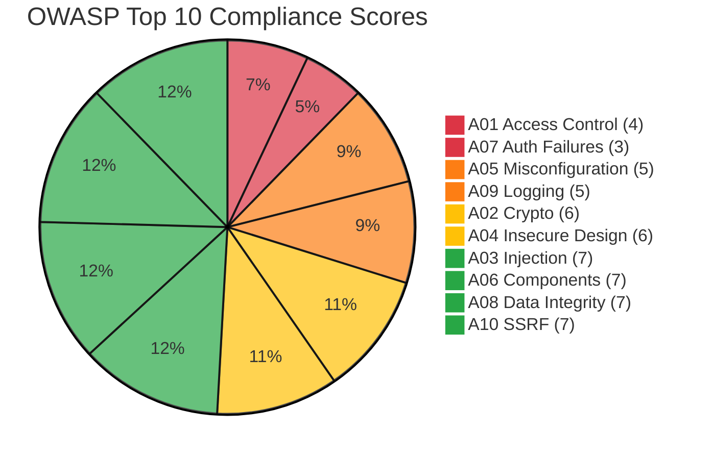

### Score Summary Table

| Category | Rating | Risk Level | Priority |
|----------|--------|------------|----------|
| A01: Broken Access Control | 4/10 | High | P1 |
| A02: Cryptographic Failures | 6/10 | Medium | P2 |
| A03: Injection | 7/10 | Low | P3 |
| A04: Insecure Design | 6/10 | Medium | P2 |
| A05: Security Misconfiguration | 5/10 | Medium | P1 |
| A06: Vulnerable Components | 7/10 | Low | P3 |
| A07: Authentication Failures | 3/10 | Critical | P1 |
| A08: Data Integrity | 7/10 | Low | P3 |
| A09: Logging Failures | 5/10 | Medium | P2 |
| A10: SSRF | 7/10 | Low | P3 |

---

## Detailed Analysis

---

### A01: Broken Access Control — Rating: 4/10

**Risk Level: HIGH**

Broken access control is the most common web application vulnerability. In OtherThing Node, access control is minimal because the local-first model assumes trust of any process that can reach localhost:8080.

#### Current State

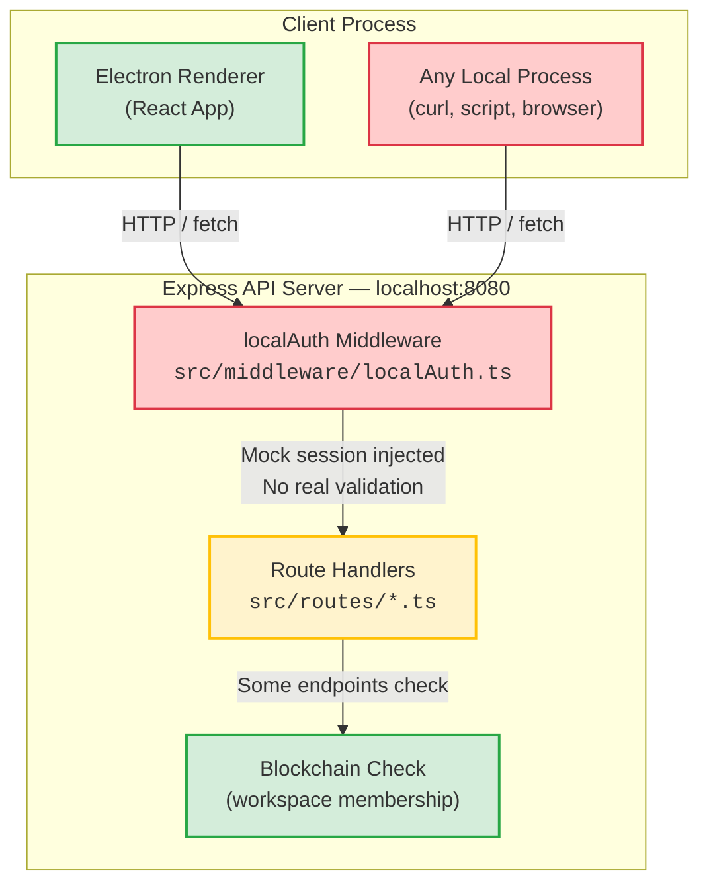

#### Findings

| Finding | Severity | File Reference |
|---------|----------|----------------|
| `localAuth` middleware injects a mock session with no real credential validation | Critical | `src/middleware/localAuth.ts` |
| No role-based access control (RBAC) system beyond basic workspace owner check in the UI layer | High | `src/renderer/` UI components |
| Any local process on the machine can call all 188+ API endpoints | High | `src/api-server.ts` |
| Workspace membership verified on-chain but not enforced server-side for most route handlers | Medium | `src/routes/*.ts` |
| No per-endpoint authorization decorators or guards | Medium | `src/routes/*.ts` |

#### Mitigating Factors

- **Local-first architecture** means the API is not exposed to the network. Only processes running on the same machine can reach it.
- **Blockchain membership checks** exist for workspace-level operations, providing decentralized access control for the most sensitive actions (escrow, treasury).
- The application is single-user by design; there is no multi-tenant concern.

#### Remediation Recommendations

1. **P1 — Implement localhost origin validation.** Add middleware that checks the request originates from the Electron renderer process (e.g., verify a shared secret token set at app startup).
2. **P2 — Add server-side workspace membership enforcement.** Before any workspace-scoped endpoint mutates data, verify the connected wallet address is a member of that workspace on-chain.
3. **P3 — Introduce endpoint-level permission annotations.** Define which operations require owner vs. member vs. public access and enforce in middleware.

---

### A02: Cryptographic Failures — Rating: 6/10

**Risk Level: MEDIUM**

Cryptographic failures relate to the protection of data in transit and at rest. OtherThing Node benefits from delegating key management to MetaMask but has gaps in data-at-rest encryption.

#### Current State

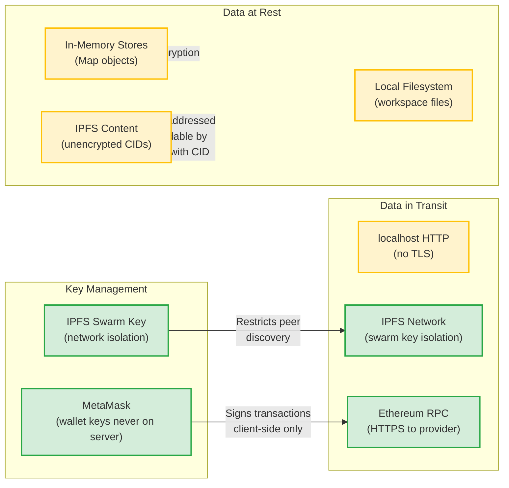

#### Findings

| Finding | Severity | File Reference |
|---------|----------|----------------|
| No encryption at rest for in-memory data stores | Medium | `src/routes/*.ts` (in-memory Maps) |
| IPFS content stored without encryption — anyone with a CID can retrieve and read content | Medium | `src/ipfs-manager.ts` |
| No TLS on localhost API (HTTP only) | Low | `src/api-server.ts` |
| Wallet private keys never touch the server — MetaMask signs client-side | N/A (Good) | `src/renderer/context/Web3Context.tsx` |
| IPFS swarm key provides network-level isolation | N/A (Good) | `src/ipfs-manager.ts` |

#### Mitigating Factors

- Local-first deployment removes the typical TLS requirement (localhost traffic does not traverse the network).
- Wallet key management is properly delegated to MetaMask, which is the industry standard.
- IPFS swarm key limits which peers can discover content.

#### Remediation Recommendations

1. **P2 — Encrypt sensitive IPFS content before pinning.** Use AES-256-GCM with workspace-derived keys so that possessing a CID alone is insufficient to read content.
2. **P3 — Add optional at-rest encryption for workspace data.** Provide a mechanism to encrypt local workspace files using a user-provided passphrase or wallet-derived key.

---

### A03: Injection — Rating: 7/10

**Risk Level: LOW**

Injection vulnerabilities occur when untrusted data is sent to an interpreter. OtherThing Node has no SQL database, which eliminates the most common injection vector, but command injection risks exist.

#### Current State

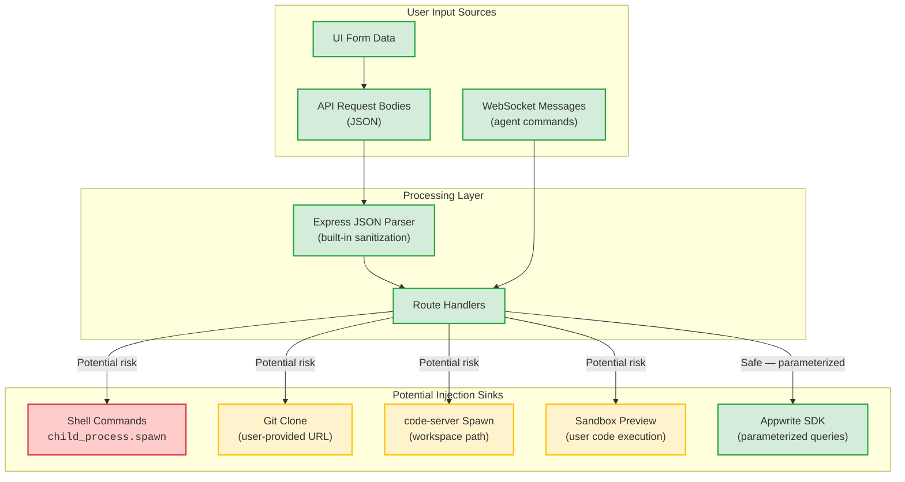

#### Findings

| Finding | Severity | File Reference |
|---------|----------|----------------|
| No SQL database eliminates SQL injection entirely | N/A (Good) | Architecture decision |
| Command injection risk in `child_process.spawn` calls for code-server, sandbox | Medium | `src/sandbox-manager.ts` |
| Git clone accepts user-provided repository URLs without sanitization | Medium | `src/routes/repos.ts` |
| Express JSON body parser prevents raw query string injection | N/A (Good) | `src/api-server.ts` |
| Appwrite SDK uses parameterized queries | N/A (Good) | `src/services/` |

#### Mitigating Factors

- No SQL or NoSQL database on the local node removes the primary injection vector.
- Express JSON body parsing provides structural validation automatically.
- `child_process.spawn` (used instead of `exec`) does not invoke a shell by default, reducing command injection risk.

#### Remediation Recommendations

1. **P2 — Validate and sanitize git clone URLs.** Allow only `https://` and `git://` schemes; reject `file://`, `ssh://`, and any URL with shell metacharacters.
2. **P2 — Add input validation library.** Integrate a schema validation library (e.g., Zod, Joi) for all endpoint request bodies.
3. **P3 — Sandbox code-server process arguments.** Ensure workspace paths passed to code-server are normalized and validated against path traversal.

---

### A04: Insecure Design — Rating: 6/10

**Risk Level: MEDIUM**

Insecure design refers to architectural flaws that cannot be fixed by correct implementation alone. OtherThing Node's local-first design is a strong security foundation, but several design decisions create risk.

#### Current State

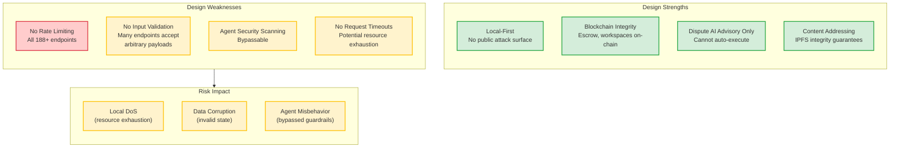

#### Findings

| Finding | Severity | File Reference |
|---------|----------|----------------|
| No rate limiting on any of the 188+ API endpoints | Medium | `src/api-server.ts` |
| Agent security scanning exists but can be bypassed by crafted prompts | Medium | Agent/AI route handlers |
| Dispute resolution AI is advisory only — cannot auto-execute financial actions | N/A (Good) | Smart contract design |
| No input validation schemas on many endpoints | Medium | `src/routes/*.ts` |
| Local-first design inherently reduces attack surface | N/A (Good) | Architecture decision |

#### Remediation Recommendations

1. **P2 — Add rate limiting middleware.** Even for local-only access, rate limiting prevents accidental resource exhaustion from misbehaving agents or scripts.
2. **P2 — Implement request body validation.** Add Zod schemas to all route handlers to reject malformed payloads early.
3. **P3 — Strengthen agent guardrails.** Add a secondary validation layer for agent-initiated actions that checks against a policy file.

---

### A05: Security Misconfiguration — Rating: 5/10

**Risk Level: MEDIUM**

Security misconfiguration covers improper server, framework, or application configuration. OtherThing Node has several default configurations that would be problematic in a production web deployment.

#### Current State

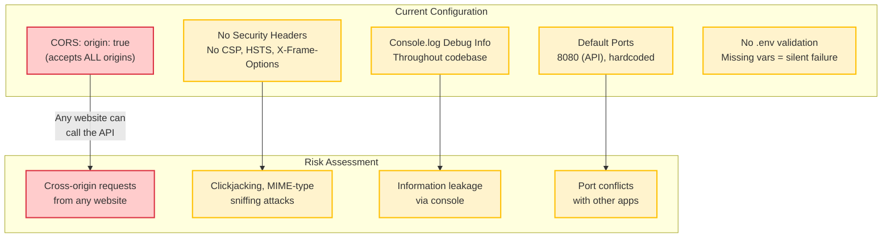

#### Findings

| Finding | Severity | File Reference |
|---------|----------|----------------|
| CORS configured with `origin: true` — accepts requests from any origin | High | `src/api-server.ts` |
| No security headers (CSP, HSTS, X-Frame-Options, X-Content-Type-Options) | Medium | `src/api-server.ts` |
| Debug information logged to console throughout the codebase | Low | All source files |
| Default port 8080 hardcoded without configuration fallback | Low | `src/api-server.ts` |
| No environment variable validation at startup | Medium | `src/api-server.ts` |

#### Remediation Recommendations

1. **P1 — Restrict CORS origin.** Change from `origin: true` to explicitly allow only the Electron renderer origin (e.g., `app://` or specific localhost port).
2. **P1 — Add security headers via Helmet.** Install and configure the `helmet` npm package for Express with appropriate CSP, X-Frame-Options, and other headers.
3. **P2 — Implement structured logging with levels.** Replace `console.log` with a logging library (e.g., pino, winston) that supports log levels and can suppress debug output in production.
4. **P3 — Make API port configurable.** Read from `PORT` environment variable with 8080 as default.

---

### A06: Vulnerable and Outdated Components — Rating: 7/10

**Risk Level: LOW**

This category covers the use of third-party components with known vulnerabilities. OtherThing Node uses standard npm dependencies and auto-downloads specific binaries.

#### Current State

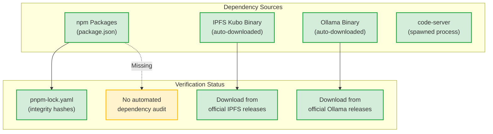

#### Findings

| Finding | Severity | File Reference |
|---------|----------|----------------|
| Standard npm ecosystem dependencies with lock file | N/A (Good) | `package.json`, `pnpm-lock.yaml` |
| IPFS Kubo binary auto-downloaded from official source | Low | `src/ipfs-manager.ts` |
| Ollama binary auto-downloaded from official source | Low | `src/ollama-manager.ts` |
| No `pnpm audit` or Dependabot in CI/CD pipeline | Medium | N/A (missing) |
| No checksum verification for downloaded binaries | Medium | `src/ipfs-manager.ts`, `src/ollama-manager.ts` |

#### Remediation Recommendations

1. **P2 — Add dependency auditing.** Run `pnpm audit` in CI and configure Dependabot or Renovate for automated dependency updates.
2. **P2 — Verify binary checksums.** When auto-downloading Kubo and Ollama binaries, verify SHA-256 checksums against published values.
3. **P3 — Pin binary versions.** Ensure downloaded binary versions are pinned and documented, not always pulling `latest`.

---

### A07: Identification and Authentication Failures — Rating: 3/10

**Risk Level: CRITICAL**

Authentication failures are the weakest area for OtherThing Node. The local-first model intentionally trades authentication for simplicity, but this creates significant risk.

#### Current State

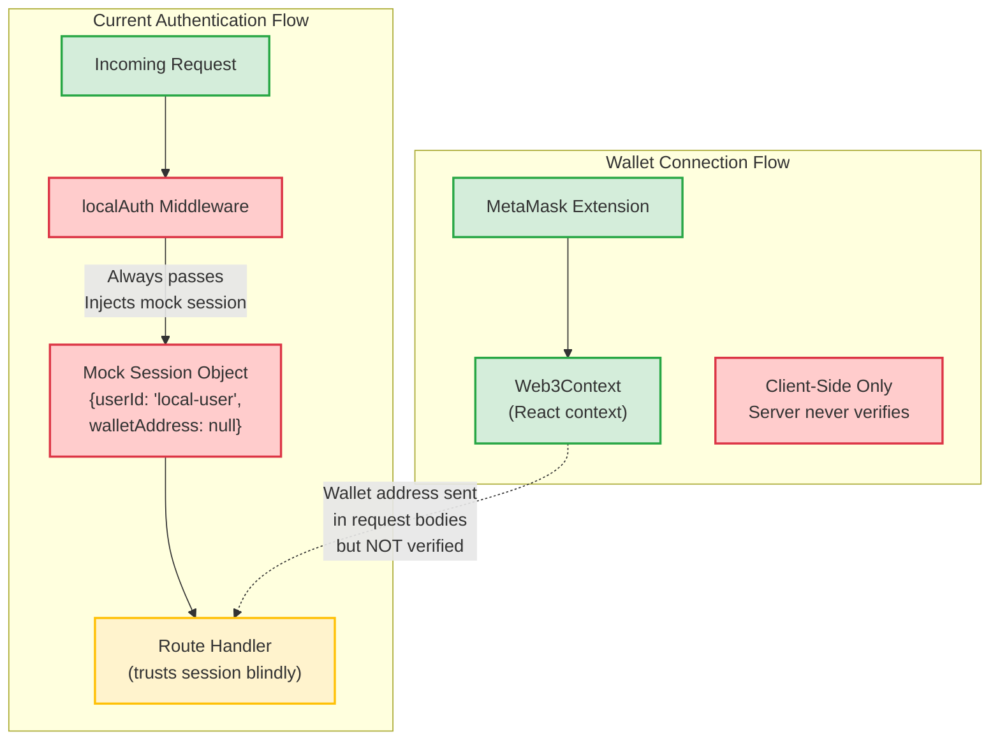

#### Findings

| Finding | Severity | File Reference |
|---------|----------|----------------|
| `localAuth` middleware provides no real authentication — always injects a mock session | Critical | `src/middleware/localAuth.ts` |
| Wallet connection is client-side only — server never verifies wallet signatures | Critical | `src/renderer/context/Web3Context.tsx` |
| No session management — stateless mock session on every request | High | `src/middleware/localAuth.ts` |
| No multi-factor authentication | Medium | N/A (not implemented) |
| No login/logout flow | Medium | N/A (not implemented) |

#### Mitigating Factors

- **Local-first deployment** means the API is not network-accessible. The primary "authentication" is operating system access control (only the local user can reach localhost).
- **Blockchain operations** require MetaMask transaction signing, which provides strong cryptographic authentication for on-chain actions.

#### Remediation Recommendations

1. **P1 — Implement wallet-based session authentication.** On app startup, require the user to sign a challenge message with MetaMask. Verify the signature server-side and issue a session token. This provides cryptographic proof of identity without passwords.
2. **P1 — Add server-side wallet verification.** When a request includes a wallet address, verify it matches the authenticated session.
3. **P2 — Add session expiry and refresh.** Even for local use, sessions should expire after inactivity to prevent stale sessions from being reused.

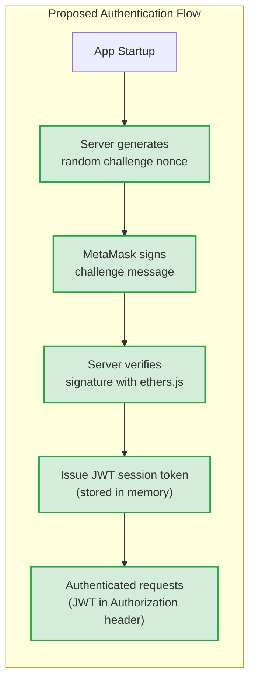

---

### A08: Software and Data Integrity Failures — Rating: 7/10

**Risk Level: LOW**

Data integrity concerns the trustworthiness of data and software updates. OtherThing Node benefits significantly from blockchain and IPFS guarantees.

#### Current State

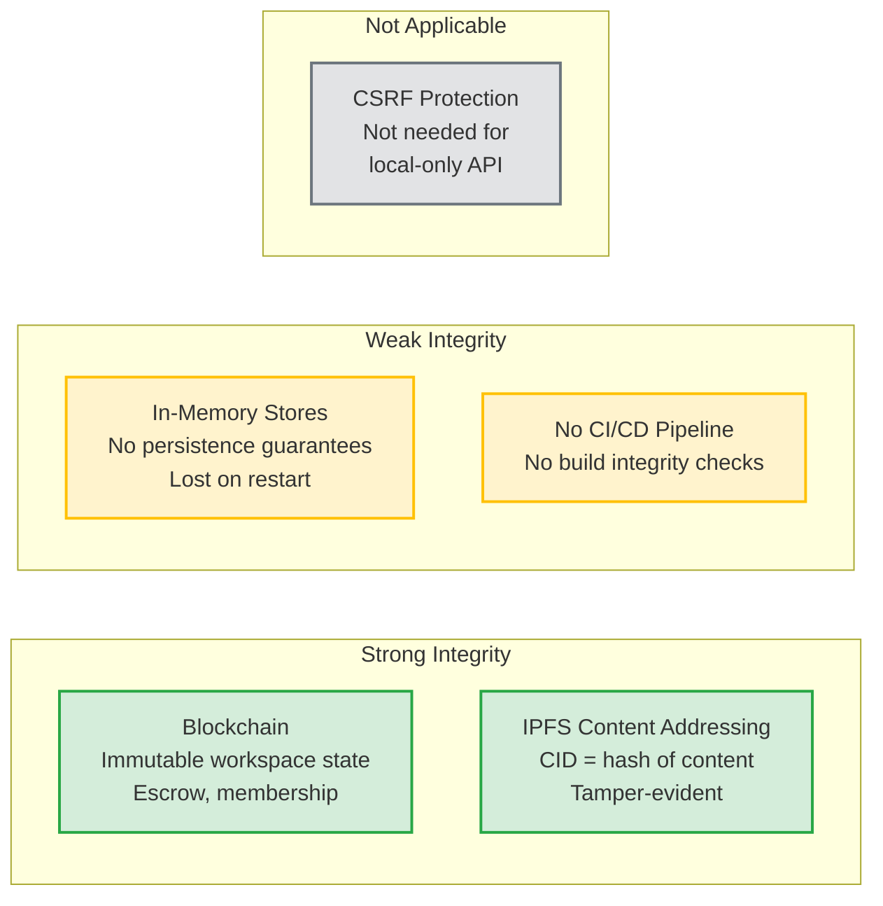

#### Findings

| Finding | Severity | File Reference |
|---------|----------|----------------|
| Blockchain provides tamper-proof integrity for workspaces, escrow, memberships | N/A (Good) | Smart contracts |
| IPFS content-addressing guarantees content integrity (CID = content hash) | N/A (Good) | `src/ipfs-manager.ts` |
| In-memory stores have no persistence or integrity guarantees — data lost on restart | Medium | `src/routes/*.ts` |
| No CSRF protection, but not needed since API is local-only | N/A | `src/api-server.ts` |
| No CI/CD pipeline with build signing or integrity verification | Low | N/A (missing) |

#### Remediation Recommendations

1. **P2 — Add optional persistence for in-memory stores.** Periodically flush critical in-memory state to disk (or IPFS) to survive restarts.
2. **P3 — Add build integrity checks.** When distributing the Electron app, sign builds and provide checksums.

---

### A09: Security Logging and Monitoring Failures — Rating: 5/10

**Risk Level: MEDIUM**

Adequate logging and monitoring are essential for detecting and responding to security incidents. OtherThing Node relies entirely on `console.log` with no structured logging infrastructure.

#### Current State

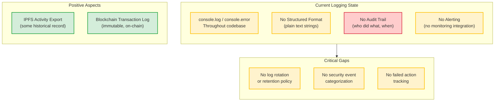

#### Findings

| Finding | Severity | File Reference |
|---------|----------|----------------|
| Console logging only — no structured logging library | Medium | All source files |
| No audit trail for security-relevant actions (endpoint access, data changes) | High | N/A (missing) |
| No log levels — debug, info, warn, error all mixed in console output | Medium | All source files |
| IPFS export provides some activity record | N/A (Partial) | `src/ipfs-manager.ts` |
| Blockchain transactions are inherently logged on-chain | N/A (Good) | Smart contracts |

#### Remediation Recommendations

1. **P2 — Integrate structured logging.** Replace `console.log` with pino or winston. Use JSON format with timestamps, levels, and request IDs.
2. **P2 — Add an audit log for security events.** Log authentication attempts, workspace access, escrow operations, and agent actions to a dedicated audit store.
3. **P3 — Add log rotation.** Implement file-based logging with rotation to prevent disk exhaustion.

---

### A10: Server-Side Request Forgery (SSRF) — Rating: 7/10

**Risk Level: LOW**

SSRF occurs when an application makes server-side requests to unintended destinations. OtherThing Node has limited outbound request patterns but some user-controlled URLs exist.

#### Current State

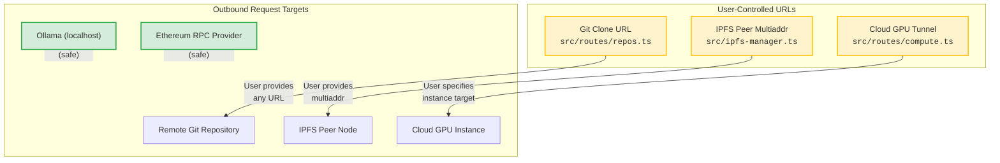

#### Findings

| Finding | Severity | File Reference |
|---------|----------|----------------|
| Git clone accepts arbitrary user-provided URLs — could target internal services | Medium | `src/routes/repos.ts` |
| IPFS peer connection accepts user-provided multiaddrs | Low | `src/ipfs-manager.ts` |
| Cloud GPU tunnel creates SSH/HTTP connections to user-specified instances | Medium | `src/routes/compute.ts` |
| Ollama calls are always to localhost — no SSRF risk | N/A (Good) | `src/ollama-manager.ts` |
| Ethereum RPC uses configured provider — not user-controlled | N/A (Good) | `src/renderer/context/Web3Context.tsx` |

#### Remediation Recommendations

1. **P2 — Validate git clone URLs.** Block private IP ranges (10.x, 172.16-31.x, 192.168.x, 127.x), `file://` scheme, and metadata endpoints (169.254.169.254).
2. **P3 — Validate IPFS multiaddrs.** Reject multiaddrs targeting private or loopback addresses.
3. **P3 — Add allowlist for GPU tunnel targets.** Only permit connections to known cloud GPU provider IP ranges.

---

## Prioritized Remediation Roadmap

### Phase 1 — Critical (P1) — Immediate

| Action | Category | Effort | Impact |
|--------|----------|--------|--------|
| Restrict CORS to Electron renderer origin | A05 | Low | High |
| Add Helmet security headers | A05 | Low | Medium |
| Implement wallet-based session auth (challenge-sign-verify) | A07 | Medium | High |
| Add localhost origin validation middleware | A01 | Low | High |

### Phase 2 — Important (P2) — Next Sprint

| Action | Category | Effort | Impact |
|--------|----------|--------|--------|
| Add Zod request validation to all endpoints | A03, A04 | High | High |
| Integrate structured logging (pino) | A09 | Medium | Medium |
| Add rate limiting middleware | A04 | Low | Medium |
| Encrypt IPFS content before pinning | A02 | Medium | Medium |
| Add `pnpm audit` to CI | A06 | Low | Medium |
| Server-side workspace membership enforcement | A01 | Medium | High |
| Validate git clone and GPU tunnel URLs against SSRF | A10 | Low | Medium |
| Security audit log for sensitive operations | A09 | Medium | Medium |

### Phase 3 — Improvement (P3) — Future

| Action | Category | Effort | Impact |
|--------|----------|--------|--------|
| Endpoint-level permission annotations | A01 | High | Medium |
| Optional at-rest encryption | A02 | Medium | Low |
| Sandbox code-server arguments | A03 | Low | Low |
| Strengthen agent guardrails | A04 | Medium | Medium |
| Pin and checksum-verify downloaded binaries | A06 | Low | Low |
| Persist in-memory stores to disk/IPFS | A08 | Medium | Medium |
| Log rotation and retention | A09 | Low | Low |
| IPFS multiaddr validation | A10 | Low | Low |

---

## Appendix: Threat Model Context

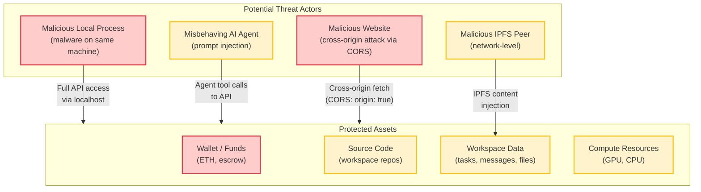

> **Note:** This assessment reflects the current local-first, single-user deployment model. If OtherThing Node is ever exposed to the network (e.g., via tunneling, multi-user mode, or cloud deployment), all ratings should be reassessed with a significantly stricter threat model.
