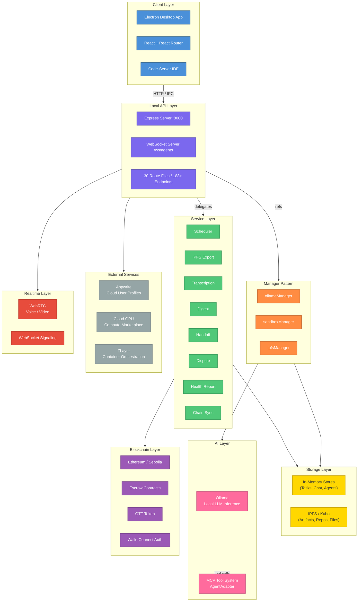

# OtherThing Node - Data Flows & Architecture Documentation

> Comprehensive documentation index for OtherThing Node, a decentralized workspace platform for developers.

---

## High-Level Architecture



---

## Documentation Map

| Document | Description | Key Topics |
|----------|-------------|------------|
| [README.md](./README.md) | This file. Documentation index, high-level architecture diagram, tech stack summary. | Index, Overview, Quick Reference |
| [architecture-overview.md](./architecture-overview.md) | Comprehensive architecture deep-dive covering system design, data stores, service layer, route architecture, and manager pattern. | Architecture, Data Stores, Services, Routes, Managers, WebSocket |

### Planned Documents

| Document | Description | Status |
|----------|-------------|--------|
| `task-lifecycle.md` | Task creation through escrow, acceptance, completion, and dispute resolution. | Planned |
| `agent-execution.md` | AI agent spawning, MCP tool execution, sandbox management, and progress streaming. | Planned |
| `workspace-sync.md` | Workspace creation on-chain, member management, and chain sync service. | Planned |
| `ipfs-storage.md` | IPFS artifact pinning, repo export, file retrieval, and Kubo management. | Planned |
| `realtime-comms.md` | WebSocket message protocol, WebRTC signaling, voice/video chat flows. | Planned |
| `compute-marketplace.md` | Cloud GPU listing, ZLayer container orchestration, compute job lifecycle. | Planned |
| `auth-identity.md` | WalletConnect authentication, Appwrite profiles, workspace membership. | Planned |

---

## Tech Stack Summary

### Frontend

| Technology | Purpose | Details |
|------------|---------|---------|
| **Electron** | Desktop shell | Cross-platform desktop app, IPC to main process |
| **React** | UI framework | Component-based renderer |
| **React Router** | Navigation | Client-side routing for workspace views |
| **Code-Server** | In-browser IDE | VS Code fork, embedded in workspace |

### Backend

| Technology | Purpose | Details |
|------------|---------|---------|
| **Express** | API server | Runs on `localhost:8080`, 188+ endpoints across 30 route files |
| **WebSocket** | Realtime | Agent progress streaming, voice/video signaling at `/ws/agents` |
| **ManagerRefs** | Dependency injection | Mutable refs for `ollamaManager`, `sandboxManager`, `ipfsManager` |
| **RouteDependencies** | DI pattern | Injected into all 30 route files for consistent access |

### Storage

| Technology | Purpose | Details |
|------------|---------|---------|
| **In-Memory** | Hot data | Tasks, chat messages, agent state |
| **IPFS (Kubo)** | Decentralized storage | Artifacts, repositories, file sharing |

### AI / ML

| Technology | Purpose | Details |
|------------|---------|---------|
| **Ollama** | Local LLM inference | Managed via `ollamaManager` ref |
| **AgentAdapter** | MCP tool system | Model Context Protocol compatible tool execution |

### Blockchain

| Technology | Purpose | Details |
|------------|---------|---------|
| **Ethereum / Sepolia** | Smart contracts | Workspace registry, escrow, OTT token |
| **WalletConnect** | Authentication | Wallet-based identity and signing |
| **Chain Sync** | State sync | Polls on-chain state, updates local stores |

### Realtime

| Technology | Purpose | Details |
|------------|---------|---------|
| **WebSocket** | Signaling | Agent progress, chat, notifications |
| **WebRTC** | Peer-to-peer | Voice and video chat within workspaces |

### Compute

| Technology | Purpose | Details |
|------------|---------|---------|
| **ZLayer** | Container orchestration | Manages sandboxed execution environments |
| **Cloud GPU** | Marketplace | External compute providers for heavy workloads |

---

## Quick Reference: Directory Structure

```
otherthing-node/
├── docs/
│   └── data-flows/
│       ├── README.md                  # This file - documentation index
│       └── architecture-overview.md   # Full architecture deep-dive
├── src/
│   ├── main/                          # Electron main process
│   ├── renderer/                      # React frontend
│   │   └── pages/
│   │       └── workspace/             # Workspace views (CodeTab, etc.)
│   ├── routes/                        # 30 Express route files
│   │   ├── compute.ts                 # Compute marketplace routes
│   │   ├── repos.ts                   # Repository management routes
│   │   └── ...                        # 28 more route files
│   ├── services/                      # Background services
│   │   ├── scheduler/                 # Task scheduling
│   │   ├── chain-sync/                # Ethereum state sync
│   │   ├── ipfs-export/               # IPFS artifact export
│   │   ├── transcription/             # Audio transcription
│   │   ├── digest/                    # Activity digests
│   │   ├── handoff/                   # Task handoff logic
│   │   ├── dispute/                   # Dispute resolution
│   │   └── health-report/             # System health monitoring
│   ├── managers/                      # Manager pattern (refs)
│   │   ├── ollamaManager/             # Ollama lifecycle
│   │   ├── sandboxManager/            # Sandbox/container mgmt
│   │   └── ipfsManager/               # IPFS/Kubo lifecycle
│   └── adapters/                      # MCP-compatible adapters
│       └── AgentAdapter/              # Tool system for AI agents
├── contracts/                         # Solidity smart contracts
├── electron.vite.config.ts            # Vite config for Electron
└── package.json
```

---

## Architecture Principles

| Principle | Description |
|-----------|-------------|
| **Local-First** | Everything runs on the user's machine. No mandatory cloud dependency. |
| **Decentralized Storage** | IPFS for artifacts and files. No central file server. |
| **On-Chain Governance** | Workspaces, escrow, and tokens live on Ethereum/Sepolia. |
| **Manager Refs** | Mutable reference objects allow hot-swapping and lifecycle management of subsystems. |
| **Route Injection** | All route files receive `RouteDependencies` for uniform access to managers, stores, and services. |
| **MCP Compatibility** | AI agents use the Model Context Protocol for tool execution, enabling interoperability. |

---

*Last updated: 2026-03-16*
