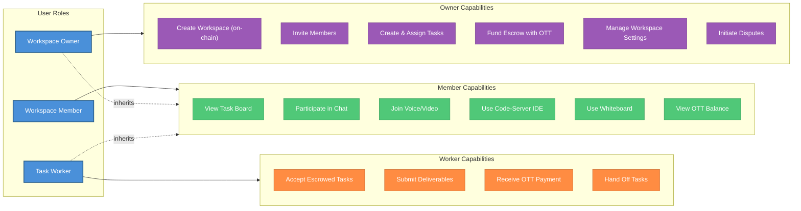
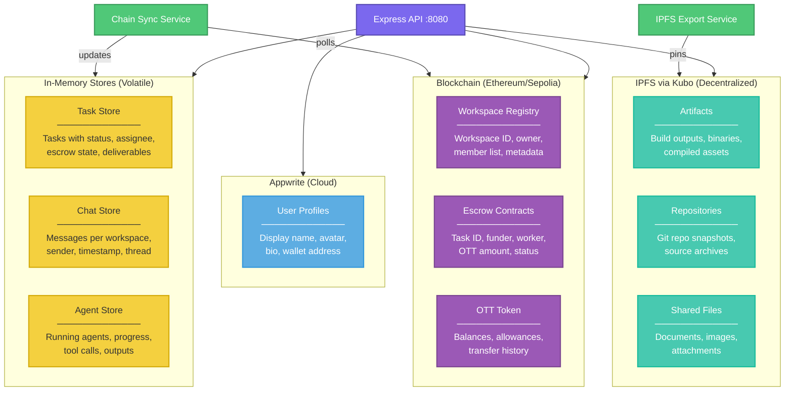
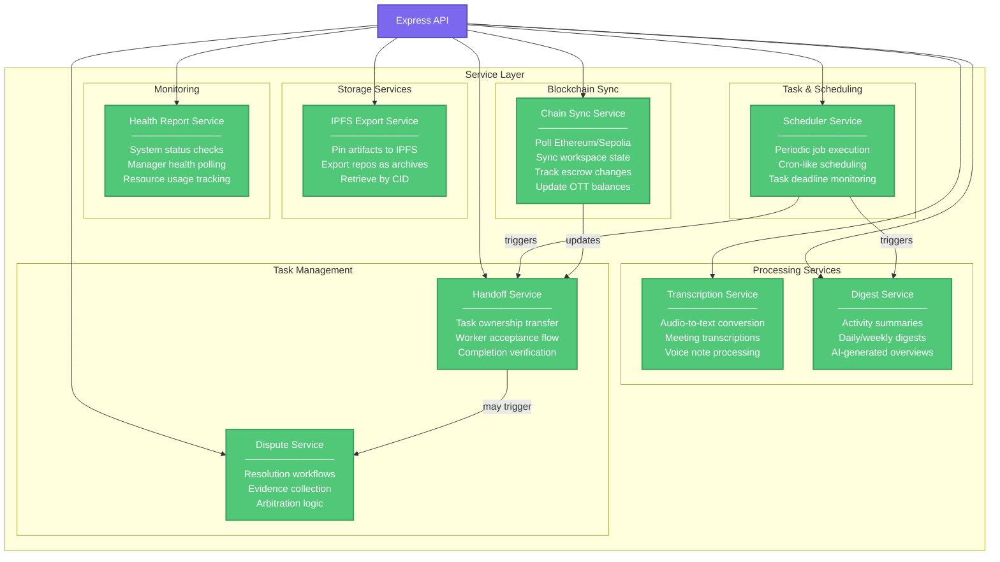
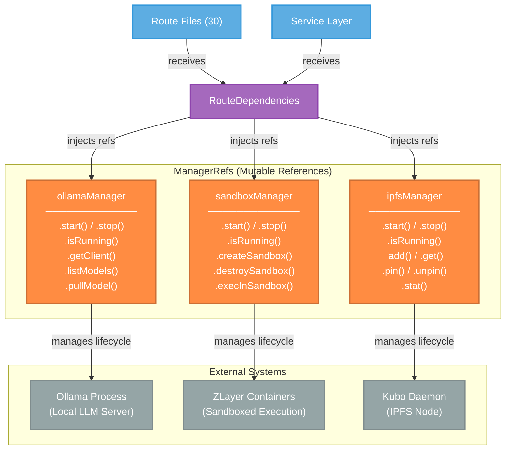
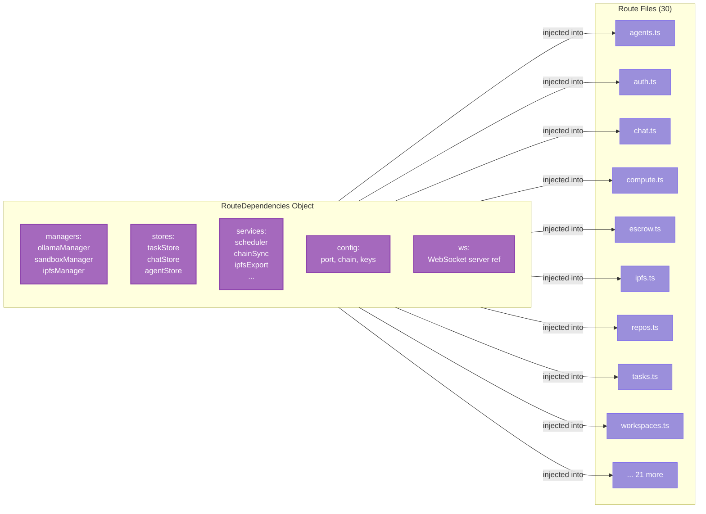
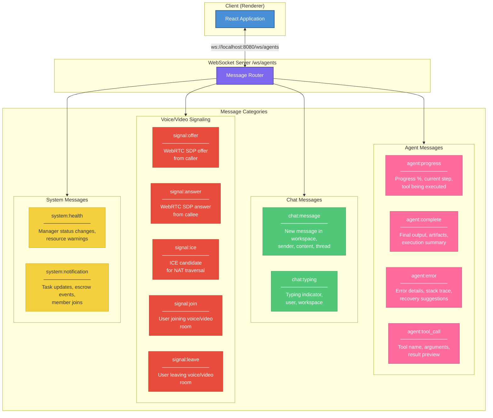
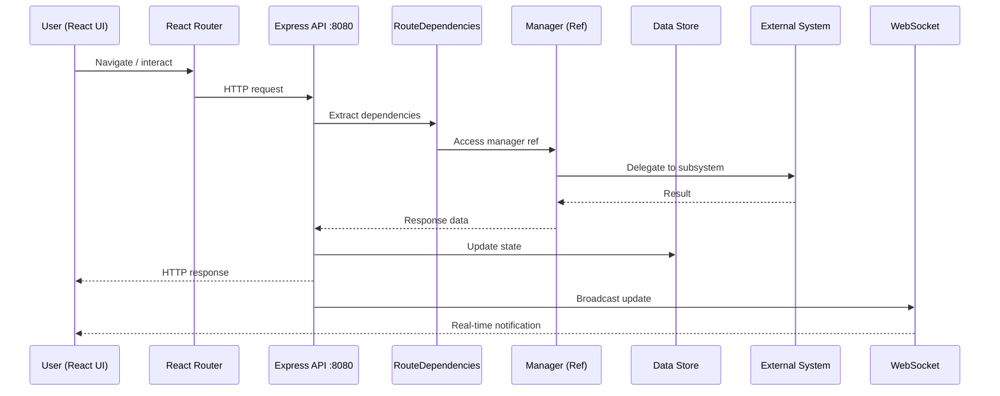

# Architecture Overview

> Deep-dive into OtherThing Node's system architecture: a local-first, decentralized workspace platform for developers.

---

## System Summary

| Metric | Value |
|--------|-------|
| **API Endpoints** | 188+ |
| **Route Files** | 30 |
| **Server Port** | `localhost:8080` |
| **Desktop Runtime** | Electron |
| **Frontend Framework** | React + React Router |
| **API Framework** | Express |
| **Storage** | In-Memory + IPFS (Kubo) |
| **AI Runtime** | Ollama (local inference) |
| **Blockchain** | Ethereum / Sepolia |
| **Token** | OTT (ERC-20) |
| **Auth** | WalletConnect |
| **User Profiles** | Appwrite (cloud) |
| **Containers** | ZLayer |
| **IDE** | Code-Server (in-browser) |
| **Realtime** | WebSocket + WebRTC |
| **User Types** | Workspace Owner, Member, Worker |
| **Architecture** | Local-first, decentralized |

---

## High-Level Architecture Diagram

```mermaid
graph TB
    subgraph Desktop["Desktop Application"]
        Electron["Electron Shell"]
        MainProcess["Main Process<br/>Window Management, IPC"]

        subgraph Renderer["React Renderer"]
            Router["React Router"]
            WorkspaceUI["Workspace Views"]
            CodeTab["CodeTab Component"]
            TaskBoard["Task Board"]
            ChatUI["Chat Interface"]
            VoiceVideo["Voice/Video UI"]
            Whiteboard["Whiteboard (iframe)"]
            BalanceDisplay["OTT Balance Display"]
            ProfileUI["User Profile Views"]
        end
    end

    subgraph APIServer["Express API Server :8080"]
        ExpressApp["Express Application"]
        WSServer["WebSocket Server<br/>/ws/agents"]

        subgraph RouteLayer["Route Layer (30 files)"]
            ComputeRoutes["compute.ts"]
            RepoRoutes["repos.ts"]
            TaskRoutes["tasks.ts"]
            ChatRoutes["chat.ts"]
            AgentRoutes["agents.ts"]
            WorkspaceRoutes["workspaces.ts"]
            AuthRoutes["auth.ts"]
            IPFSRoutes["ipfs.ts"]
            EscrowRoutes["escrow.ts"]
            OtherRoutes["... 21 more route files"]
        end

        subgraph DI["Dependency Injection"]
            RouteDeps["RouteDependencies"]
        end
    end

    subgraph Managers["Manager Pattern (Mutable Refs)"]
        OllamaRef["ollamaManager<br/>Ollama lifecycle, model mgmt"]
        SandboxRef["sandboxManager<br/>Container lifecycle"]
        IPFSRef["ipfsManager<br/>Kubo daemon lifecycle"]
    end

    subgraph Services["Service Layer"]
        Scheduler["Scheduler Service<br/>Cron-like task scheduling"]
        IPFSExport["IPFS Export Service<br/>Artifact pinning & retrieval"]
        Transcription["Transcription Service<br/>Audio-to-text"]
        Digest["Digest Service<br/>Activity summaries"]
        Handoff["Handoff Service<br/>Task transition logic"]
        Dispute["Dispute Service<br/>Resolution workflows"]
        HealthReport["Health Report Service<br/>System monitoring"]
        ChainSync["Chain Sync Service<br/>Ethereum state polling"]
    end

    subgraph DataStores["Data Stores"]
        subgraph InMemory["In-Memory Stores"]
            TaskStore["Task Store"]
            ChatStore["Chat Store"]
            AgentStore["Agent Store"]
        end

        subgraph Persistent["Persistent / Decentralized"]
            IPFS["IPFS (Kubo)<br/>Artifacts, Repos, Files"]
            Blockchain["Ethereum / Sepolia<br/>Workspaces, Escrow, OTT"]
            Appwrite["Appwrite<br/>User Profiles"]
        end
    end

    subgraph AI["AI Layer"]
        Ollama["Ollama Runtime"]
        AgentAdapter["AgentAdapter<br/>MCP Tool System"]
        ToolRegistry["Tool Registry<br/>MCP-Compatible Tools"]
    end

    subgraph Realtime["Realtime Layer"]
        WSMessages["WebSocket Messages<br/>Agent progress, Chat, Notifications"]
        WebRTC["WebRTC Peers<br/>Voice & Video Streams"]
        Signaling["Signaling Protocol<br/>Offer/Answer/ICE"]
    end

    subgraph External["External Services"]
        CloudGPU["Cloud GPU Providers"]
        ZLayer["ZLayer<br/>Container Orchestration"]
        CodeServerInst["Code-Server Instance<br/>In-Browser IDE"]
    end

    %% Connections
    Electron --> MainProcess
    MainProcess -->|IPC| Renderer
    Renderer -->|HTTP| APIServer
    ExpressApp --> RouteLayer
    RouteLayer --> DI
    DI --> Managers
    DI --> Services
    Managers --> DataStores
    Services --> DataStores
    ChainSync --> Blockchain
    OllamaRef --> Ollama
    SandboxRef --> ZLayer
    IPFSRef --> IPFS
    AgentRoutes --> AgentAdapter
    AgentAdapter --> ToolRegistry
    AgentAdapter --> Ollama
    WSServer --> Realtime
    AuthRoutes -->|WalletConnect| Blockchain
    WorkspaceRoutes --> Appwrite
    ComputeRoutes --> CloudGPU

    classDef desktop fill:#4A90D9,stroke:#2C5F8A,color:#FFFFFF,stroke-width:2px
    classDef renderer fill:#5DADE2,stroke:#3498DB,color:#FFFFFF,stroke-width:2px
    classDef api fill:#7B68EE,stroke:#5A4CB5,color:#FFFFFF,stroke-width:2px
    classDef route fill:#9B8FDB,stroke:#7B68EE,color:#FFFFFF,stroke-width:1px
    classDef di fill:#A569BD,stroke:#8E44AD,color:#FFFFFF,stroke-width:2px
    classDef manager fill:#FF8C42,stroke:#CC6F35,color:#FFFFFF,stroke-width:2px
    classDef service fill:#50C878,stroke:#3A9D5C,color:#FFFFFF,stroke-width:2px
    classDef memory fill:#F4D03F,stroke:#D4AC0D,color:#333333,stroke-width:2px
    classDef persistent fill:#FFD700,stroke:#CCA800,color:#333333,stroke-width:2px
    classDef ai fill:#FF6B9D,stroke:#CC5580,color:#FFFFFF,stroke-width:2px
    classDef realtime fill:#E74C3C,stroke:#C0392B,color:#FFFFFF,stroke-width:2px
    classDef external fill:#95A5A6,stroke:#7F8C8D,color:#FFFFFF,stroke-width:2px

    class Electron,MainProcess desktop
    class Router,WorkspaceUI,CodeTab,TaskBoard,ChatUI,VoiceVideo,Whiteboard,BalanceDisplay,ProfileUI renderer
    class ExpressApp,WSServer api
    class ComputeRoutes,RepoRoutes,TaskRoutes,ChatRoutes,AgentRoutes,WorkspaceRoutes,AuthRoutes,IPFSRoutes,EscrowRoutes,OtherRoutes route
    class RouteDeps di
    class OllamaRef,SandboxRef,IPFSRef manager
    class Scheduler,IPFSExport,Transcription,Digest,Handoff,Dispute,HealthReport,ChainSync service
    class TaskStore,ChatStore,AgentStore memory
    class IPFS,Blockchain,Appwrite persistent
    class Ollama,AgentAdapter,ToolRegistry ai
    class WSMessages,WebRTC,Signaling realtime
    class CloudGPU,ZLayer,CodeServerInst external
```



---

## Technology Stack

### Frontend Technologies

| Technology | Role | Integration Point |
|------------|------|-------------------|
| **Electron** | Desktop application shell | Wraps React renderer, manages main process, system tray, IPC |
| **React** | UI component framework | Renders all workspace views, task boards, chat, settings |
| **React Router** | Client-side routing | Navigates between workspace pages, settings, onboarding |
| **Code-Server** | Embedded IDE | VS Code fork running as iframe within workspace CodeTab |
| **Whiteboard** | Collaborative canvas | Embedded iframe component for visual collaboration |

### Backend API Technologies

| Technology | Role | Integration Point |
|------------|------|-------------------|
| **Express** | HTTP API server | Serves 188+ endpoints on `localhost:8080` |
| **WebSocket (ws)** | Realtime messaging | Server at `/ws/agents` for bidirectional communication |
| **RouteDependencies** | Dependency injection | Injects managers, stores, services into all 30 route files |
| **ManagerRefs** | Mutable references | Hot-swappable lifecycle management for subsystems |

### Storage Technologies

| Technology | Role | Data Types | Durability |
|------------|------|------------|------------|
| **In-Memory** | Hot working data | Tasks, chat messages, agent state | Volatile (session) |
| **IPFS (Kubo)** | Decentralized storage | Artifacts, repositories, shared files | Persistent (pinned) |
| **Ethereum / Sepolia** | On-chain state | Workspaces, escrow, OTT balances | Permanent (blockchain) |
| **Appwrite** | Cloud database | User profiles, avatars, display names | Persistent (cloud) |

### AI / ML Technologies

| Technology | Role | Integration Point |
|------------|------|-------------------|
| **Ollama** | Local LLM inference | Managed by `ollamaManager`, serves model completions |
| **AgentAdapter** | MCP tool bridge | Translates agent tool calls into system actions |
| **MCP Protocol** | Tool interoperability | Model Context Protocol for standardized tool definitions |

### Blockchain Technologies

| Technology | Role | Integration Point |
|------------|------|-------------------|
| **Ethereum** | Smart contract platform | Hosts workspace registry, escrow, OTT token contracts |
| **Sepolia Testnet** | Development chain | Testing environment for all on-chain operations |
| **WalletConnect** | Wallet authentication | Connects user wallets for signing and identity |
| **OTT Token** | Platform currency | ERC-20 token for escrow, payments, compute marketplace |

### Realtime Technologies

| Technology | Role | Integration Point |
|------------|------|-------------------|
| **WebSocket** | Server-push messaging | Agent progress updates, chat messages, notifications |
| **WebRTC** | Peer-to-peer media | Voice and video streams between workspace members |
| **Signaling** | WebRTC negotiation | Offer/answer/ICE candidate exchange over WebSocket |

### Compute Technologies

| Technology | Role | Integration Point |
|------------|------|-------------------|
| **ZLayer** | Container orchestration | Manages sandboxed environments for agent execution |
| **Cloud GPU** | External compute | Marketplace for GPU-accelerated workloads |
| **Code-Server** | Development environment | In-browser VS Code for workspace code editing |

---

## Directory Structure

```
otherthing-node/
├── docs/
│   └── data-flows/
│       ├── README.md                      # Documentation index
│       └── architecture-overview.md       # This file
│
├── src/
│   ├── main/                              # Electron main process
│   │   ├── index.ts                       # App entry point, window creation
│   │   └── ...                            # IPC handlers, tray, auto-update
│   │
│   ├── renderer/                          # React frontend
│   │   ├── App.tsx                        # Root component, router setup
│   │   ├── pages/
│   │   │   └── workspace/
│   │   │       ├── CodeTab.tsx            # Code-server IDE integration
│   │   │       ├── TaskBoard.tsx          # Task management UI
│   │   │       ├── Chat.tsx               # Real-time chat interface
│   │   │       ├── VoiceVideo.tsx         # WebRTC voice/video
│   │   │       ├── Whiteboard.tsx         # Collaborative whiteboard
│   │   │       └── ...                    # Other workspace views
│   │   └── components/                    # Shared UI components
│   │
│   ├── routes/                            # Express route files (30 total)
│   │   ├── agents.ts                      # AI agent management
│   │   ├── auth.ts                        # WalletConnect authentication
│   │   ├── chat.ts                        # Chat messaging
│   │   ├── compute.ts                     # Compute marketplace
│   │   ├── escrow.ts                      # Escrow operations
│   │   ├── ipfs.ts                        # IPFS file operations
│   │   ├── repos.ts                       # Repository management
│   │   ├── tasks.ts                       # Task CRUD & lifecycle
│   │   ├── workspaces.ts                  # Workspace management
│   │   └── ...                            # 21 additional route files
│   │
│   ├── services/                          # Background services
│   │   ├── scheduler/                     # Cron-like task scheduling
│   │   ├── chain-sync/                    # Ethereum state synchronization
│   │   ├── ipfs-export/                   # IPFS artifact export & pinning
│   │   ├── transcription/                 # Audio-to-text processing
│   │   ├── digest/                        # Activity summary generation
│   │   ├── handoff/                       # Task ownership transitions
│   │   ├── dispute/                       # Dispute resolution workflows
│   │   └── health-report/                 # System health monitoring
│   │
│   ├── managers/                          # Manager pattern implementations
│   │   ├── ollamaManager/                 # Ollama process lifecycle
│   │   ├── sandboxManager/                # Container/sandbox lifecycle
│   │   └── ipfsManager/                   # Kubo daemon lifecycle
│   │
│   └── adapters/                          # External system adapters
│       └── AgentAdapter/                  # MCP-compatible tool system
│
├── contracts/                             # Solidity smart contracts
│   ├── WorkspaceRegistry.sol              # On-chain workspace creation
│   ├── Escrow.sol                         # Task escrow logic
│   └── OTTToken.sol                       # ERC-20 OTT token
│
├── electron.vite.config.ts                # Vite build config for Electron
└── package.json                           # Dependencies and scripts
```

---

## User Roles



---

## Data Stores

### Store Architecture



### Store Details

| Store | Type | Contents | Lifecycle |
|-------|------|----------|-----------|
| **Task Store** | In-Memory | Task ID, title, description, status, assignee, escrow reference, deliverables | Created on task creation, persists for session |
| **Chat Store** | In-Memory | Message ID, workspace ID, sender, content, timestamp, thread ID | Accumulated during session |
| **Agent Store** | In-Memory | Agent ID, model, status, tool calls log, progress %, output | Created on agent spawn, cleared on completion |
| **IPFS Artifacts** | IPFS (Kubo) | CID-addressed build outputs, compiled assets, binary artifacts | Pinned until unpinned |
| **IPFS Repos** | IPFS (Kubo) | Git repository snapshots, source code archives | Pinned on export |
| **IPFS Files** | IPFS (Kubo) | Shared documents, images, attachments uploaded by members | Pinned on upload |
| **Workspace Registry** | Ethereum | Workspace ID, owner address, member addresses, metadata hash | Permanent (on-chain) |
| **Escrow** | Ethereum | Task ID, funder address, worker address, OTT amount, escrow status | Permanent (on-chain) |
| **OTT Token** | Ethereum | ERC-20 balances, allowances, transfer events | Permanent (on-chain) |
| **User Profiles** | Appwrite | Display name, avatar URL, bio, linked wallet address | Persistent (cloud) |

---

## Service Layer



### Service Responsibilities

| Service | Trigger | Input | Output | Dependencies |
|---------|---------|-------|--------|-------------|
| **Scheduler** | Timer / Cron | Schedule configuration | Job execution | All other services |
| **IPFS Export** | API call / Service | File data, repo path | IPFS CID | `ipfsManager` |
| **Transcription** | API call | Audio buffer/file | Text transcript | `ollamaManager` (optional) |
| **Digest** | Scheduler / API | Workspace activity data | Summary text | Chat Store, Task Store, `ollamaManager` |
| **Handoff** | API call / Chain Sync | Task ID, new worker | Updated task state | Task Store, Escrow |
| **Dispute** | API call | Task ID, evidence | Resolution outcome | Escrow, Task Store |
| **Health Report** | Scheduler / API | System state | Health status JSON | All managers |
| **Chain Sync** | Scheduler (polling) | Ethereum RPC | Updated local state | Task Store, Blockchain |

---

## Manager Pattern

The Manager Pattern uses mutable reference objects (`ManagerRefs`) to encapsulate the lifecycle of external subsystems. Each manager controls starting, stopping, health-checking, and interfacing with its respective subsystem.



### Why Mutable Refs?

| Concern | Solution |
|---------|----------|
| **Hot restart** | Managers can `.stop()` and `.start()` without restarting the Express server |
| **Lazy initialization** | Subsystems start on first use, not at boot |
| **Health monitoring** | `.isRunning()` allows health checks without coupling |
| **Testability** | Refs can be swapped with mocks in tests |
| **Graceful degradation** | If a manager fails, other subsystems continue operating |

---

## Route Architecture

### RouteDependencies Injection

All 30 route files receive a single `RouteDependencies` object that provides access to every shared resource:



### Route File Categories

| Category | Route Files | Endpoint Count (est.) | Description |
|----------|------------|----------------------|-------------|
| **Core Workspace** | `workspaces.ts`, `auth.ts` | ~20 | Workspace CRUD, membership, WalletConnect auth |
| **Task Management** | `tasks.ts`, `escrow.ts`, `handoff.ts` | ~25 | Task lifecycle, escrow funding, worker acceptance |
| **AI & Agents** | `agents.ts`, `models.ts` | ~20 | Agent spawning, progress, model management |
| **Communication** | `chat.ts`, `voice.ts`, `notifications.ts` | ~15 | Messaging, voice/video, push notifications |
| **Storage** | `ipfs.ts`, `repos.ts`, `files.ts` | ~25 | IPFS operations, git repos, file uploads |
| **Compute** | `compute.ts`, `sandbox.ts` | ~20 | GPU marketplace, container management |
| **Profiles** | `profiles.ts`, `settings.ts` | ~15 | Appwrite profiles, user preferences |
| **System** | `health.ts`, `config.ts`, `debug.ts` | ~10 | Health checks, configuration, debugging |
| **Other** | 14+ additional route files | ~38 | Remaining domain-specific endpoints |

---

## WebSocket Message Types

The WebSocket server at `/ws/agents` handles multiple message categories:



### Message Protocol

| Direction | Message Type | Payload | Purpose |
|-----------|-------------|---------|---------|
| Server -> Client | `agent:progress` | `{ agentId, progress, step, tool }` | Stream agent execution progress |
| Server -> Client | `agent:complete` | `{ agentId, output, artifacts[] }` | Agent finished execution |
| Server -> Client | `agent:error` | `{ agentId, error, recoverable }` | Agent execution failed |
| Server -> Client | `agent:tool_call` | `{ agentId, tool, args, result }` | Agent invoked a tool |
| Bidirectional | `chat:message` | `{ workspaceId, sender, content, ts }` | New chat message |
| Client -> Server | `chat:typing` | `{ workspaceId, userId }` | Typing indicator |
| Client -> Server | `signal:offer` | `{ targetId, sdp }` | WebRTC offer |
| Client -> Server | `signal:answer` | `{ targetId, sdp }` | WebRTC answer |
| Bidirectional | `signal:ice` | `{ targetId, candidate }` | ICE candidate exchange |
| Client -> Server | `signal:join` | `{ workspaceId, userId }` | Join voice/video room |
| Client -> Server | `signal:leave` | `{ workspaceId, userId }` | Leave voice/video room |
| Server -> Client | `system:health` | `{ managers: { ... } }` | Health status change |
| Server -> Client | `system:notification` | `{ type, data }` | System notifications |

---

## Key Files Reference

| File | Purpose | Layer |
|------|---------|-------|
| `src/main/index.ts` | Electron main process entry point | Desktop |
| `src/renderer/App.tsx` | React root component with router | Frontend |
| `src/renderer/pages/workspace/CodeTab.tsx` | Code-server IDE integration | Frontend |
| `src/routes/compute.ts` | Compute marketplace API endpoints | API |
| `src/routes/repos.ts` | Repository management API endpoints | API |
| `src/routes/tasks.ts` | Task lifecycle API endpoints | API |
| `src/routes/agents.ts` | AI agent management API endpoints | API |
| `src/routes/escrow.ts` | Escrow operations API endpoints | API |
| `src/managers/ollamaManager/` | Ollama process lifecycle management | Manager |
| `src/managers/sandboxManager/` | Container/sandbox lifecycle management | Manager |
| `src/managers/ipfsManager/` | Kubo/IPFS daemon lifecycle management | Manager |
| `src/services/scheduler/` | Cron-like job scheduling | Service |
| `src/services/chain-sync/` | Ethereum state synchronization | Service |
| `src/services/handoff/` | Task ownership transfer logic | Service |
| `src/services/dispute/` | Dispute resolution workflows | Service |
| `src/adapters/AgentAdapter/` | MCP-compatible tool system | Adapter |
| `contracts/` | Solidity smart contracts | Blockchain |
| `electron.vite.config.ts` | Build configuration | Config |

---

## Request Flow

A typical request through the system:



---

*Last updated: 2026-03-16*
