# AI Services & Intelligence — Data Flow

All AI inference in OtherThing runs locally via **Ollama**. There are no external API calls for intelligence features. This document covers every AI-powered service, its data flow, and integration points.

---

## Table of Contents

1. [Ollama Chat (SSE)](#1-ollama-chat-sse)
2. [Agent Execution](#2-agent-execution)
3. [Transcription](#3-transcription)
4. [AI Digest](#4-ai-digest)
5. [Handoff Document](#5-handoff-document)
6. [Health Reports](#6-health-reports)
7. [Dispute Analysis](#7-dispute-analysis)
8. [Workspace Tools](#8-workspace-tools)
9. [Semantic Memory (ELID)](#9-semantic-memory-elid)
10. [Service Dependency Graph](#10-service-dependency-graph)
11. [Endpoints Catalog](#11-endpoints-catalog)

---

## 1. Ollama Chat (SSE)

Streaming chat completions via Server-Sent Events. When a `workspaceId` is provided, the handoff document is injected as a system message so the model has full project context.

Model auto-selection prefers `qwen` > `llama` > `gemma` from locally available models.

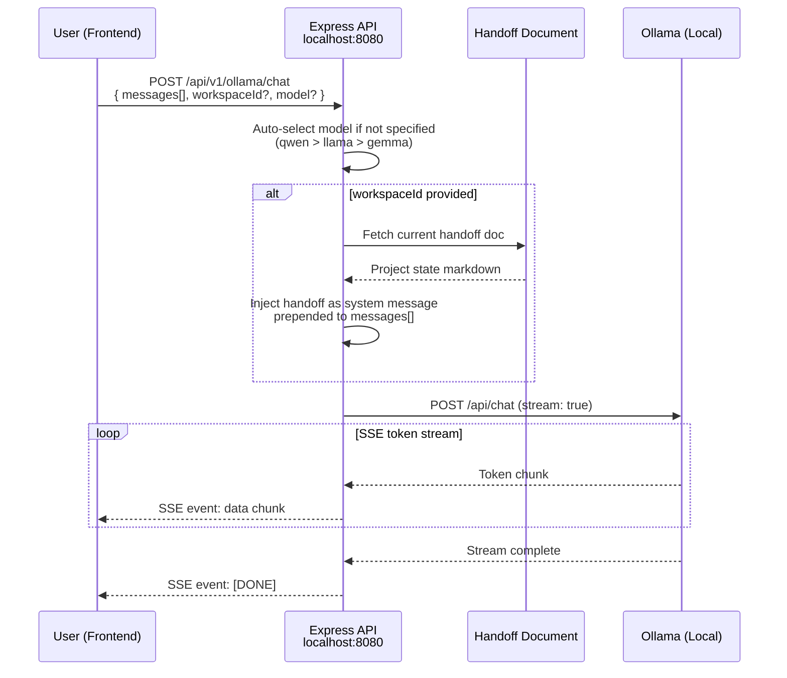

---

## 2. Agent Execution

The `AgentAdapter` supports three architectures: **react**, **plan-execute**, and **simple**. All goals are security-scanned before execution. Agents operate in dual mode -- local Ollama or remote via `nodeManager`.

### Tools Available to Agents

| Tool | Description |
|------|-------------|
| `think` | Internal reasoning step (no side effects) |
| `search` | Search workspace content |
| `calculate` | Evaluate mathematical expressions |
| `filesystem` | Read/write/list files in sandboxed paths |
| `sandbox` | Execute code in isolated environment |
| `memory_store` | Store semantic memory (ELID) |
| `memory_search` | Search memories via embeddings |

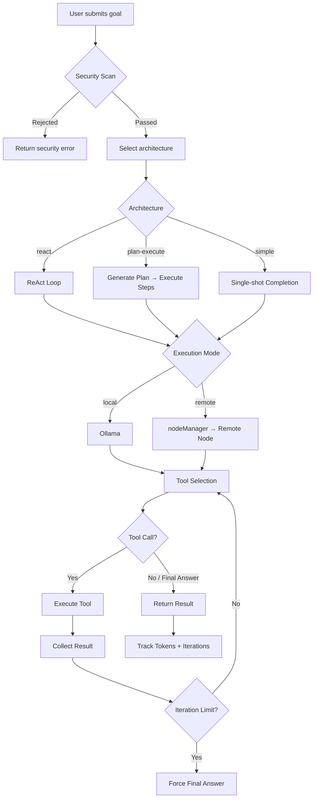

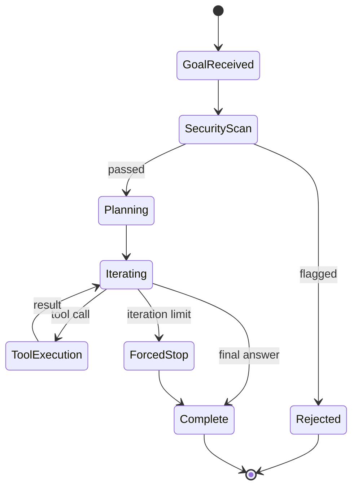

---

## 3. Transcription

Audio from voice/video chat is captured per peer stream using `MediaRecorder` at 15-second intervals. Chunks are sent to the backend, transcribed locally via Ollama's whisper model, aggregated per session, and exported to IPFS on finalize.

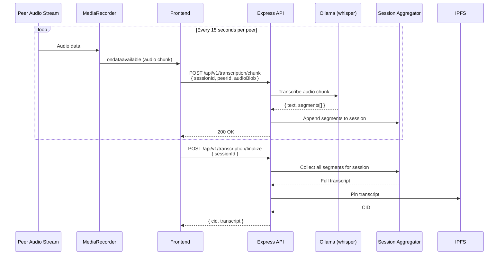

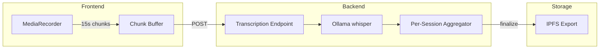

---

## 4. AI Digest

A scheduled job running every **12 hours**. Gathers recent workspace artifacts from IPFS (chat logs, transcriptions, whiteboard snapshots), builds a structured prompt, calls Ollama, and parses the JSON response. Suggested tasks are auto-created.

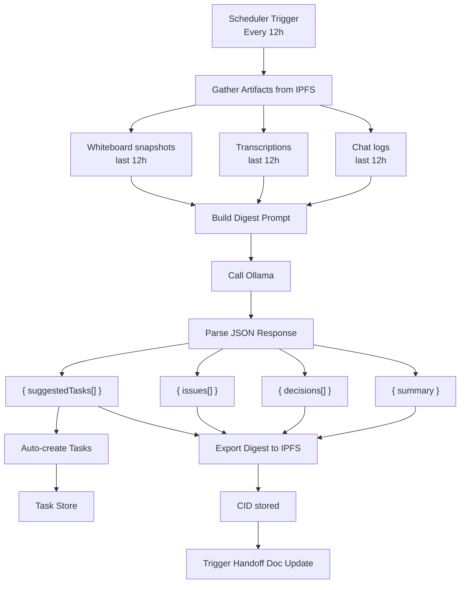

### Digest JSON Schema

```json
{
  "summary": "string — high-level summary of the 12h period",
  "decisions": ["string — each decision made"],
  "issues": ["string — each issue identified"],
  "suggestedTasks": [
    {
      "title": "string",
      "description": "string",
      "priority": "low | medium | high"
    }
  ]
}
```

---

## 5. Handoff Document

A living document updated after each digest cycle. It aggregates the latest digest, current tasks, repository state, and recent decisions into a comprehensive markdown document. This document serves two purposes:

1. Onboarding context for new contributors joining a workspace.
2. System prompt injection for AI chat (see Section 1).

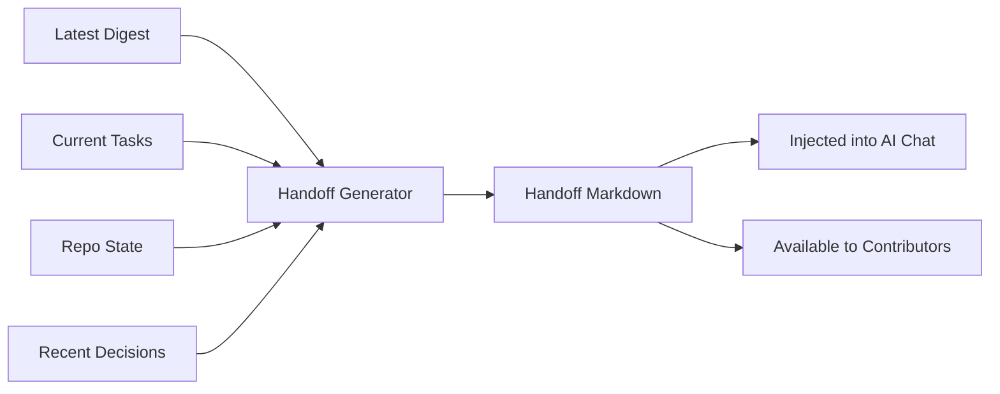

---

## 6. Health Reports

A scheduled job running every **48 hours**. Computes participation metrics and task velocity, then uses Ollama to generate AI predictions and recommendations.

**Participation metrics:** unique speakers, message counts, artifact counts.

**Task velocity:** created, completed, in-progress, blocked counts over the period.

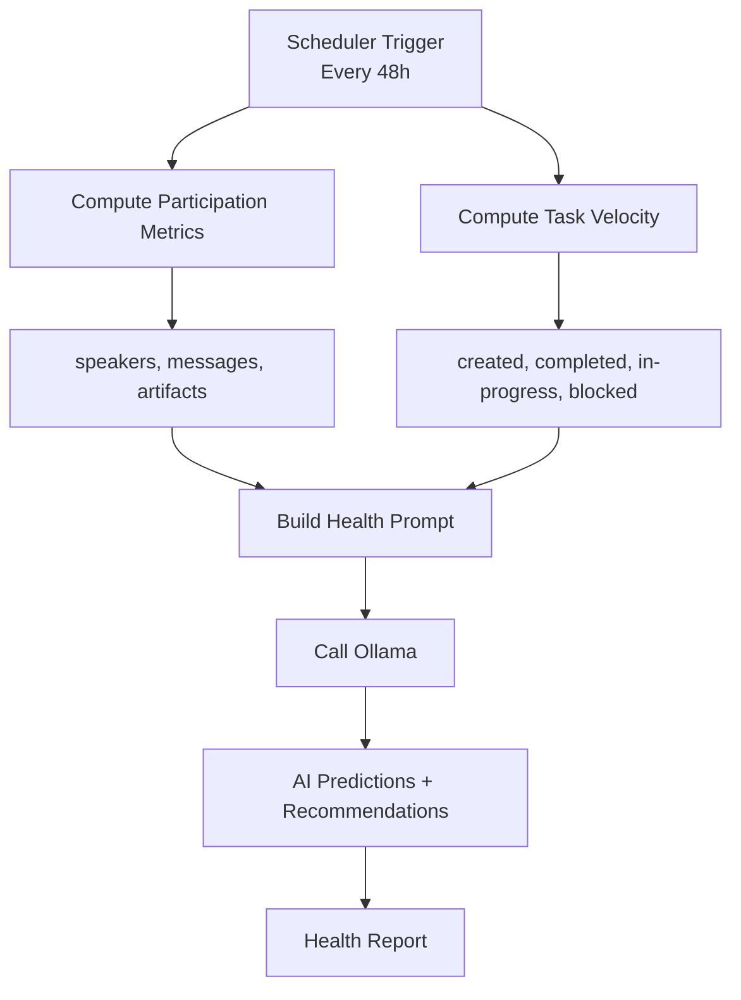

---

## 7. Dispute Analysis

When a milestone is disputed, AI can analyze the situation. It gathers all available evidence -- task details, workspace chat, transcriptions, and code -- then prompts Ollama for a structured recommendation. The result is **advisory only** (no automatic on-chain action).

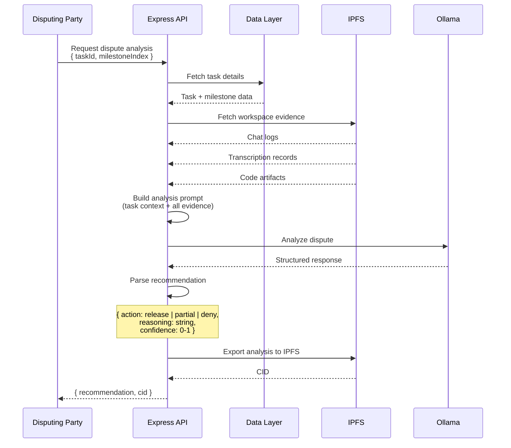

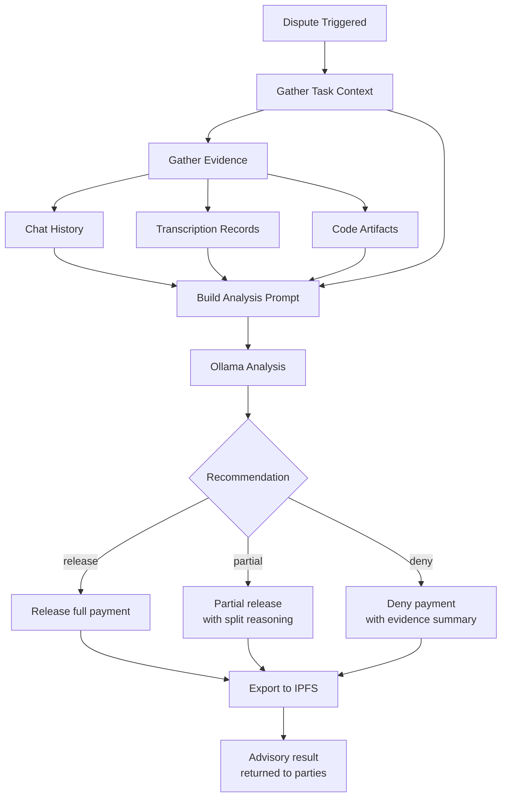

---

## 8. Workspace Tools

AI agents and chat can invoke workspace tools to read and mutate workspace state.

| Tool | Action | Description |
|------|--------|-------------|
| `update_task` | Write | Update task status, assignee, or details |
| `create_task` | Write | Create a new task in the workspace |
| `list_tasks` | Read | List tasks with optional filters |
| `search_chat` | Read | Full-text search across chat history |
| `get_workspace_state` | Read | Snapshot of workspace members, tasks, repos |

---

## 9. Semantic Memory (ELID)

Per-workspace semantic memory using embeddings for storage and retrieval.

| Operation | Description |
|-----------|-------------|
| `memory_store` | Store a text chunk with embedding vector, scoped to workspace |
| `memory_search` | Cosine similarity search over stored embeddings |
| `memory_recent` | Retrieve most recently stored memories |
| `memory_stats` | Count and metadata for workspace memory store |

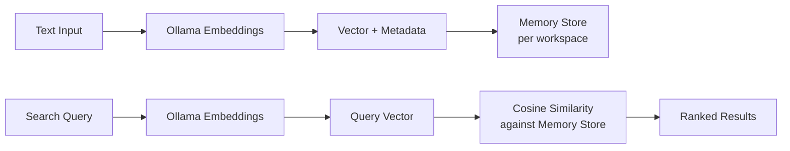

---

## 10. Service Dependency Graph

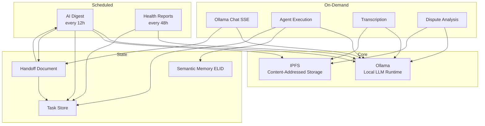

---

## 11. Endpoints Catalog

| Method | Endpoint | Description | Response |
|--------|----------|-------------|----------|
| POST | `/api/v1/ollama/chat` | Stream chat completion via SSE | SSE stream |
| POST | `/api/v1/ollama/models` | List available local models | JSON |
| POST | `/api/v1/agent/execute` | Execute agent with goal | JSON (streaming) |
| POST | `/api/v1/transcription/chunk` | Submit audio chunk for transcription | JSON |
| POST | `/api/v1/transcription/finalize` | Finalize session, export to IPFS | JSON { cid } |
| GET | `/api/v1/workspace/:id/digest` | Get latest digest | JSON |
| POST | `/api/v1/workspace/:id/digest/trigger` | Manually trigger digest | JSON |
| GET | `/api/v1/workspace/:id/handoff` | Get current handoff document | Markdown |
| GET | `/api/v1/workspace/:id/health` | Get latest health report | JSON |
| POST | `/api/v1/dispute/:taskId/analyze` | Run AI dispute analysis | JSON |
| POST | `/api/v1/memory/store` | Store semantic memory | JSON |
| POST | `/api/v1/memory/search` | Search semantic memory | JSON |
| GET | `/api/v1/memory/recent` | Get recent memories | JSON |
| GET | `/api/v1/memory/stats` | Get memory statistics | JSON |
