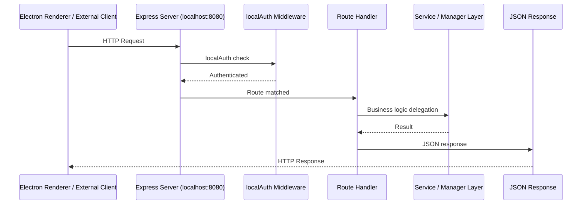

# API Endpoint Catalog

## Overview

OtherThing Node exposes a local Express API at `localhost:8080` with 188+ endpoints across 30 route files. All routes use the `localAuth` middleware for authentication and receive dependencies via the `RouteDependencies` injection pattern.

---

## Request Flow



## RouteDependencies Injection Pattern

Each route file exports a function that receives a `RouteDependencies` object containing shared services, managers, and configuration. This avoids global singletons and allows each route module to access only the dependencies it needs.

```
function registerRoutes(deps: RouteDependencies): Router {
    // deps.ipfsManager, deps.sandboxManager, deps.agentService, etc.
    const router = express.Router();
    // ... define routes using deps ...
    return router;
}
```

---

## Endpoint Catalog by Domain

### Auth (4 endpoints)

| Method | Path | Description |
|--------|------|-------------|
| POST | `/api/auth/signup` | Create a new user account |
| POST | `/api/auth/login` | Authenticate and receive session |
| POST | `/api/auth/logout` | End current session |
| GET | `/api/auth/me` | Get current authenticated user |

### Workspaces (6 endpoints)

| Method | Path | Description |
|--------|------|-------------|
| GET | `/api/workspaces` | List all workspaces for current user |
| POST | `/api/workspaces` | Create a new workspace |
| POST | `/api/workspaces/:id/join` | Join an existing workspace |
| GET | `/api/workspaces/:id` | Get workspace details |
| DELETE | `/api/workspaces/:id` | Delete a workspace |
| POST | `/api/workspaces/:id/leave` | Leave a workspace |

### Tasks (4 endpoints)

| Method | Path | Description |
|--------|------|-------------|
| GET | `/api/workspaces/:id/tasks` | List tasks in a workspace |
| POST | `/api/workspaces/:id/tasks` | Create a new task |
| PUT | `/api/workspaces/:id/tasks/:taskId` | Update an existing task |
| DELETE | `/api/workspaces/:id/tasks/:taskId` | Delete a task |

### Agents (6 endpoints)

| Method | Path | Description |
|--------|------|-------------|
| GET | `/api/workspaces/:id/agents` | List agents in a workspace |
| POST | `/api/workspaces/:id/agents` | Create a new agent |
| POST | `/api/workspaces/:id/agents/analyze` | Run agent analysis on workspace |
| POST | `/api/workspaces/:id/agents/scan` | Scan workspace with agent |
| GET | `/api/workspaces/:id/agents/:agentId` | Get agent details |
| POST | `/api/workspaces/:id/agents/:agentId/cancel` | Cancel running agent execution |

### Nodes (6 endpoints)

| Method | Path | Description |
|--------|------|-------------|
| GET | `/api/workspaces/:id/nodes` | List nodes in a workspace |
| POST | `/api/workspaces/:id/nodes` | Add a node by key |
| DELETE | `/api/workspaces/:id/nodes/:nodeId` | Remove a node from workspace |
| GET | `/api/nodes/my-nodes` | List nodes owned by current user |
| POST | `/api/workspaces/:id/nodes/:nodeId/assign` | Assign node to a task |
| GET | `/api/nodes` | List all known nodes |

### Flows (3 endpoints)

| Method | Path | Description |
|--------|------|-------------|
| GET | `/api/workspaces/:id/flows` | List flows in a workspace |
| POST | `/api/workspaces/:id/flows` | Create a new flow |
| DELETE | `/api/workspaces/:id/flows/:flowId` | Delete a flow |

### Repos (9 endpoints)

| Method | Path | Description |
|--------|------|-------------|
| GET | `/api/workspaces/:id/repos` | List repos in a workspace |
| POST | `/api/workspaces/:id/repos/clone` | Clone a repo into workspace |
| POST | `/api/workspaces/:id/repos/:repoId/sync` | Sync repo to IPFS |
| POST | `/api/workspaces/:id/repos/:repoId/pull` | Pull repo from IPFS |
| POST | `/api/workspaces/:id/repos/:repoId/analyze` | Analyze repo contents |
| DELETE | `/api/workspaces/:id/repos/:repoId` | Delete a repo |
| POST | `/api/repos/analyze` | Standalone: analyze a repo path |
| GET | `/api/repos/analyze/:analysisId` | Standalone: get analysis result |
| DELETE | `/api/repos/analyze/:analysisId` | Standalone: clear analysis |

### Storage (7 endpoints)

| Method | Path | Description |
|--------|------|-------------|
| GET | `/api/storage/files` | List files in storage |
| POST | `/api/storage/upload` | Upload a file |
| GET | `/api/storage/files/:fileId` | Get file content |
| DELETE | `/api/storage/files/:fileId` | Delete a file |
| GET | `/api/storage/api-keys` | List storage API keys |
| POST | `/api/storage/api-keys` | Create a storage API key |
| DELETE | `/api/storage/api-keys/:keyId` | Delete a storage API key |
| GET | `/api/storage/usage` | Get storage usage statistics |

### Compute (40+ endpoints)

| Method | Path | Description |
|--------|------|-------------|
| GET | `/api/compute/summary` | Local compute resource summary |
| **Sandbox** | | |
| GET | `/api/compute/sandbox` | List sandboxes |
| POST | `/api/compute/sandbox` | Create a sandbox |
| GET | `/api/compute/sandbox/:id` | Get sandbox details |
| DELETE | `/api/compute/sandbox/:id` | Delete a sandbox |
| GET | `/api/compute/sandbox/:id/settings` | Get sandbox settings |
| PUT | `/api/compute/sandbox/:id/settings` | Update sandbox settings |
| POST | `/api/compute/sandbox/:id/chat` | Chat with sandbox agent |
| **Code Server** | | |
| POST | `/api/compute/code-server/start` | Start code-server for workspace |
| GET | `/api/compute/code-server/status` | Get code-server status |
| POST | `/api/compute/code-server/stop` | Stop code-server |
| GET | `/api/compute/stats` | Compute statistics |
| GET | `/api/compute/hardware` | Hardware detection info |
| GET | `/api/compute/drives` | List available drives |
| GET | `/api/compute/models` | List local models |
| **Cloud GPU (Vast.ai)** | | |
| POST | `/api/compute/gpu/configure` | Set Vast.ai API key |
| GET | `/api/compute/gpu/offers` | Search GPU offers |
| GET | `/api/compute/gpu/instances` | List rented instances |
| POST | `/api/compute/gpu/rent` | Rent a GPU instance |
| POST | `/api/compute/gpu/tunnel` | Create SSH tunnel to instance |
| POST | `/api/compute/gpu/pull` | Pull model to GPU instance |
| GET | `/api/compute/gpu/models` | List models on GPU instance |
| DELETE | `/api/compute/gpu/instances/:id` | Terminate GPU instance |
| **ZLayer** | | |
| GET | `/api/compute/zlayer/status` | ZLayer CLI status |
| POST | `/api/compute/zlayer/install` | Install ZLayer CLI |
| GET | `/api/compute/zlayer/services` | List deployed services |
| POST | `/api/compute/zlayer/deploy` | Deploy a service |
| POST | `/api/compute/zlayer/stop` | Stop a service |
| DELETE | `/api/compute/zlayer/services/:id` | Remove a service |
| POST | `/api/compute/zlayer/scale` | Scale a service |
| GET | `/api/compute/zlayer/logs` | Get service logs |
| POST | `/api/compute/zlayer/wasm` | Execute WASM module |
| POST | `/api/compute/zlayer/build` | Build container image |
| POST | `/api/compute/zlayer/workspace-deploy` | Auto-containerize and deploy workspace |

### Web3 (11 endpoints)

| Method | Path | Description |
|--------|------|-------------|
| GET | `/api/web3/contracts` | Get contract addresses |
| POST | `/api/web3/contracts` | Set contract addresses |
| POST | `/api/web3/fund-wallet` | Fund a wallet |
| GET | `/api/web3/node-capabilities` | Get node capabilities config |
| GET | `/api/web3/networks` | List supported networks |
| POST | `/api/web3/nodes/verify` | Submit node for verification |
| GET | `/api/web3/nodes/verified` | List verified nodes |
| GET | `/api/web3/nodes/compute` | List compute-capable nodes |
| GET | `/api/web3/nodes/pending` | List pending verification |
| POST | `/api/web3/nodes/unlink` | Unlink a node |
| POST | `/api/web3/nodes/report` | Report a node |
| GET | `/api/web3/stats` | Web3 network statistics |

### Ollama (7 endpoints)

| Method | Path | Description |
|--------|------|-------------|
| GET | `/api/ollama/status` | Check Ollama service status |
| POST | `/api/ollama/start` | Start Ollama service |
| POST | `/api/ollama/stop` | Stop Ollama service |
| GET | `/api/ollama/models` | List available models |
| POST | `/api/ollama/pull` | Pull a model |
| POST | `/api/ollama/chat` | Chat with a model |
| DELETE | `/api/ollama/models/:model` | Delete a model |

### IPFS (7 endpoints)

| Method | Path | Description |
|--------|------|-------------|
| GET | `/api/ipfs/status` | IPFS daemon status |
| POST | `/api/ipfs/start` | Start IPFS daemon |
| POST | `/api/ipfs/stop` | Stop IPFS daemon |
| POST | `/api/ipfs/add` | Add content to IPFS |
| POST | `/api/ipfs/pin` | Pin content by CID |
| POST | `/api/ipfs/unpin` | Unpin content by CID |
| POST | `/api/ipfs/download` | Download IPFS binary |

### Git (9 endpoints)

| Method | Path | Description |
|--------|------|-------------|
| GET | `/api/git/github/auth` | Initiate GitHub OAuth flow |
| GET | `/api/git/github/callback` | GitHub OAuth callback |
| GET | `/api/git/github/status` | Check GitHub auth status |
| POST | `/api/git/github/disconnect` | Disconnect GitHub account |
| GET | `/api/git/github/repos` | List GitHub repos |
| GET | `/api/git/ssh-keys` | List SSH keys |
| POST | `/api/git/ssh-keys/generate` | Generate new SSH key pair |
| POST | `/api/git/ssh-keys/import` | Import existing SSH key |
| DELETE | `/api/git/ssh-keys/:id` | Delete an SSH key |
| POST | `/api/git/clone` | Clone a repository |

### Adapters (5 endpoints)

| Method | Path | Description |
|--------|------|-------------|
| GET | `/api/adapters` | List available adapters |
| GET | `/api/adapters/tools` | List adapter tools |
| GET | `/api/adapters/:id` | Get adapter details |
| POST | `/api/adapters/:id/execute` | Execute adapter method |
| POST | `/api/adapters/mcp/execute` | Execute MCP tool |

### UAF - Universal Abstraction Framework (13 endpoints)

| Method | Path | Description |
|--------|------|-------------|
| GET | `/api/uaf/grid` | Get UAF grid |
| GET | `/api/uaf/stats` | Get UAF statistics |
| GET | `/api/uaf/elements` | List elements |
| POST | `/api/uaf/elements` | Create an element |
| GET | `/api/uaf/elements/:id` | Get element details |
| PUT | `/api/uaf/elements/:id` | Update an element |
| DELETE | `/api/uaf/elements/:id` | Delete an element |
| GET | `/api/uaf/relationships` | List relationships |
| POST | `/api/uaf/relationships` | Create a relationship |
| DELETE | `/api/uaf/relationships/:id` | Delete a relationship |
| GET | `/api/uaf/views` | List UAF views |
| POST | `/api/uaf/export` | Export UAF data |
| POST | `/api/uaf/import` | Import UAF data |

### Memory (8 endpoints)

| Method | Path | Description |
|--------|------|-------------|
| POST | `/api/memory/store` | Store a memory entry |
| POST | `/api/memory/search` | Search memory entries |
| GET | `/api/memory/recent` | Get recent memory entries |
| GET | `/api/memory/stats` | Memory usage statistics |
| DELETE | `/api/memory/:id` | Delete a memory entry |
| DELETE | `/api/memory` | Clear all memory entries |
| POST | `/api/memory/export` | Export all memory |
| POST | `/api/memory/import` | Import memory dump |

### Profiles (7 endpoints)

| Method | Path | Description |
|--------|------|-------------|
| GET | `/api/profiles/:userId` | Get user profile |
| PUT | `/api/profiles/:userId` | Update user profile |
| POST | `/api/profiles/wallet-challenge` | Request wallet auth challenge |
| POST | `/api/profiles/link-wallet` | Link wallet to profile |
| POST | `/api/profiles/unlink-wallet` | Unlink wallet from profile |
| GET | `/api/profiles/address/:address` | Get profile by wallet address |

### Agreements (5 endpoints)

| Method | Path | Description |
|--------|------|-------------|
| POST | `/api/agreements` | Create an agreement |
| GET | `/api/agreements` | List agreements |
| POST | `/api/agreements/:id/sign` | Sign an agreement |
| GET | `/api/agreements/:id/check` | Check agreement status |
| GET | `/api/agreements/:id/signatures` | List signatures |

### Milestones (9 endpoints)

| Method | Path | Description |
|--------|------|-------------|
| POST | `/api/milestones` | Create a milestone |
| POST | `/api/milestones/:id/assign` | Assign milestone to user |
| POST | `/api/milestones/:id/submit` | Submit milestone for review |
| POST | `/api/milestones/:id/approve` | Approve milestone |
| POST | `/api/milestones/:id/release` | Release milestone payment |
| POST | `/api/milestones/:id/dispute` | Dispute a milestone |
| POST | `/api/milestones/:id/cancel` | Cancel a milestone |
| GET | `/api/milestones/:id` | Get milestone details |
| GET | `/api/milestones` | List milestones |

### IP - Intellectual Property (5 endpoints)

| Method | Path | Description |
|--------|------|-------------|
| GET | `/api/ip/license-types` | List available license types |
| POST | `/api/ip/register` | Register IP for a task |
| GET | `/api/ip/task/:taskId` | Get IP records for a task |
| POST | `/api/ip/check` | Check IP compliance |
| GET | `/api/ip/workspace/:workspaceId` | List IP in a workspace |

### Treasury (2 endpoints)

| Method | Path | Description |
|--------|------|-------------|
| GET | `/api/treasury/info` | Get treasury information |
| GET | `/api/treasury/packs` | List available OTT packs |

### Exports (4 endpoints)

| Method | Path | Description |
|--------|------|-------------|
| POST | `/api/exports/chat` | Export workspace chat to IPFS |
| POST | `/api/exports/whiteboard` | Export whiteboard to IPFS |
| GET | `/api/exports` | List exported artifacts |
| GET | `/api/exports/:cid` | Get artifact by CID |

### Scheduler (2 endpoints)

| Method | Path | Description |
|--------|------|-------------|
| GET | `/api/scheduler/jobs` | List scheduled jobs |
| POST | `/api/scheduler/jobs/:jobId/trigger` | Manually trigger a job |

### Transcription (3 endpoints)

| Method | Path | Description |
|--------|------|-------------|
| POST | `/api/transcription/chunk` | Send audio chunk for transcription |
| POST | `/api/transcription/session` | Start a transcription session |
| POST | `/api/transcription/finalize` | Finalize and close session |

### Digest (5 endpoints)

| Method | Path | Description |
|--------|------|-------------|
| POST | `/api/digest/generate` | Generate workspace digest |
| GET | `/api/digest/latest` | Get latest digest |
| GET | `/api/digest/history` | Get digest history |
| GET | `/api/digest/handoff` | Get handoff document |
| POST | `/api/digest/handoff/regenerate` | Regenerate handoff document |

### Disputes (2 endpoints)

| Method | Path | Description |
|--------|------|-------------|
| POST | `/api/disputes/analyze` | Analyze a dispute |
| GET | `/api/disputes/:id/analysis` | Get dispute analysis |

### Health Reports (3 endpoints)

| Method | Path | Description |
|--------|------|-------------|
| POST | `/api/health-reports/generate` | Generate workspace health report |
| GET | `/api/health-reports/latest` | Get latest health report |
| GET | `/api/health-reports/history` | Get health report history |

### Sandbox Preview (3 endpoints)

| Method | Path | Description |
|--------|------|-------------|
| POST | `/api/sandbox-preview/start` | Start dev server preview |
| GET | `/api/sandbox-preview/status` | Get preview status |
| POST | `/api/sandbox-preview/stop` | Stop dev server preview |
