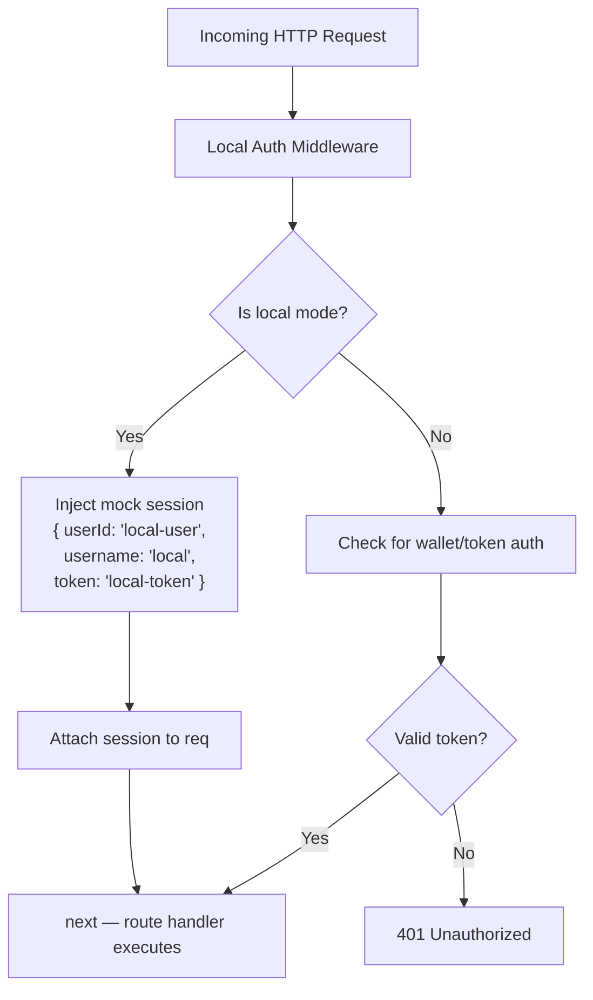
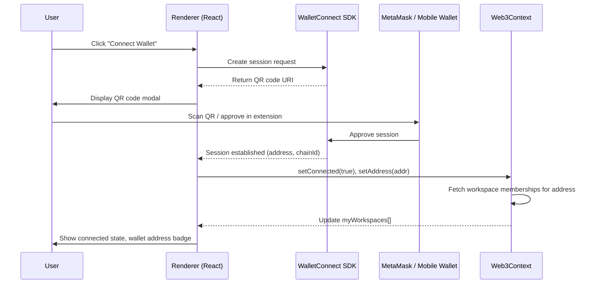
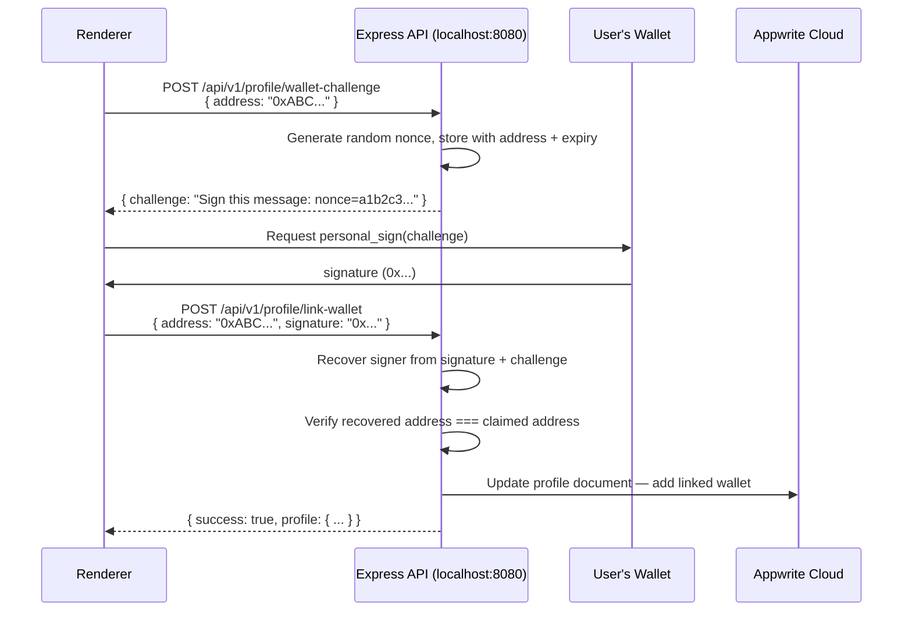
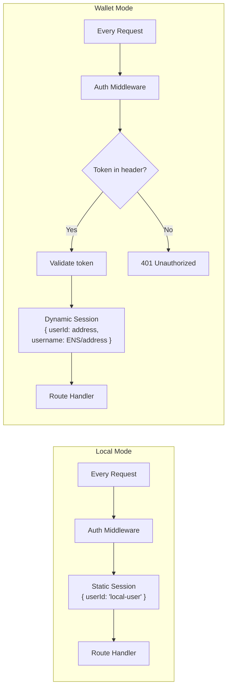
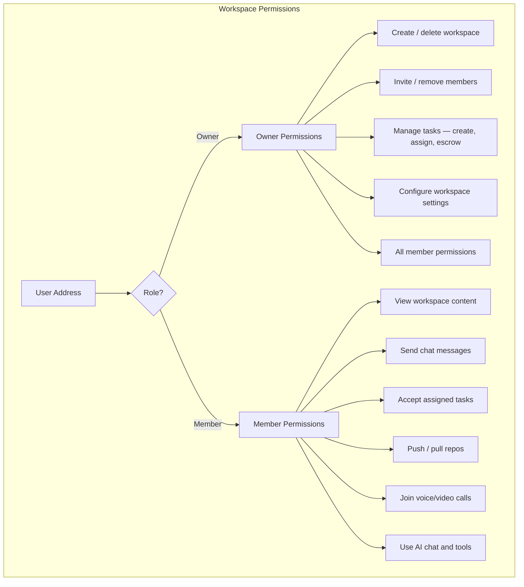

# Authentication & Wallet Connection

## Overview

OtherThing Node supports two authentication modes: a **local auth bypass** for the desktop Electron app and a **wallet-based identity** system using Ethereum wallets via WalletConnect. An optional **Appwrite cloud profile** layer allows users to persist display names, avatars, and linked wallet addresses.

---

## 1. Local Auth Bypass

The desktop app runs an Express API at `localhost:8080`. A middleware intercepts every incoming request and injects a mock session, removing the need for any real authentication in local mode.

**Injected session object:**

```json
{
  "userId": "local-user",
  "username": "local",
  "token": "local-token"
}
```

Every API route receives this session on `req.session` (or equivalent), so all permission checks pass transparently.



---

## 2. Wallet Connection

Users connect an Ethereum wallet (MetaMask, WalletConnect-compatible wallets) through a QR code modal rendered in the Electron renderer. The `Web3Context` React context manages connection state and exposes it to all workspace components.

### Web3Context State

| Field          | Type       | Description                                      |
|----------------|------------|--------------------------------------------------|
| `connected`    | `boolean`  | Whether a wallet is currently connected           |
| `address`      | `string`   | Connected wallet's Ethereum address (checksummed) |
| `myWorkspaces` | `string[]` | Workspace IDs the connected address belongs to    |

### Connection Flow



---

## 3. Profile Linking

Links an Ethereum wallet address to an Appwrite cloud profile using a challenge-response signature flow. This proves wallet ownership without exposing private keys.

### Flow



### Unlinking

```
DELETE /api/v1/profile/unlink-wallet
Body: { address: "0xABC..." }
```

Removes the wallet association from the Appwrite profile. The wallet can then be linked to a different profile.

---

## 4. Appwrite Cloud Profiles

Optional cloud-synced profiles stored in Appwrite. Used for display names, avatars, and cross-device identity persistence.

| Field          | Type     | Description                           |
|----------------|----------|---------------------------------------|
| `userId`       | `string` | Appwrite user ID                      |
| `displayName`  | `string` | User-chosen display name              |
| `avatar`       | `string` | URL or Appwrite file ID for avatar    |
| `walletAddresses` | `string[]` | Linked Ethereum addresses         |
| `bio`          | `string` | Optional profile bio                  |

---

## 5. Session Model Comparison



| Aspect             | Local Mode                        | Wallet Mode                                 |
|--------------------|-----------------------------------|---------------------------------------------|
| Identity           | Fixed: `local-user`               | Ethereum address (e.g., `0xABC...`)          |
| Authentication     | None (auto-injected)              | Wallet signature via WalletConnect            |
| Token              | `local-token` (static)            | JWT or session token from challenge-response  |
| Profile            | Implicit local profile            | Appwrite cloud profile (optional)             |
| Multi-user         | No                                | Yes                                          |
| Persistence        | None needed                       | Token stored in localStorage / secure storage |

---

## 6. Permissions Model



| Permission               | Owner | Member |
|--------------------------|:-----:|:------:|
| Create workspace         |  Yes  |   --   |
| Delete workspace         |  Yes  |   No   |
| Invite members           |  Yes  |   No   |
| Remove members           |  Yes  |   No   |
| Create tasks             |  Yes  |  Yes   |
| Assign tasks             |  Yes  |   No   |
| Escrow funds for tasks   |  Yes  |   No   |
| Accept tasks             |  Yes  |  Yes   |
| Send chat messages       |  Yes  |  Yes   |
| Clone / sync repos       |  Yes  |  Yes   |
| Join calls               |  Yes  |  Yes   |
| Use code-server          |  Yes  |  Yes   |
| View workspace settings  |  Yes  |  Yes   |
| Modify workspace settings|  Yes  |   No   |

---

## API Endpoints Reference

### Auth

| Method | Path                              | Description                        |
|--------|-----------------------------------|------------------------------------|
| POST   | `/api/v1/auth/signup`             | Create new account                 |
| POST   | `/api/v1/auth/login`              | Log in, receive session token      |
| POST   | `/api/v1/auth/logout`             | Invalidate current session         |
| GET    | `/api/v1/auth/me`                 | Return current authenticated user  |

### Profile

| Method | Path                              | Description                                   |
|--------|-----------------------------------|-----------------------------------------------|
| GET    | `/api/v1/profile`                 | Get current user's profile                    |
| PUT    | `/api/v1/profile`                 | Update current user's profile (name, avatar)  |
| POST   | `/api/v1/profile/wallet-challenge`| Request a signing challenge for wallet linking |
| POST   | `/api/v1/profile/link-wallet`     | Submit signed challenge to link wallet         |
| DELETE | `/api/v1/profile/unlink-wallet`   | Remove a linked wallet from profile            |
| GET    | `/api/v1/profile/:address`        | Look up profile by Ethereum address            |
