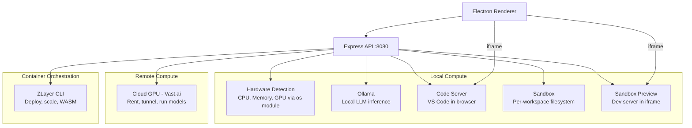
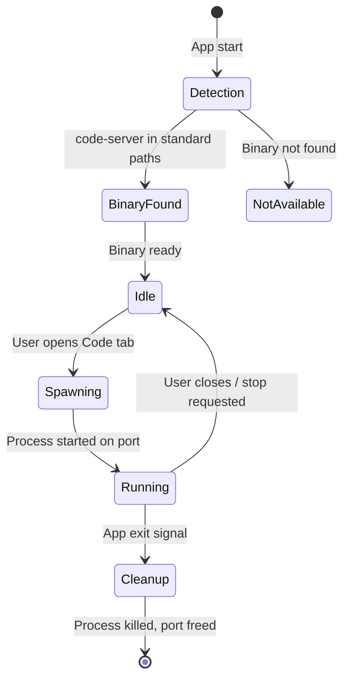
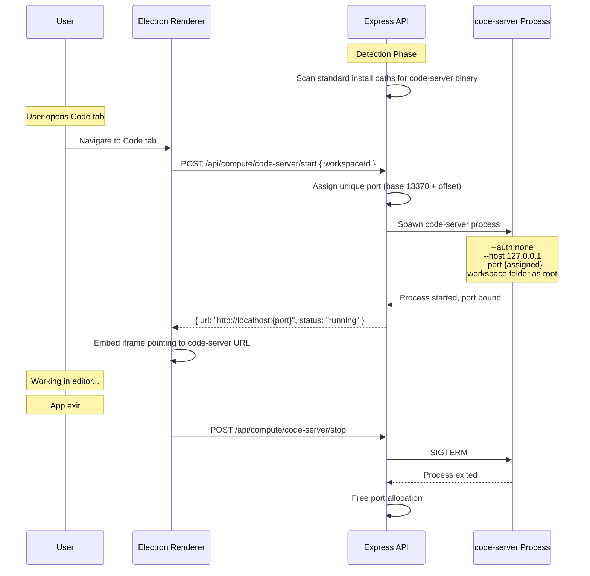
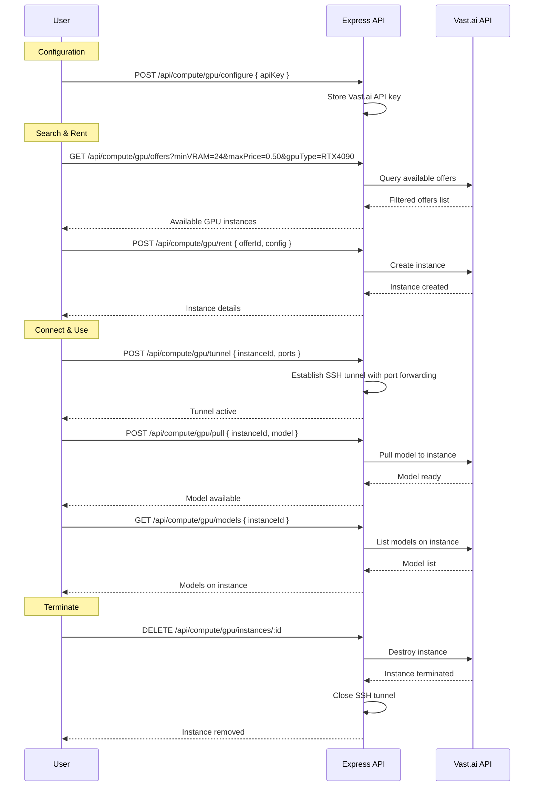
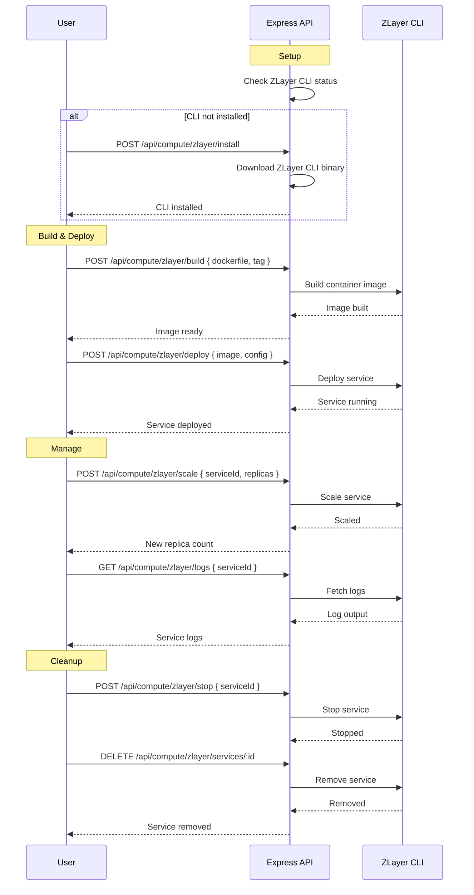
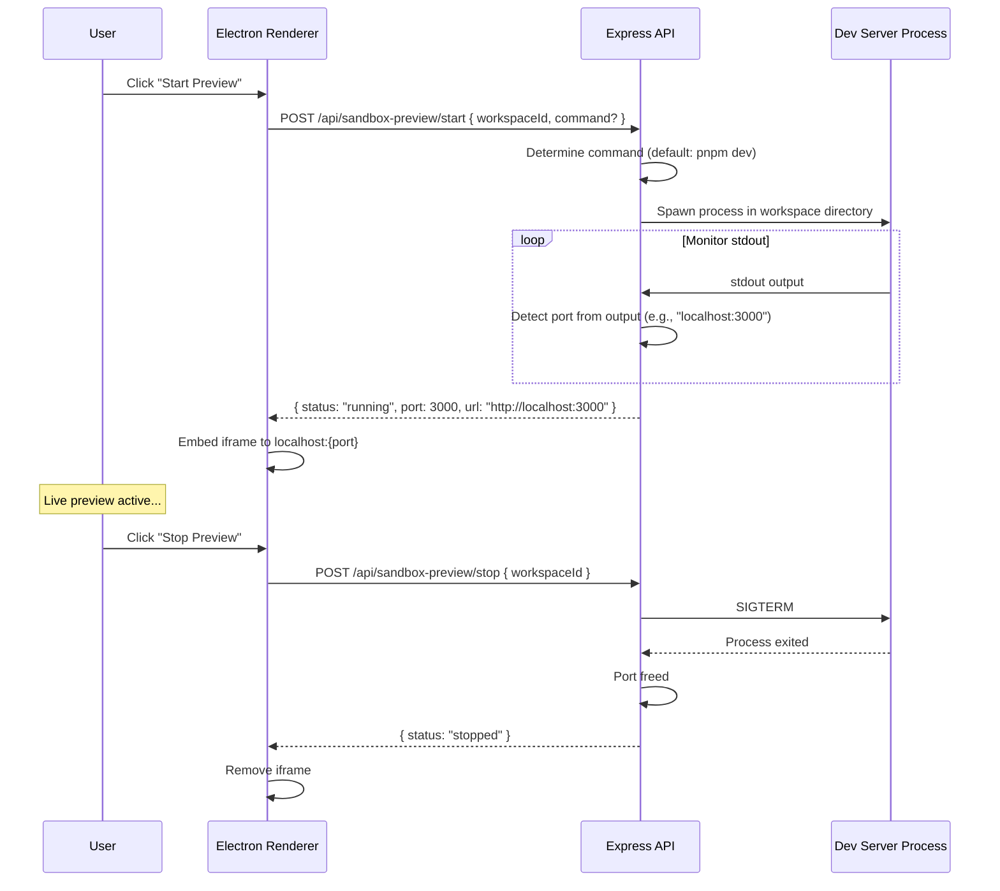

# Compute, Code Server & Containers

## Overview

OtherThing Node provides a layered compute architecture spanning local code editing (code-server), per-workspace sandboxes, cloud GPU rental (Vast.ai), container orchestration (ZLayer), sandbox preview for dev servers, and local hardware detection. All compute resources are managed through the Express API and surfaced in the Electron UI.

---

## Compute Resource Architecture

---

## Code Server

The code-server integration embeds a full VS Code editor inside the workspace Code tab via iframe.

### Lifecycle

### Code Server Lifecycle (Detailed)

**Key details:**
- Binary detected from standard install paths (e.g., `/usr/bin/code-server`, `~/.local/bin/code-server`)
- Each workspace gets a unique port starting from base `13370`
- Auth is disabled (`--auth none`) since access is localhost-only
- Workspace folder is set as the editor root directory
- On app exit, all code-server processes are cleaned up via SIGTERM

---

## Sandbox

Per-workspace isolated filesystem for agent code execution.

### Operations

| Operation | Description |
|-----------|-------------|
| Create | Initialize sandbox directory for a workspace |
| List files | Enumerate files in the sandbox |
| Read file | Read file content from sandbox |
| Write file | Write or create a file in sandbox |
| Delete file | Remove a file from sandbox |
| Delete sandbox | Remove entire sandbox directory |

Sandboxes provide isolation so that agent-executed code operates within a contained filesystem boundary per workspace, without affecting the host or other workspaces.

---

## Cloud GPU (Vast.ai Integration)

Rent remote GPU instances for model inference, fine-tuning, or heavy compute tasks.

### GPU Rental Flow

**Offer filters:**
- Minimum VRAM (GB)
- Maximum price ($/hr)
- GPU type (RTX 3090, RTX 4090, A100, etc.)

---

## ZLayer Container Orchestration

ZLayer provides container deployment, scaling, and WASM execution capabilities.

### ZLayer Deployment Flow

### ZLayer Capabilities

| Feature | Description |
|---------|-------------|
| Service deploy | Deploy container images as services |
| Service stop/remove | Lifecycle management |
| Service scale | Adjust replica count |
| Service logs | Stream/fetch logs |
| Image build | Build container images from Dockerfiles |
| WASM execution | Run WebAssembly modules |
| WASM support detection | Check if host supports WASM runtime |
| Workspace deploy | Auto-containerize a workspace and deploy |

### Workspace Auto-Deploy

The `workspace-deploy` endpoint packages an entire workspace into a container image and deploys it via ZLayer in a single operation. This automates the build-deploy cycle for rapid iteration.

---

## Sandbox Preview

Run a workspace's dev server and embed it in the UI for live preview.

### Sandbox Preview Flow

**Key details:**
- Default command is `pnpm dev`, can be overridden per workspace
- Port is auto-detected by parsing stdout for common patterns (e.g., `localhost:XXXX`, `port XXXX`)
- Preview is embedded as an iframe in the workspace UI
- Process is killed and port freed on stop or app exit

---

## Local Compute Summary

The `/api/compute/summary` endpoint aggregates local compute resource information.

| Resource | Detection Method |
|----------|-----------------|
| CPU | `os.cpus()` -- model, cores, speed |
| Memory | `os.totalmem()` / `os.freemem()` |
| GPU count | System-specific detection |
| Ollama models | Query Ollama API for installed models |

The hardware detection endpoint (`/api/compute/hardware`) provides detailed system information for compute capability reporting, used by the Web3 node verification system to advertise what a node can offer to the network.
