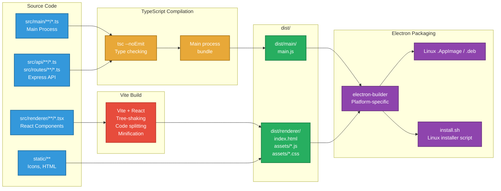
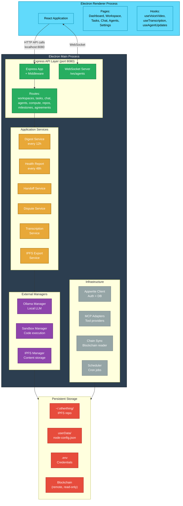
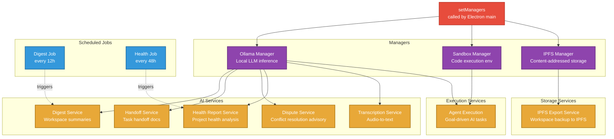

# Build & Deployment Data Flows

## Overview

OtherThing Node is an Electron desktop application with an embedded Express API server. The build pipeline compiles TypeScript, bundles the React renderer with Vite, and packages everything into a native desktop application. At runtime, the main process initializes services in a specific dependency order before the application becomes fully operational.

---

## Development Setup

### Prerequisites

| Dependency | Minimum Version | Purpose |
|------------|-----------------|---------|
| Node.js | 18+ | Runtime for main process and build tools |
| pnpm | Latest | Package manager (workspace-aware) |
| Git | Latest | Source control, also used at runtime for repo operations |

### Development Commands

| Command | Effect |
|---------|--------|
| `pnpm install` | Install all dependencies |
| `pnpm dev` | Start Vite dev server (renderer hot reload) + Electron main process |

**Development mode behavior:**
- Vite dev server serves the renderer with HMR (hot module replacement)
- Electron main process loads the Vite dev URL instead of built files
- Express API server starts on port 8080 (same as production)
- Changes to renderer code reflect immediately via HMR
- Changes to main process code require Electron restart

---

## Build Pipeline

### Compilation Stages

| Stage | Input | Output | Tool |
|-------|-------|--------|------|
| 1. TypeScript Compilation | `src/**/*.ts`, `src/**/*.tsx` | Type-checked JavaScript | `tsc` |
| 2. Vite Build (Renderer) | `src/renderer/**/*.tsx` | Optimized bundle in `dist/renderer/` | Vite + React plugin |
| 3. Main Process Bundle | `src/main/**/*.ts`, `src/api/**/*.ts` | Bundled main process JS | Vite or esbuild |
| 4. Electron Packaging | `dist/` + `node_modules/` | Platform-specific installer | electron-builder |

### Build Pipeline Diagram



---

## Runtime Architecture

### Process Model

OtherThing runs as a multi-process Electron application:

| Process | Role | Key Components |
|---------|------|----------------|
| **Main Process** | Node.js backend | Express API, WebSocket server, service managers, blockchain sync |
| **Renderer Process** | Chromium frontend | React application in BrowserWindow, UI state, WebRTC peers |

### Process Architecture Diagram



---

## Startup Initialization Sequence

### Step-by-Step Startup

| Order | Step | Component | Detail |
|-------|------|-----------|--------|
| 1 | Constructor | `ApiServer` | Create Express app, attach middleware (CORS, JSON parsing, localAuth), register all route handlers |
| 2 | Initialize Appwrite | `ApiServer.start()` | Connect to Appwrite backend for auth and database |
| 3 | Initialize MCP Adapters | `ApiServer.start()` | Set up Model Context Protocol tool adapters for agent use |
| 4 | Start Chain Sync | `ApiServer.start()` | Begin synchronizing blockchain state (milestones, agreements, treasury) |
| 5 | Create HTTP Server | `ApiServer.start()` | Create Node.js HTTP server from Express app |
| 6 | Create WebSocket Server | `ApiServer.start()` | Attach WebSocket server to HTTP server at `/ws/agents` |
| 7 | Listen | `ApiServer.start()` | Bind to port 8080 (fallback to 8081 if occupied) |
| 8 | Set Managers | `setManagers()` | Called externally after server start; injects Ollama, Sandbox, IPFS managers |
| 9 | Wire Services | `setManagers()` | Managers connected to all AI services: digest, handoff, dispute, health, transcription, export |
| 10 | Register Jobs | Post-init | Scheduler registers: digest every 12h, health report every 48h |

### Startup Sequence Diagram

```mermaid
sequenceDiagram
    participant E as Electron Main
    participant A as ApiServer
    participant AW as Appwrite
    participant MCP as MCP Adapters
    participant CS as Chain Sync
    participant HTTP as HTTP Server
    participant WS as WebSocket Server
    participant M as Managers

    rect rgb(44, 62, 80)
        Note over E,A: Phase 1 — Construction
        E->>A: new ApiServer()
        A->>A: Create Express app
        A->>A: Attach middleware (CORS, JSON, localAuth)
        A->>A: Register route handlers
    end

    rect rgb(39, 174, 96)
        Note over A,WS: Phase 2 — Server Start
        E->>A: start()
        A->>AW: Initialize Appwrite client
        AW-->>A: Connected
        A->>MCP: Initialize MCP adapters
        MCP-->>A: Adapters ready
        A->>CS: Start chain sync
        CS-->>A: Sync started (background)
        A->>HTTP: createServer(expressApp)
        A->>WS: new WebSocketServer({ server, path })
        A->>HTTP: listen(8080)
        HTTP-->>A: Listening on :8080
    end

    rect rgb(142, 68, 173)
        Note over E,M: Phase 3 — Manager Injection
        E->>A: setManagers(ollama, sandbox, ipfs)
        A->>A: Wire Ollama to digest, handoff, dispute, health, transcription
        A->>A: Wire Sandbox to agent execution
        A->>A: Wire IPFS to export service
    end

    rect rgb(230, 126, 34)
        Note over A,A: Phase 4 — Scheduled Jobs
        A->>A: Register digest job (every 12h)
        A->>A: Register health report job (every 48h)
    end

    Note over E,M: Server fully operational
```



### Manager Initialization and Dependency Graph



### Service Wiring Diagram

```mermaid
flowchart LR
    classDef infra fill:#34495e,stroke:#2c3e50,color:#fff,stroke-width:2px
    classDef route fill:#27ae60,stroke:#1e8449,color:#fff,stroke-width:2px
    classDef service fill:#e8a838,stroke:#b07c1a,color:#fff,stroke-width:2px
    classDef external fill:#95a5a6,stroke:#7f8c8d,color:#fff,stroke-width:2px

    subgraph Infrastructure["Init Order (left to right)"]
        direction LR
        AW[Appwrite<br/>1st]:::infra
        MCP_A[MCP Adapters<br/>2nd]:::infra
        CHAIN[Chain Sync<br/>3rd]:::infra
        SCHED[Scheduler<br/>4th]:::infra
    end

    subgraph Routes["API Routes"]
        direction TB
        R_WS[/workspaces]:::route
        R_TASK[/tasks]:::route
        R_CHAT[/chat]:::route
        R_AGENT[/agents]:::route
        R_COMPUTE[/compute]:::route
        R_REPO[/repos]:::route
        R_MILE[/milestones]:::route
        R_AGREE[/agreements]:::route
    end

    subgraph Services["Services"]
        direction TB
        S_DIGEST[Digest]:::service
        S_HANDOFF[Handoff]:::service
        S_DISPUTE[Dispute]:::service
        S_HEALTH[Health]:::service
        S_TRANS[Transcription]:::service
        S_EXPORT[Export]:::service
        S_AGENT[Agent Exec]:::service
    end

    subgraph External["External Dependencies"]
        direction TB
        OLLAMA_P[Ollama<br/>localhost:11434]:::external
        IPFS_P[IPFS Node<br/>Private swarm]:::external
        BLOCKCHAIN_P[Blockchain<br/>RPC endpoint]:::external
        APPWRITE_P[Appwrite<br/>Cloud/self-hosted]:::external
    end

    AW --> APPWRITE_P
    CHAIN --> BLOCKCHAIN_P

    R_AGENT --> S_AGENT
    R_AGENT --> MCP_A
    R_MILE --> CHAIN
    R_AGREE --> CHAIN
    R_COMPUTE --> S_TRANS

    S_DIGEST --> OLLAMA_P
    S_HANDOFF --> OLLAMA_P
    S_DISPUTE --> OLLAMA_P
    S_HEALTH --> OLLAMA_P
    S_TRANS --> OLLAMA_P
    S_AGENT --> OLLAMA_P
    S_EXPORT --> IPFS_P

    SCHED --> S_DIGEST
    SCHED --> S_HEALTH
```

---

## Environment Configuration

### Configuration Files

| File | Location | Purpose | Contents |
|------|----------|---------|----------|
| `.env` | Project root | Secrets and endpoints | Appwrite credentials, RPC endpoints, API keys |
| `node-config.json` | `userData/` (Electron) | Node-specific config | Storage path, node identity |
| Storage directory | `~/.otherthing/` | Runtime data | IPFS repo, workspace data, cached content |

### Environment Variable Categories

| Category | Examples | Sensitivity |
|----------|----------|-------------|
| Appwrite | `APPWRITE_ENDPOINT`, `APPWRITE_PROJECT_ID`, `APPWRITE_API_KEY` | High |
| Blockchain | `RPC_ENDPOINT`, `CHAIN_ID`, `CONTRACT_ADDRESSES` | Medium |
| Storage | `STORAGE_PATH`, `IPFS_SWARM_KEY` | Medium |
| Runtime | `PORT`, `NODE_ENV` | Low |

---

## Linux Installer

The `install.sh` script automates first-time setup on Linux systems:

| Step | Action |
|------|--------|
| 1 | Check system prerequisites (Node.js, pnpm) |
| 2 | Download or install missing dependencies |
| 3 | Configure application directories (`~/.otherthing/`) |
| 4 | Set up desktop entry and icons |
| 5 | Configure auto-start (optional) |

---

## Port Allocation

| Port | Service | Fallback |
|------|---------|----------|
| 8080 | Express API + WebSocket | 8081 |
| 11434 | Ollama (external) | N/A |
| 5001 | IPFS API (internal) | N/A |
| 4001 | IPFS Swarm (internal) | N/A |
| 5173 | Vite dev server (dev only) | N/A |
