# Escrow, Milestone Tasks & Treasury — Data Flow

On-chain escrow system for milestone-based task payments using the **OTT token** on **Ethereum Sepolia**. Smart contracts handle token locking, milestone approval, dispute flagging, agreement signing, and IP registration.

---

## Table of Contents

1. [Task Lifecycle](#1-task-lifecycle)
2. [State Machines](#2-state-machines)
3. [Agreement Signing](#3-agreement-signing)
4. [Dispute Resolution](#4-dispute-resolution)
5. [IP Registration](#5-ip-registration)
6. [Treasury & OTT Token](#6-treasury--ott-token)
7. [Endpoints Catalog](#7-endpoints-catalog)

---

## 1. Task Lifecycle

A milestone task moves through creation, escrow funding, worker assignment, per-milestone work/approval cycles, and final payment.

### Prerequisites

- Creator must hold sufficient OTT tokens.
- Worker must have signed all required workspace agreements.
- Worker must have a registered node.

### Flow

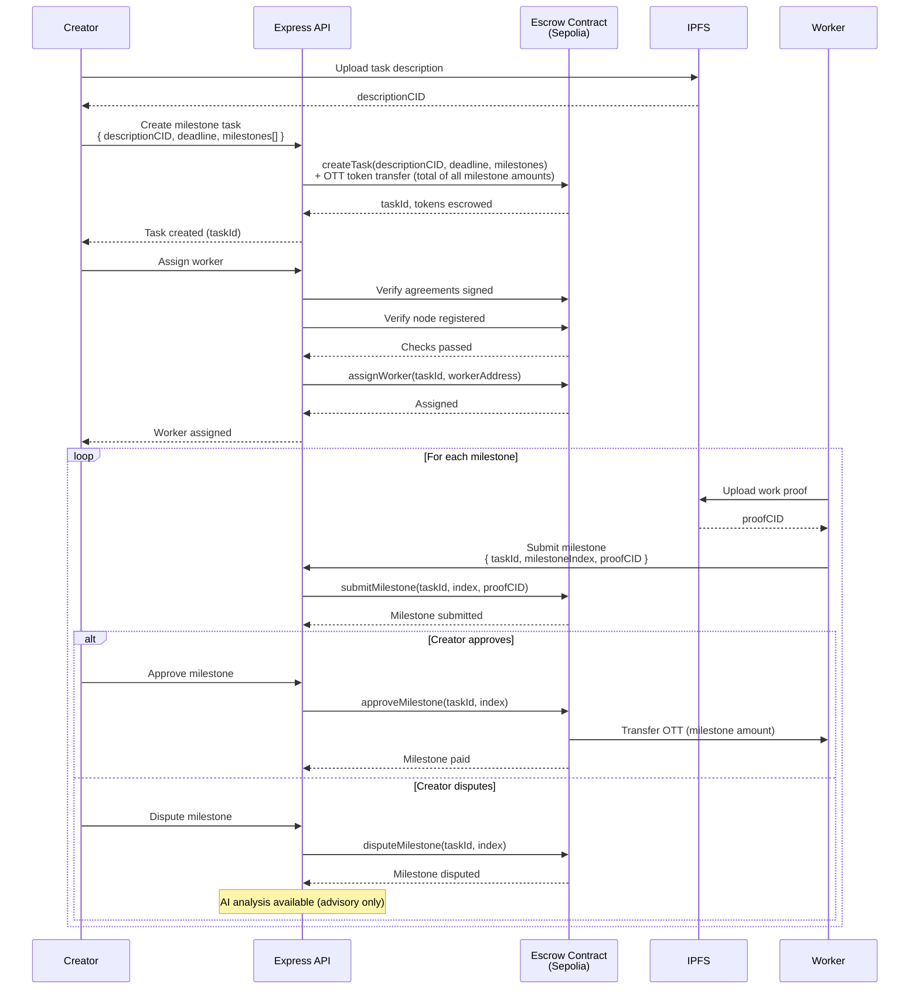

### Cancellation

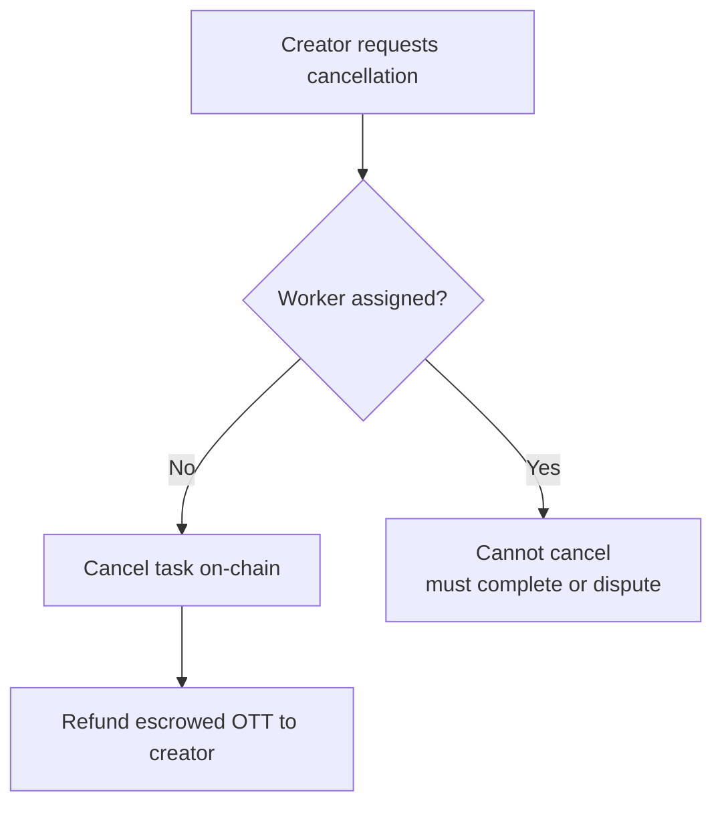

---

## 2. State Machines

### Task States

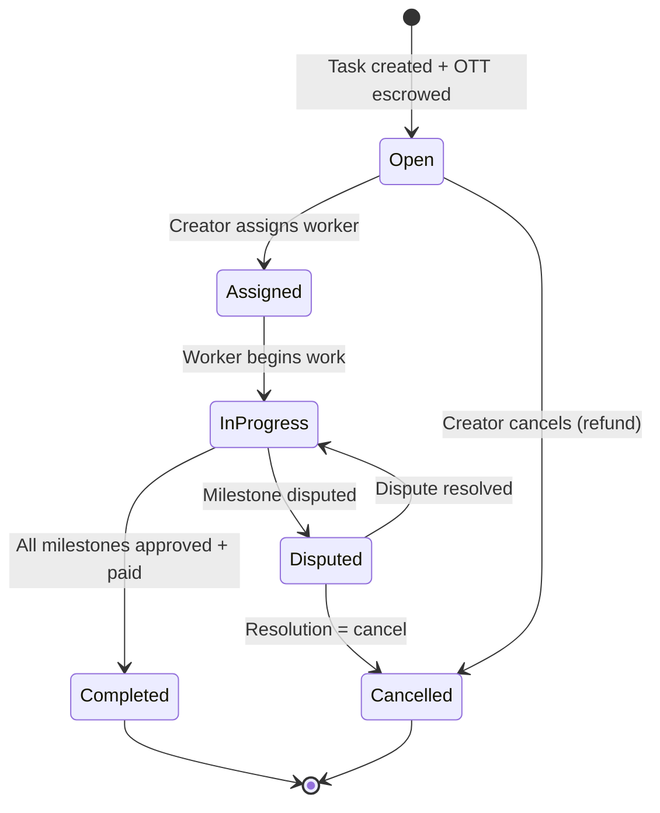

| State | Value | Description |
|-------|-------|-------------|
| Open | 0 | Task created, OTT escrowed, no worker assigned |
| Assigned | 1 | Worker assigned, agreements verified |
| InProgress | 2 | Worker actively submitting milestones |
| Completed | 3 | All milestones approved and paid |
| Disputed | 4 | One or more milestones under dispute |
| Cancelled | 5 | Task cancelled, escrowed OTT refunded |

### Milestone States

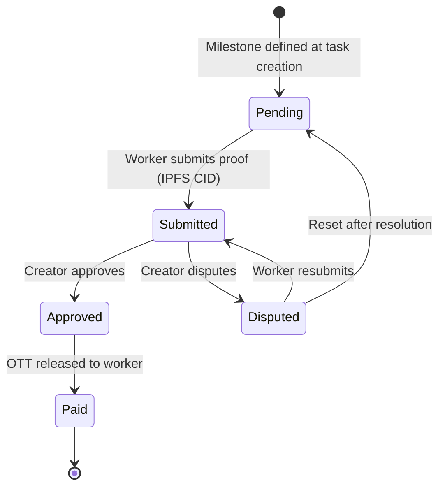

| State | Value | Description |
|-------|-------|-------------|
| Pending | 0 | Awaiting worker submission |
| Submitted | 1 | Worker has submitted proof CID |
| Approved | 2 | Creator approved the submission |
| Paid | 3 | OTT payment released to worker |
| Disputed | 4 | Under dispute |

---

## 3. Agreement Signing

Workspace agreements must be signed on-chain before a worker can be assigned to a task. Agreement types: **NDA**, **TOS**, **IP Assignment**, **Custom**.

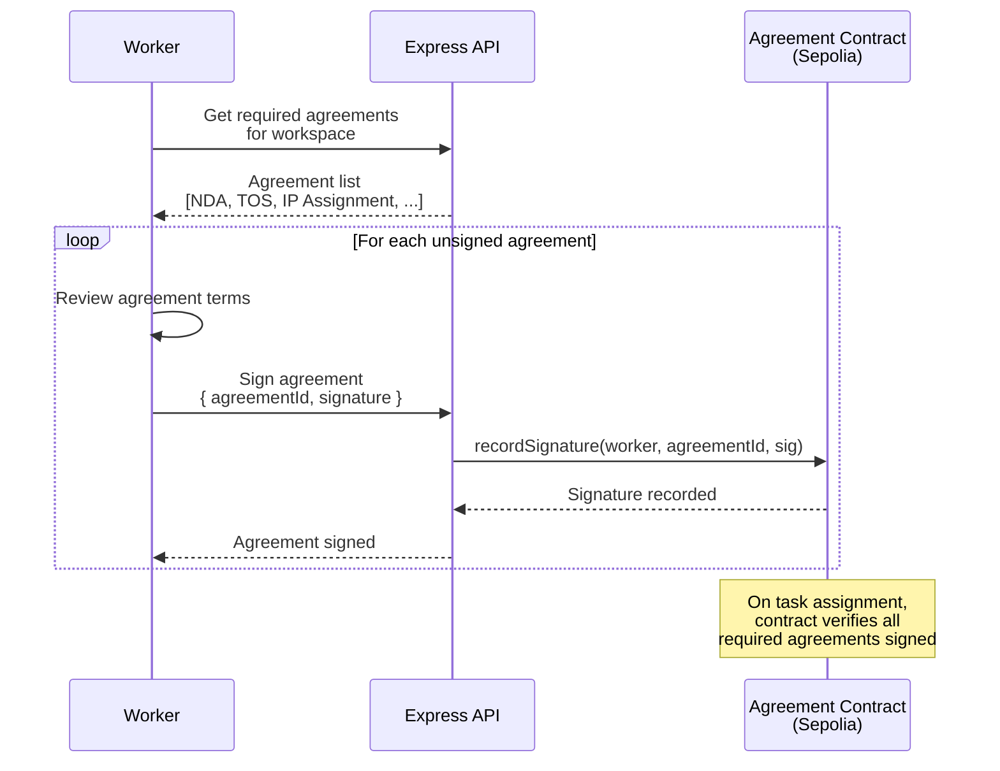

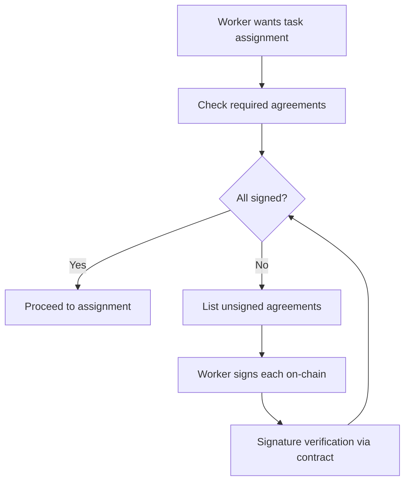

### Agreement Types

| Type | Description |
|------|-------------|
| NDA | Non-disclosure agreement for workspace content |
| TOS | Terms of service for the workspace |
| IP Assignment | Intellectual property assignment terms |
| Custom | Workspace-defined custom agreement |

---

## 4. Dispute Resolution

When a creator disputes a milestone, AI analysis is available as an **advisory** tool. The AI gathers evidence and produces a recommendation, but no automatic on-chain action is taken.

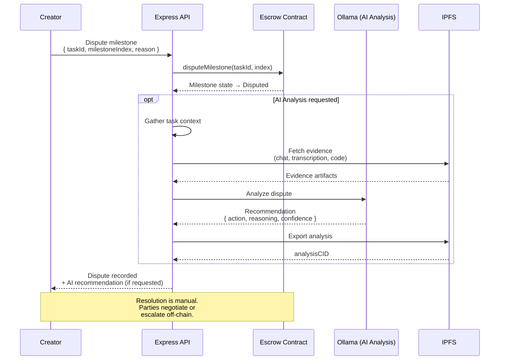

### AI Recommendation Schema

```json
{
  "action": "release | partial | deny",
  "reasoning": "string — detailed justification",
  "confidence": 0.85
}
```

| Action | Meaning |
|--------|---------|
| `release` | Release full milestone payment to worker |
| `partial` | Partial release with suggested split |
| `deny` | Deny payment, evidence favors creator |

---

## 5. IP Registration

Before final payment on a task, the worker registers the intellectual property on-chain. This records the license type and associates it with the task.

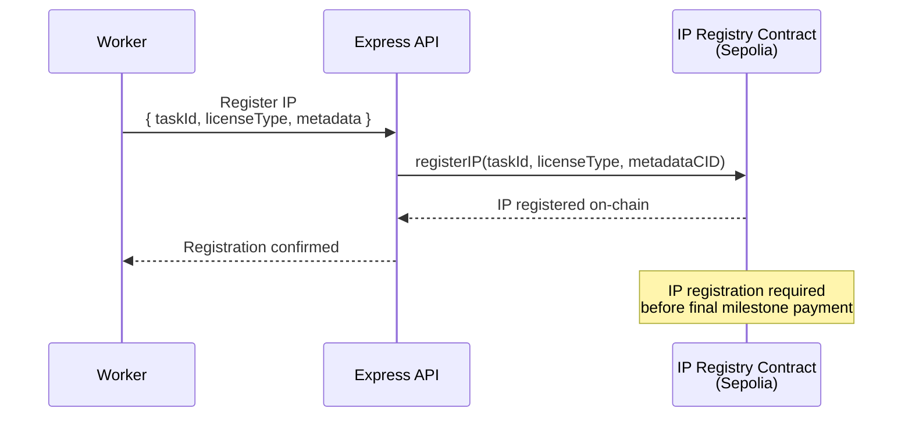

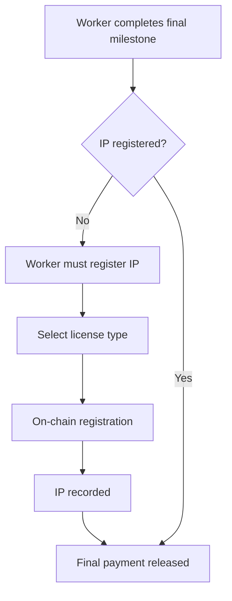

### License Types

| License | Description |
|---------|-------------|
| MIT | Permissive open-source license |
| Apache 2.0 | Permissive with patent protection |
| Proprietary | All rights reserved to workspace/creator |
| Work for Hire | IP owned by hiring party |
| Custom | Custom license terms (referenced by CID) |

---

## 6. Treasury & OTT Token

OTT is the platform token deployed on Ethereum Sepolia. The treasury endpoint reads on-chain state to report balances and token info. Pack tiers are available for purchasing OTT.

```mermaid
flowchart TD
    subgraph On-Chain (Sepolia)
        Token[OTT Token Contract]
        Escrow[Escrow Contract]
        Treasury[Treasury Balance]
    end

    subgraph API
        TreasuryEP[GET /api/v1/treasury/info]
        PacksEP[GET /api/v1/treasury/packs]
        PurchaseEP[POST /api/v1/treasury/purchase]
    end

    TreasuryEP -->|Read| Token
    TreasuryEP -->|Read| Treasury
    PacksEP --> PackTiers[Pack Tier Definitions]
    PurchaseEP -->|Transfer| Token

    subgraph Escrow Flow
        Creator -->|Fund task| Escrow
        Escrow -->|Milestone payment| Worker
        Escrow -->|Refund on cancel| Creator
    end

    Token --- Escrow
```

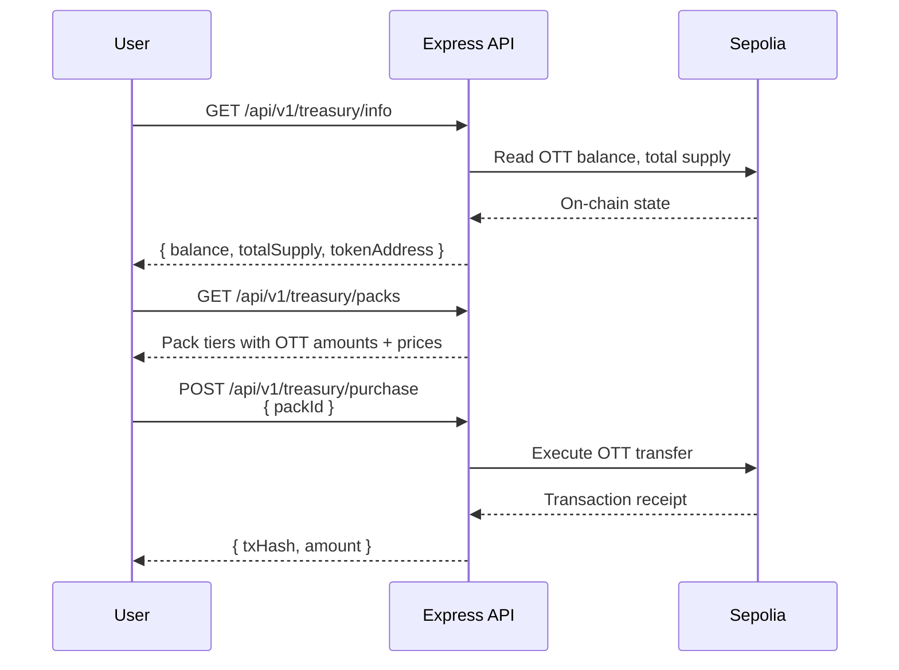

### OTT Token Flow Through System

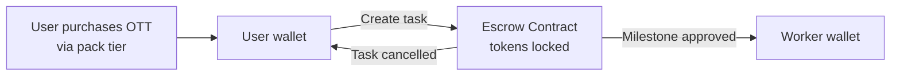

---

## 7. Endpoints Catalog

| Method | Endpoint | Description | Response |
|--------|----------|-------------|----------|
| POST | `/api/v1/tasks` | Create milestone task (escrows OTT) | JSON { taskId } |
| GET | `/api/v1/tasks/:id` | Get task details and milestone states | JSON |
| POST | `/api/v1/tasks/:id/assign` | Assign worker to task | JSON |
| POST | `/api/v1/tasks/:id/cancel` | Cancel task (refund if unassigned) | JSON |
| POST | `/api/v1/tasks/:id/milestones/:index/submit` | Submit work proof for milestone | JSON |
| POST | `/api/v1/tasks/:id/milestones/:index/approve` | Approve milestone (releases OTT) | JSON |
| POST | `/api/v1/tasks/:id/milestones/:index/dispute` | Dispute a milestone | JSON |
| POST | `/api/v1/dispute/:taskId/analyze` | Run AI dispute analysis | JSON |
| GET | `/api/v1/agreements/:workspaceId` | List required agreements | JSON |
| POST | `/api/v1/agreements/sign` | Sign an agreement on-chain | JSON |
| GET | `/api/v1/agreements/verify/:worker` | Verify worker has signed all required | JSON |
| POST | `/api/v1/ip/register` | Register IP on-chain | JSON |
| GET | `/api/v1/ip/:taskId` | Get IP registration for task | JSON |
| GET | `/api/v1/treasury/info` | Treasury info (reads on-chain state) | JSON |
| GET | `/api/v1/treasury/packs` | Available OTT pack tiers | JSON |
| POST | `/api/v1/treasury/purchase` | Purchase OTT pack | JSON { txHash } |
