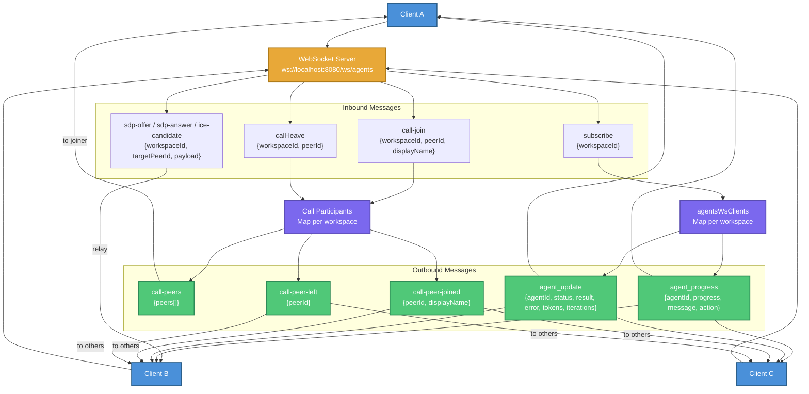
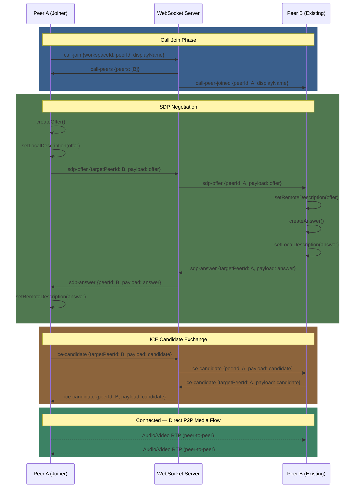
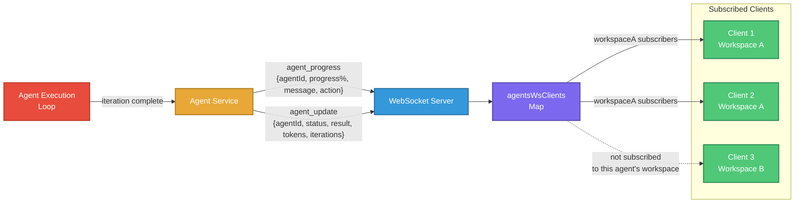
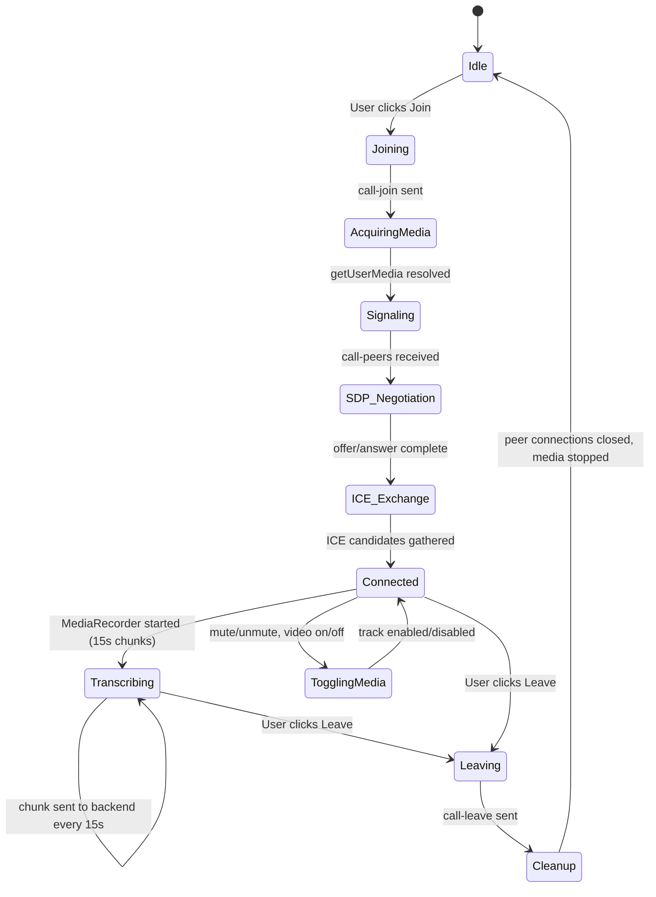
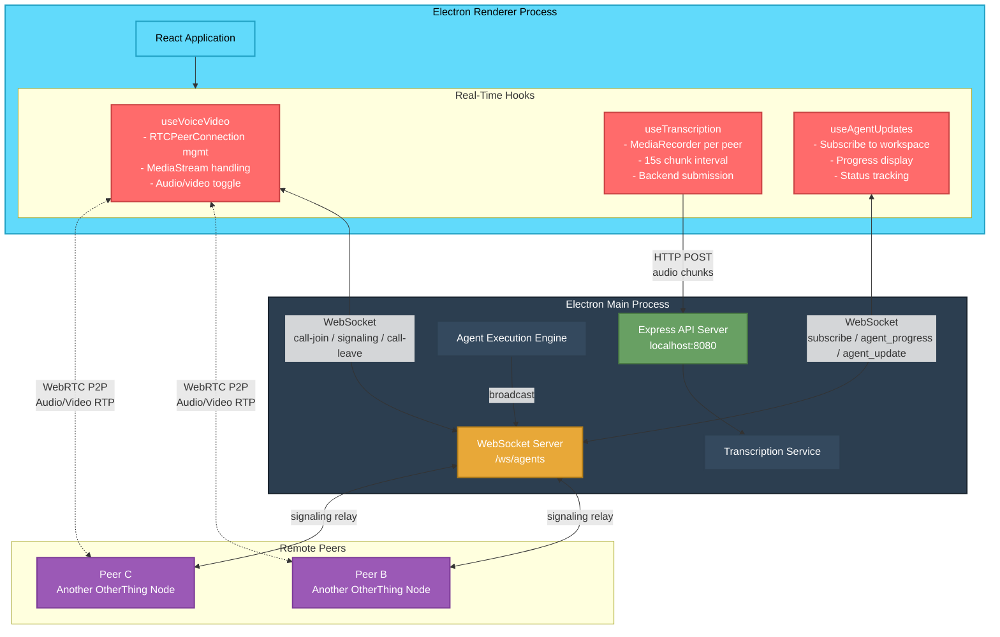

# Real-Time Communication Data Flows

## Overview

OtherThing uses a single WebSocket server for all real-time communication: agent progress updates, voice/video call signaling, and WebRTC peer coordination. The server runs at `ws://localhost:8080/ws/agents` alongside the Express API.

---

## WebSocket Server Architecture

### Server Initialization

The WebSocket server is created as part of the API server startup:

```
new WebSocketServer({ server, path: '/ws/agents' })
```

All real-time message types share this single WebSocket endpoint. Clients connect once and send typed JSON messages to interact with different subsystems.

### Connection State Management

Two primary data structures track connection state:

| Structure | Type | Purpose |
|-----------|------|---------|
| `agentsWsClients` | `Map<workspaceId, Set<WebSocket>>` | Tracks which clients are subscribed to agent updates for each workspace |
| Call participant tracking | Per-workspace peer sets | Tracks active voice/video participants with peerId and displayName |

### Connection Lifecycle

| Event | Server Behavior |
|-------|-----------------|
| `connection` | Log new connection |
| `message` | Parse JSON, route by `type` field to handler |
| `close` | Remove from `agentsWsClients` subscriptions, remove from call participant sets, notify remaining call peers with `call-peer-left` |
| `error` | Log error, trigger cleanup identical to `close` |

---

## Message Type Reference

### 1. Agent Subscription — `subscribe`

**Direction:** Client -> Server

| Field | Type | Description |
|-------|------|-------------|
| `type` | `"subscribe"` | Message type identifier |
| `workspaceId` | `string` | Workspace to subscribe to |

**Server behavior:**
- Adds the WebSocket connection to `agentsWsClients.get(workspaceId)` set
- Creates the set if it does not exist for this workspace
- No acknowledgment message sent back

### 2. Call Join — `call-join`

**Direction:** Client -> Server -> Broadcast

| Field | Type | Description |
|-------|------|-------------|
| `type` | `"call-join"` | Message type identifier |
| `workspaceId` | `string` | Workspace call room |
| `peerId` | `string` | Unique peer identifier |
| `displayName` | `string` | Human-readable name |

**Server behavior:**
1. Adds peer to workspace call participant set
2. Returns `call-peers` message to the joining client containing all existing participants
3. Broadcasts `call-peer-joined` with `{ peerId, displayName }` to all other participants in the workspace call

### 3. Call Leave — `call-leave`

**Direction:** Client -> Server -> Broadcast

| Field | Type | Description |
|-------|------|-------------|
| `type` | `"call-leave"` | Message type identifier |
| `workspaceId` | `string` | Workspace call room |
| `peerId` | `string` | Peer leaving the call |

**Server behavior:**
1. Removes peer from workspace call participant set
2. Broadcasts `call-peer-left` with `{ peerId }` to remaining participants
3. If no participants remain, cleans up the workspace call state entirely

### 4. WebRTC Signaling — `sdp-offer` / `sdp-answer` / `ice-candidate`

**Direction:** Client -> Server -> Target Peer

| Field | Type | Description |
|-------|------|-------------|
| `type` | `"sdp-offer"` / `"sdp-answer"` / `"ice-candidate"` | Signaling message type |
| `workspaceId` | `string` | Workspace context |
| `targetPeerId` | `string` | Intended recipient peer |
| `payload` | `object` | SDP or ICE candidate data |

**Server behavior:**
- Relays the message to the WebSocket connection associated with `targetPeerId` in the given workspace
- Server does not inspect or modify the payload
- Acts purely as a signaling relay for peer-to-peer WebRTC negotiation

### 5. Agent Progress — `agent_progress` (Server -> Client)

| Field | Type | Description |
|-------|------|-------------|
| `type` | `"agent_progress"` | Broadcast type |
| `agentId` | `string` | Agent execution identifier |
| `progress` | `number` | Completion percentage (0-100) |
| `message` | `string` | Human-readable status |
| `action` | `object` | Current action details, includes final result on completion |

### 6. Agent Update — `agent_update` (Server -> Client)

| Field | Type | Description |
|-------|------|-------------|
| `type` | `"agent_update"` | Broadcast type |
| `agentId` | `string` | Agent execution identifier |
| `status` | `string` | Execution status (running, completed, failed) |
| `result` | `object \| null` | Final result payload |
| `error` | `string \| null` | Error message if failed |
| `tokens` | `number` | Token count consumed |
| `iterations` | `number` | Iteration count completed |

**Broadcasting rule:** Both `agent_progress` and `agent_update` are sent to all WebSocket clients in the `agentsWsClients` set for the relevant workspace.

---

## Client-Side Hooks

### `useVoiceVideo`

Manages the full voice/video call lifecycle from the React renderer.

| Responsibility | Detail |
|----------------|--------|
| WebSocket messaging | Sends `call-join`, `call-leave`, signaling messages |
| Peer tracking | Maintains list of active peers from server events |
| RTCPeerConnection management | Creates one `RTCPeerConnection` per remote peer |
| MediaStream handling | Acquires local audio/video via `getUserMedia` |
| Audio/video toggle | Mute/unmute audio, enable/disable video tracks |
| Cleanup | Closes all peer connections and stops local media on leave |

**Peer connection flow per remote peer:**
1. Receive `call-peer-joined` or `call-peers` list
2. Create `RTCPeerConnection` with ICE servers
3. Add local media tracks to connection
4. If initiator: create SDP offer, set local description, send via WebSocket
5. Receive SDP answer, set remote description
6. Exchange ICE candidates bidirectionally via WebSocket relay
7. On `track` event: attach remote MediaStream to UI

### `useTranscription`

Handles real-time audio transcription by chunking peer audio streams.

| Responsibility | Detail |
|----------------|--------|
| MediaRecorder creation | One `MediaRecorder` per peer audio stream |
| Chunk interval | 15-second recording chunks |
| Backend submission | Sends audio blobs to backend transcription endpoint |
| Result aggregation | Collects transcription text per peer per chunk |

**Chunk pipeline:**
1. `MediaRecorder.ondataavailable` fires every 15 seconds
2. Audio blob extracted from event
3. Blob sent to backend transcription service via HTTP POST
4. Backend processes via Ollama whisper model or configured transcription service
5. Transcription result returned and displayed in UI

---

## Diagrams

### WebSocket Message Flow — All Types



### WebRTC Signaling Sequence



### Agent Progress Broadcasting Flow



### Voice/Video Call Lifecycle



### Client-Server Real-Time Architecture



---

## Data Flow Summary Table

| Flow | Protocol | Direction | Persistence | Latency Target |
|------|----------|-----------|-------------|----------------|
| Agent subscribe | WebSocket | Client -> Server | In-memory Map | Immediate |
| Agent progress | WebSocket | Server -> Client | None (fire-and-forget) | < 100ms |
| Agent update | WebSocket | Server -> Client | None (fire-and-forget) | < 100ms |
| Call join/leave | WebSocket | Bidirectional | In-memory per call | Immediate |
| SDP signaling | WebSocket | Peer -> Server -> Peer | None (relay) | < 50ms |
| ICE candidates | WebSocket | Peer -> Server -> Peer | None (relay) | < 50ms |
| Media streams | WebRTC (P2P) | Peer <-> Peer | None | Real-time |
| Transcription chunks | HTTP POST | Client -> Server | Processed, not stored | 15s batches |

---

## Failure Modes and Recovery

| Failure | Impact | Recovery |
|---------|--------|----------|
| WebSocket disconnect | Agent updates stop, call signaling breaks | Client auto-reconnects, re-sends `subscribe` and `call-join` |
| ICE negotiation failure | No P2P media path | Fall back to TURN relay (if configured) or retry |
| MediaRecorder error | Transcription gaps | Skip chunk, continue with next 15s interval |
| Server restart | All subscriptions and call state lost (in-memory) | Clients detect disconnect, rejoin on reconnect |
| getUserMedia denied | No local media | User prompted again, can join call audio-only or view-only |
