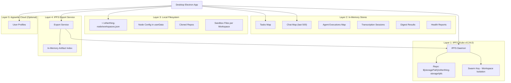
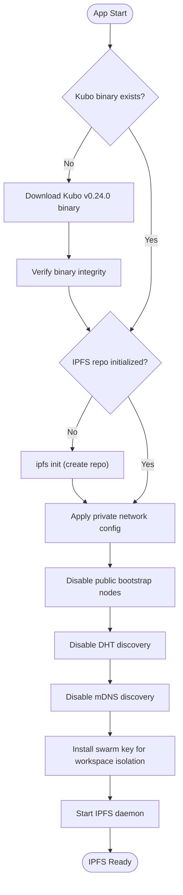
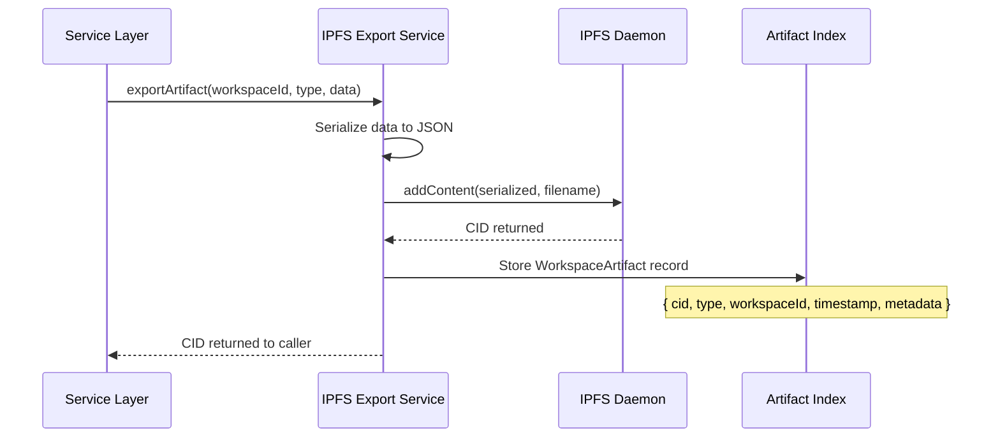
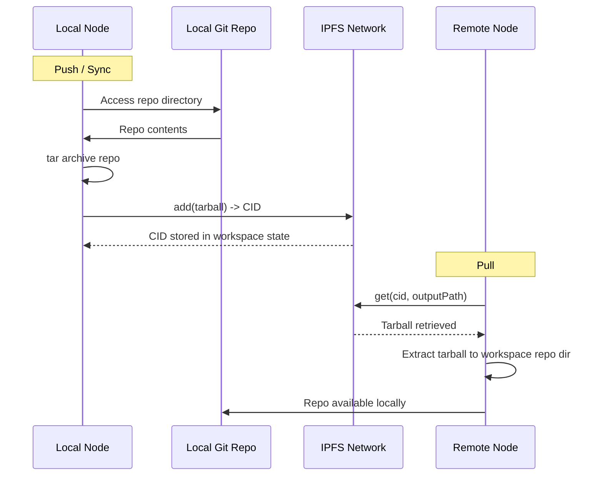
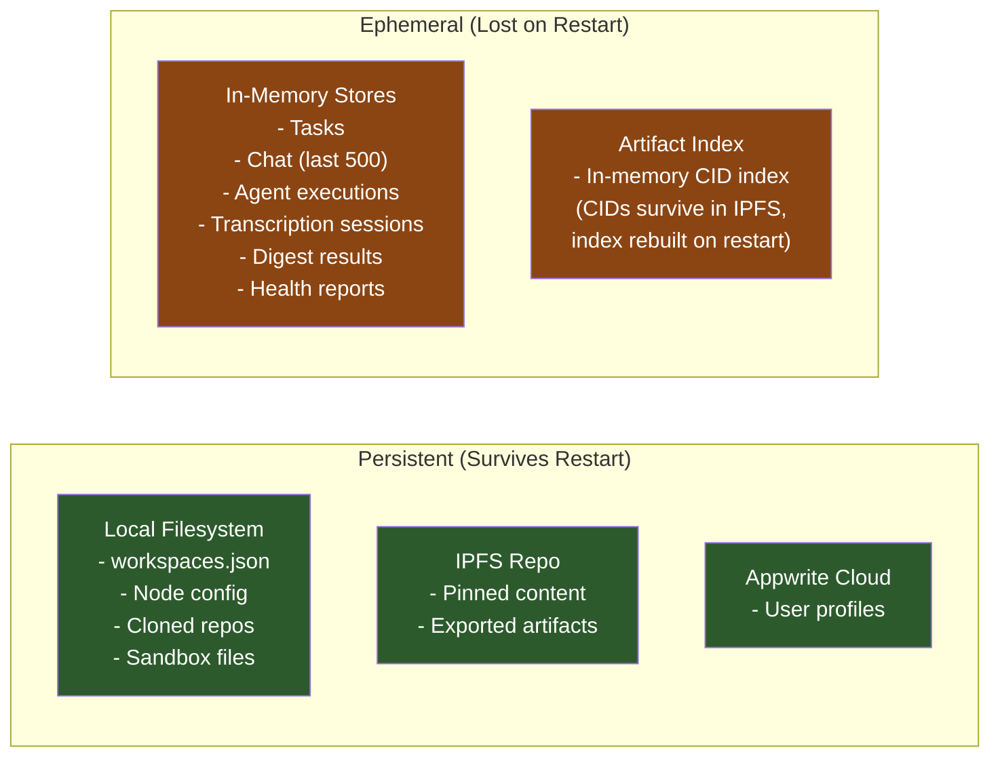

# Storage & IPFS Data Flows

## Overview

OtherThing Node uses a multi-layer storage architecture combining decentralized storage (IPFS), ephemeral in-memory stores, local filesystem persistence, an IPFS export service for workspace artifacts, and optional Appwrite cloud storage. Each layer serves a distinct purpose in the platform's local-first design.

---

## Storage Architecture



---

## Layer 1: IPFS (Kubo v0.24.0)

Primary decentralized storage. The Kubo binary is auto-downloaded on first run. Operates in **private network mode** with public bootstrap nodes, DHT, and mDNS all disabled. A swarm key provides workspace-level isolation.

**Repo location:** `${storagePath}/otherthing-storage/ipfs`

### IPFS API

| Method | Signature | Description |
|--------|-----------|-------------|
| `addContent` | `addContent(content, filename) -> CID` | Add raw content with a filename, returns CID |
| `add` | `add(filePath) -> CID` | Add a file from local filesystem, returns CID |
| `get` | `get(cid, outputPath)` | Retrieve content by CID to a local path |
| `pin` | `pin(cid)` | Pin content to prevent garbage collection |
| `unpin` | `unpin(cid)` | Unpin content, allowing garbage collection |
| `connectPeer` | `connectPeer(multiaddr)` | Connect to a peer by multiaddress |

### IPFS Initialization Flow



---

## Layer 2: In-Memory Stores

Ephemeral data that lives only for the duration of the app session. These stores provide fast access for active workspace data.

| Store | Key | Value | Notes |
|-------|-----|-------|-------|
| Tasks | `workspaceId` | `tasks[]` | All tasks for a workspace |
| Chat | `workspaceId` | `messages[]` | Rolling window, last 500 messages |
| Agent Executions | `executionId` | `execution` | Active and completed agent runs |
| Transcription Sessions | `sessionId` | `session` | Voice transcription in progress |
| Digest Results | `digestId` | `digest` | Generated workspace digests |
| Health Reports | `reportId` | `report` | Workspace health analysis results |

---

## Layer 3: Local Filesystem

Persistent configuration and workspace data stored on the local machine.

| Path | Contents | Persistence |
|------|----------|-------------|
| `~/.otherthing-node/workspaces.json` | Workspace membership and configuration | Permanent |
| `userData` (Electron) | Node identity, keys, settings | Permanent |
| Cloned repos directory | Git repositories pulled for workspaces | Permanent until deleted |
| Sandbox files | Per-workspace isolated file trees | Permanent until workspace deleted |

---

## Layer 4: IPFS Export Service

Exports workspace artifacts to IPFS for decentralized persistence and sharing. Maintains an in-memory index of artifacts per workspace.

### WorkspaceArtifact Schema

```
WorkspaceArtifact {
    cid: string           // IPFS content identifier
    type: ArtifactType    // One of the supported artifact types
    workspaceId: string   // Owning workspace
    timestamp: number     // Export timestamp
    metadata: object      // Type-specific metadata
}
```

### Supported Artifact Types

| Type | Description |
|------|-------------|
| `chat` | Workspace chat history |
| `whiteboard` | Whiteboard canvas state |
| `transcription` | Voice transcription output |
| `digest` | AI-generated workspace digest |
| `handoff` | Project handoff document |
| `health-report` | Workspace health analysis |
| `dispute-analysis` | Dispute resolution analysis |

### Querying Artifacts

`getArtifactsSince(workspaceId, since, type?)` -- Retrieve artifacts for a workspace since a given timestamp, optionally filtered by type.

### Artifact Export Pipeline



---

## Layer 5: Appwrite Cloud (Optional)

Optional cloud storage backend for user profile data. Used when users opt into cloud-backed profiles for cross-device access.

---

## Repo Sync Flow

Repositories are synced between nodes via IPFS. A local git repo is archived, added to IPFS, and the CID is shared. Remote nodes retrieve and extract.



---

## Data Persistence Model



**Key distinction:** IPFS content itself persists (pinned data survives daemon restarts), but the in-memory artifact index is ephemeral. The CIDs remain valid and content is retrievable, but the index mapping workspace IDs to artifact CIDs must be rebuilt.
