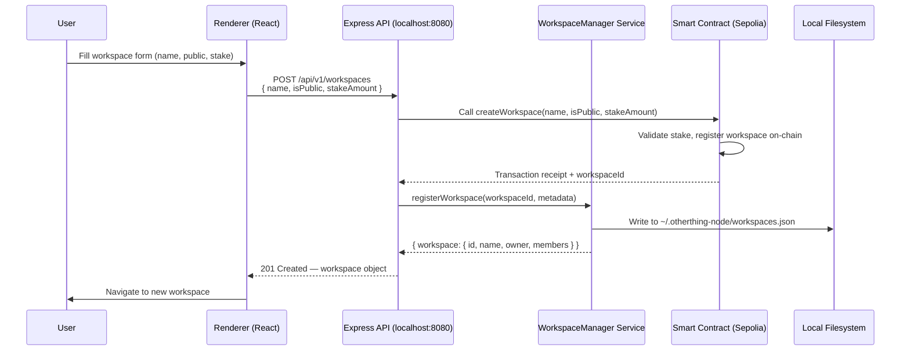
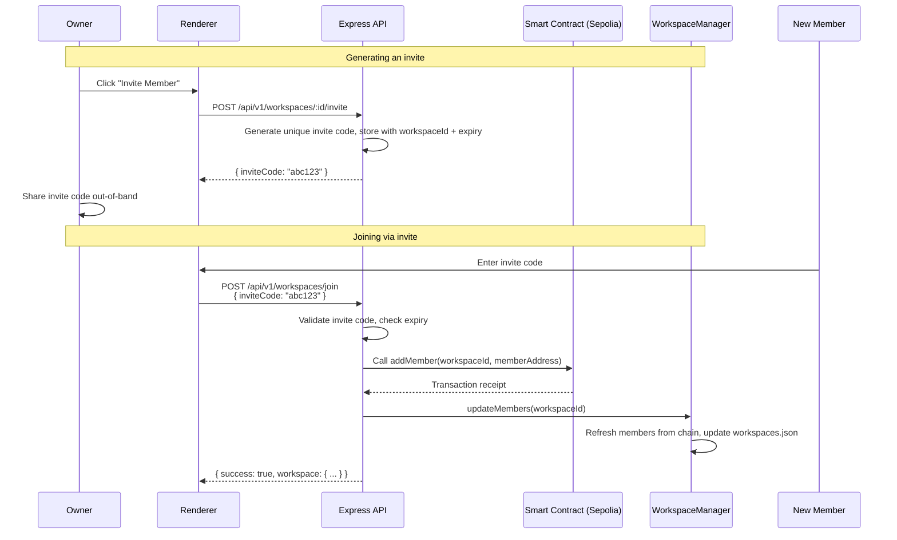
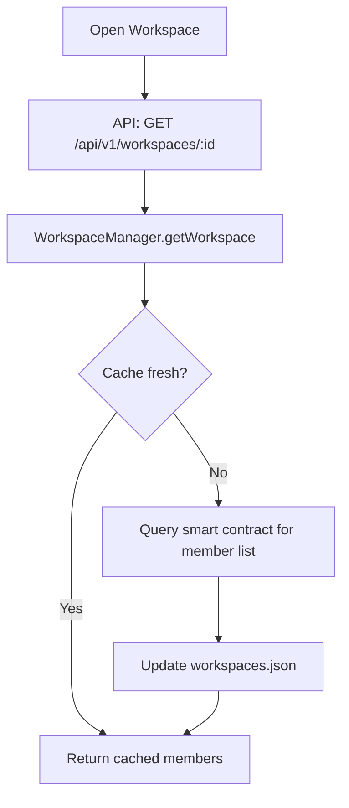
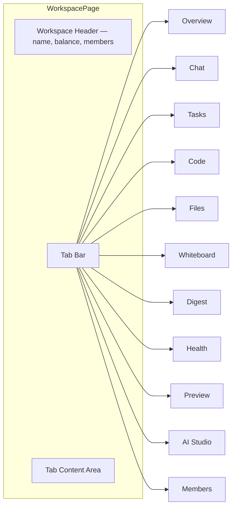
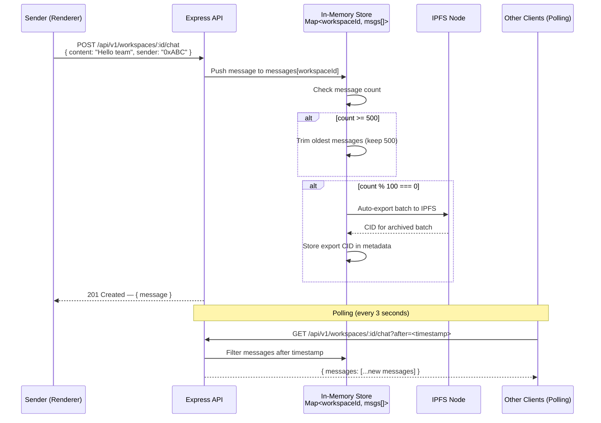
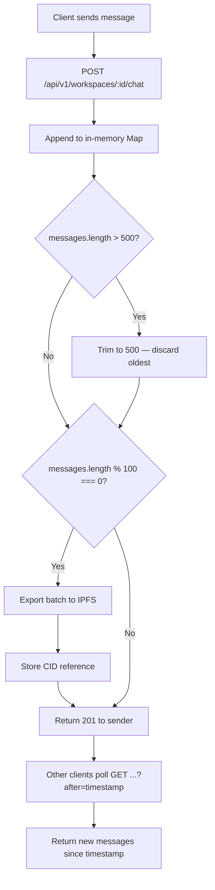
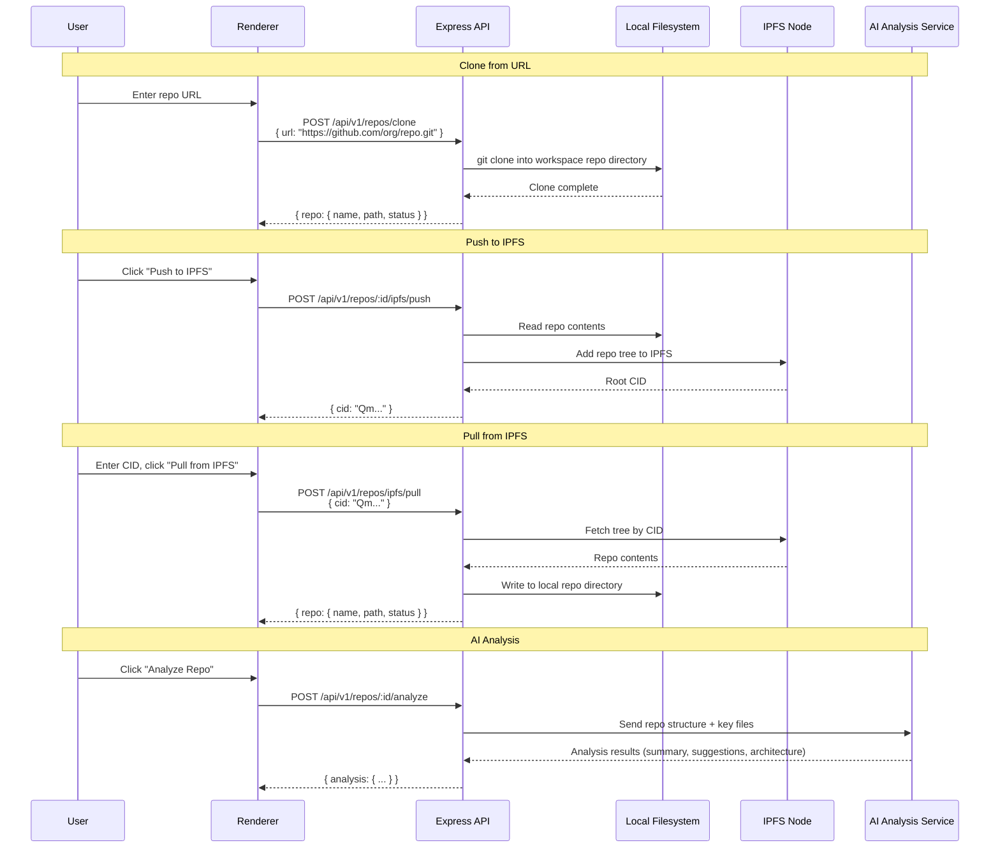
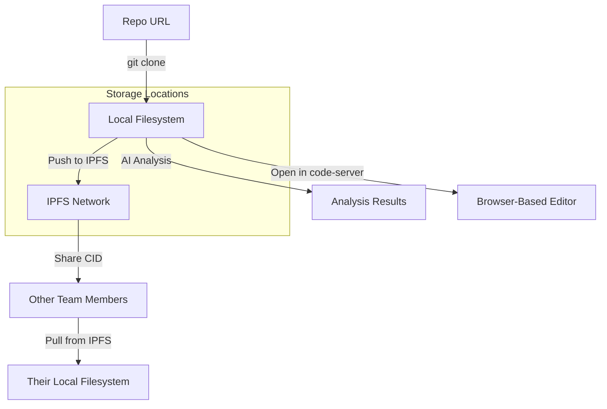
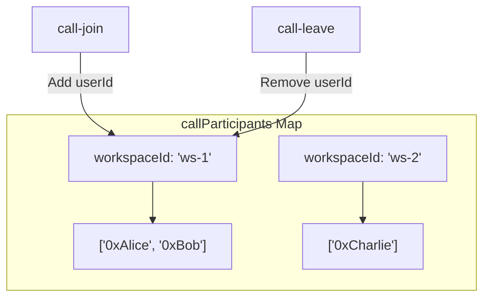
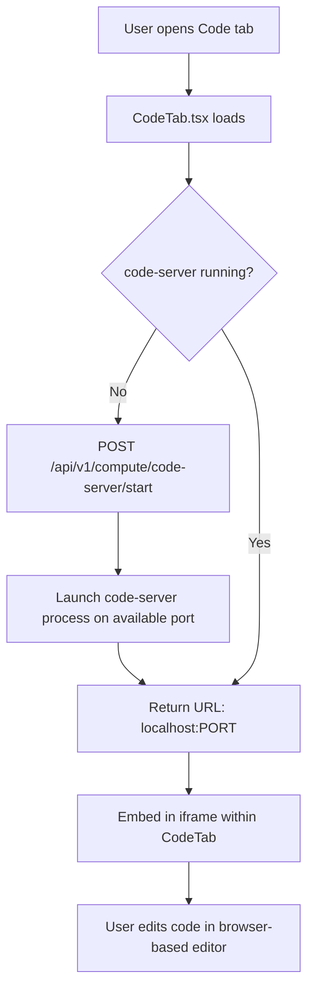

# Workspace & Collaboration

## Overview

Workspaces are the central organizational unit in OtherThing Node. They are created on-chain (Ethereum Sepolia) via a smart contract and tracked locally in `~/.otherthing-node/workspaces.json` by the `WorkspaceManager` service. Each workspace provides a full collaboration environment: tasks, chat, file management, repositories, code editing, whiteboard, voice/video calls, AI assistance, digest summaries, and health reports.

---

## 1. Workspace Creation

Workspaces are created through a smart contract call on Ethereum Sepolia, then registered locally.

### Smart Contract Parameters

| Parameter     | Type      | Description                                        |
|---------------|-----------|----------------------------------------------------|
| `name`        | `string`  | Workspace display name                             |
| `isPublic`    | `bool`    | Whether the workspace is publicly discoverable      |
| `stakeAmount` | `uint256` | Required stake in OTT tokens to create the workspace|

### Creation Flow



### Local Storage Format (`~/.otherthing-node/workspaces.json`)

```json
{
  "workspaces": [
    {
      "id": "0x...",
      "name": "My Project",
      "owner": "0xOwnerAddress",
      "isPublic": true,
      "stakeAmount": "100",
      "members": ["0xOwnerAddress", "0xMember1"],
      "createdAt": "2026-03-10T12:00:00Z"
    }
  ]
}
```

---

## 2. Member Management

Members are loaded from the blockchain. New members join via invite codes.

### Flow



### Member Loading

On workspace open, the API reads the member list from the smart contract and caches it locally:



---

## 3. Workspace Tabs Architecture

Each workspace renders a tabbed interface. All tabs share the workspace context (ID, members, permissions).



| Tab        | Key Component               | Backend Route Prefix              | Description                                    |
|------------|-----------------------------|-----------------------------------|------------------------------------------------|
| Overview   | `OverviewTab`               | `/api/v1/workspaces/:id`          | Workspace summary, recent activity              |
| Chat       | `ChatTab`                   | `/api/v1/workspaces/:id/chat`     | Real-time team messaging                        |
| Tasks      | `TasksTab`                  | `/api/v1/tasks`                   | Task board with escrow, assignment, status       |
| Code       | `CodeTab`                   | `/api/v1/repos`, `/api/v1/compute`| code-server editor, repo management             |
| Files      | `FilesTab`                  | `/api/v1/files`                   | Local and IPFS file management                   |
| Whiteboard | `WhiteboardTab`             | --                                | Embedded whiteboard iframe                       |
| Digest     | `DigestTab`                 | `/api/v1/workspaces/:id/digest`   | AI-generated workspace activity summaries        |
| Health     | `HealthTab`                 | `/api/v1/workspaces/:id/health`   | Project health reports and metrics               |
| Preview    | `PreviewTab`                | --                                | Live preview of workspace outputs                |
| AI Studio  | `AIStudioTab`               | `/api/v1/ai`                      | AI chat, code analysis, project planning         |
| Members    | `MembersTab`                | `/api/v1/workspaces/:id/members`  | Member list, roles, invite management            |

---

## 4. Team Chat

Chat messages are stored in an in-memory `Map<workspaceId, messages[]>` on the Express server. The last 500 messages are retained per workspace. Every 100 messages, an automatic export to IPFS is triggered.

### Message Lifecycle



### Chat Data Flow Detail



### Endpoints

| Method | Path                                    | Description                              |
|--------|-----------------------------------------|------------------------------------------|
| POST   | `/api/v1/workspaces/:id/chat`           | Send a message                           |
| GET    | `/api/v1/workspaces/:id/chat`           | Fetch messages (supports `?after=` param)|
| GET    | `/api/v1/workspaces/:id/chat/exports`   | List IPFS export CIDs for chat history   |

---

## 5. Repository Management

Repositories are cloned via URL and stored on the local filesystem. They can be synced to and from IPFS for decentralized sharing. AI-powered repo analysis is available.

### Repository Sync Flow



### Full Lifecycle Diagram



### Endpoints

| Method | Path                            | Description                        |
|--------|---------------------------------|------------------------------------|
| GET    | `/api/v1/repos`                 | List all repos in workspace        |
| POST   | `/api/v1/repos/clone`           | Clone a repo by URL                |
| DELETE | `/api/v1/repos/:id`             | Remove a local repo                |
| POST   | `/api/v1/repos/:id/ipfs/push`   | Push repo contents to IPFS         |
| POST   | `/api/v1/repos/ipfs/pull`       | Pull repo contents from IPFS by CID|
| POST   | `/api/v1/repos/:id/analyze`     | Run AI analysis on a repo          |
| GET    | `/api/v1/repos/:id/files`       | List files in a repo               |

### Key Files

| File                          | Role                                              |
|-------------------------------|---------------------------------------------------|
| `src/routes/repos.ts`         | Express routes for repo CRUD and IPFS sync         |
| `src/routes/compute.ts`       | Express routes for code-server and compute tasks   |
| `src/renderer/pages/workspace/CodeTab.tsx` | React UI for code editor and repo management |

---

## 6. Voice / Video Calls

Real-time voice and video calls use WebRTC with signaling handled over a WebSocket connection at `/ws/agents`. Participant state is tracked server-side in a `callParticipants` Map. Live transcription is available during calls.

### Signaling Flow

```mermaid
sequenceDiagram
    participant A as Caller (Renderer)
    participant WS as WebSocket Server (/ws/agents)
    participant Map as callParticipants Map
    participant B as Callee (Renderer)

    Note over A,B: Joining a call
    A->>WS: { type: "call-join", workspaceId, userId }
    WS->>Map: Add A to callParticipants[workspaceId]
    WS->>B: { type: "call-join", userId: A }

    Note over A,B: WebRTC negotiation
    A->>WS: { type: "sdp-offer", target: B, sdp: offer }
    WS->>B: { type: "sdp-offer", from: A, sdp: offer }
    B->>WS: { type: "sdp-answer", target: A, sdp: answer }
    WS->>A: { type: "sdp-answer", from: B, sdp: answer }

    Note over A,B: ICE candidate exchange
    A->>WS: { type: "ice-candidate", target: B, candidate }
    WS->>B: { type: "ice-candidate", from: A, candidate }
    B->>WS: { type: "ice-candidate", target: A, candidate }
    WS->>A: { type: "ice-candidate", from: B, candidate }

    Note over A,B: Media flows peer-to-peer
    A<-->B: Direct WebRTC media stream (audio/video)

    Note over A,B: Leaving a call
    A->>WS: { type: "call-leave", workspaceId, userId }
    WS->>Map: Remove A from callParticipants[workspaceId]
    WS->>B: { type: "call-leave", userId: A }
```

### Signaling Message Types

| Message Type      | Direction       | Payload                                         |
|-------------------|-----------------|--------------------------------------------------|
| `call-join`       | Client -> Server| `{ workspaceId, userId }`                        |
| `call-join`       | Server -> Peers | `{ userId }` — broadcast to existing participants|
| `call-leave`      | Client -> Server| `{ workspaceId, userId }`                        |
| `call-leave`      | Server -> Peers | `{ userId }` — broadcast to remaining participants|
| `sdp-offer`       | Client -> Server| `{ target, sdp }` — forwarded to target peer     |
| `sdp-answer`      | Client -> Server| `{ target, sdp }` — forwarded to target peer     |
| `ice-candidate`   | Client -> Server| `{ target, candidate }` — forwarded to target peer|

### Server-Side State



### Live Transcription

During active calls, audio streams can be processed for live transcription. Transcription results are broadcast to all call participants over the same WebSocket connection and can be included in workspace digests.

---

## 7. Code-Server Integration

Each workspace can launch a browser-based VS Code instance via code-server. The `CodeTab` component manages the iframe embedding and repo selection.



### Endpoints

| Method | Path                                    | Description                          |
|--------|-----------------------------------------|--------------------------------------|
| POST   | `/api/v1/compute/code-server/start`     | Start code-server for a workspace    |
| POST   | `/api/v1/compute/code-server/stop`      | Stop code-server instance            |
| GET    | `/api/v1/compute/code-server/status`    | Check if code-server is running      |

---

## 8. Whiteboard

The whiteboard tab embeds a collaborative whiteboard application in an iframe. No dedicated backend routes are required -- the whiteboard state is managed by the embedded application.

---

## 9. Summary of All Workspace Endpoints

| Method | Path                                      | Description                              |
|--------|-------------------------------------------|------------------------------------------|
| GET    | `/api/v1/workspaces`                      | List all workspaces for current user      |
| POST   | `/api/v1/workspaces`                      | Create a new workspace (on-chain + local) |
| GET    | `/api/v1/workspaces/:id`                  | Get workspace details                     |
| DELETE | `/api/v1/workspaces/:id`                  | Delete a workspace                        |
| POST   | `/api/v1/workspaces/:id/invite`           | Generate an invite code                   |
| POST   | `/api/v1/workspaces/join`                 | Join workspace via invite code            |
| GET    | `/api/v1/workspaces/:id/members`          | List workspace members                    |
| DELETE | `/api/v1/workspaces/:id/members/:address` | Remove a member                           |
| POST   | `/api/v1/workspaces/:id/chat`             | Send a chat message                       |
| GET    | `/api/v1/workspaces/:id/chat`             | Get chat messages                         |
| GET    | `/api/v1/workspaces/:id/chat/exports`     | List IPFS chat export CIDs               |
| GET    | `/api/v1/workspaces/:id/digest`           | Get workspace activity digest             |
| GET    | `/api/v1/workspaces/:id/health`           | Get workspace health report               |
| GET    | `/api/v1/repos`                           | List repos                                |
| POST   | `/api/v1/repos/clone`                     | Clone a repo                              |
| POST   | `/api/v1/repos/:id/ipfs/push`             | Push repo to IPFS                         |
| POST   | `/api/v1/repos/ipfs/pull`                 | Pull repo from IPFS                       |
| POST   | `/api/v1/repos/:id/analyze`               | AI repo analysis                          |
| POST   | `/api/v1/compute/code-server/start`       | Start code-server                         |
| POST   | `/api/v1/compute/code-server/stop`        | Stop code-server                          |
| GET    | `/api/v1/compute/code-server/status`      | Code-server status                        |
| WS     | `/ws/agents`                              | WebSocket for call signaling + real-time  |
